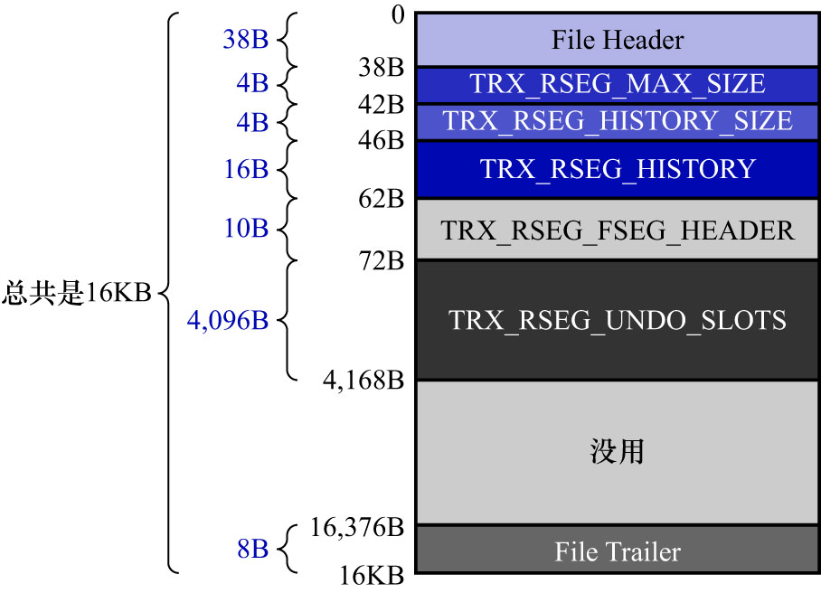

# 1. 回滚段的概念

1个事务在执行过程中,最多可以分配4个`Undo`页面链表.在同一时刻,不同事务拥有的`Undo`页面链表是不同的,
也就是说系统在同一时刻可以存在很多个`Undo`页面链表.为了更好地管理这些链表,InnoDB的设计者又设计了一个名为`Rollback Segment Header`的结构.
该结构中存放了各个`Undo`页面链表的`first undo page`的页号,这些页号称为`undo slot`.

注: 其实`Rollback Segment Header`并不是一种页面类型(书中写的是页面),而是一种结构(和之前讲过的`List Node`/`List Base Node`/`Segment Header`类似),
只是该结构的大小确实是16KB,所以它被存放在一个页面中.我想这就是作者把`Rollback Segment Header`也称为一种页面的原因吧.

可以这样理解:

- 每个`Undo`页面链表都相当于是一个班,该链表的`first undo page`就相当于这个班的班长
- 找到了这个班的班长,就可以找到班里的其他同学(其他同学相当于`normal undo page`)

有时,学校需要向这些班级传达精神,就需要把班长都召集在会议室,`Rollback Segment Header`就相当于是一个会议室.

`Rollback Segment Header`结构如下图示:

InnoDB的设计者规定: **每1个`Rollback Segment Header`结构都对应着1个段,该段就称为回滚段(`Rollback Segment`).
与前面介绍的各种段不同的是,回滚段中其实只有1个页面**.

注: 我猜测这里作者想表达的是: `Rollback Segment Header`结构存储在由`Rollback Segment`分配的那个页面中.

注: 关于这种设计的猜想:

- 可能是InnoDB的设计者们的一种洁癖,他们可能觉得为了某个目的去分配页面的话,都要先申请一个段
- 或者他们觉得:虽然目前版本的MySQL(5.7.22)中,回滚段中只有1个页面,但之后的版本可能会增加页面

理解了回滚段的作用后,再来看看`Rollback Segment Header`结构各个部分的含义:

- `TRX_RSEG_MAX_SIZE`(4字节): 该回滚段中管理的所有`Undo`页面链表中的Undo页面数量之和的最大值
  - 即: 在该回滚段中,所有`Undo`页面链表中的`Undo`页面数量之和,不得超过`TRX_RSEG_MAX_SIZE`表示的值
  - 该属性的默认值为无限大,表示想在1个回滚段中,所有`Undo`页面链表中的`Undo`页面数量之和,可以是任意大的值
  - 无限大其实只是个夸张的说法,4字节能表示最大的数为`0xFFFFFFFF`
  - 但是后面会讲到,`0xFFFFFFFF`这个数字有特殊用途
  - 所以实际上`TRX_RSEG_MAX_SIZE`的默认值为`0xFFFFFFFE`
- `TRX_RSEG_HISTORY_SIZE`(4字节): History链表占用的页面数量
  - History链表后边会讲到,这里先不用管
- `TRX_RSEG_HISTORY`(16字节): History链表的基节点
  - History链表后边会讲到,这里先不用管
- `TRX_RSEG_FSEG_HEADER`(10字节): 该回滚段对应的10字节大小的[`Segment Header`](https://github.com/rayallen20/howDoesMySQLWork/blob/main/%E7%AC%AC9%E7%AB%A0%20%E5%AD%98%E6%94%BE%E9%A1%B5%E9%9D%A2%E7%9A%84%E5%A4%A7%E6%B1%A0%E5%AD%90--InnoDB%E7%9A%84%E8%A1%A8%E7%A9%BA%E9%97%B4/2.%20%E7%8B%AC%E7%AB%8B%E8%A1%A8%E7%A9%BA%E9%97%B4%E7%BB%93%E6%9E%84/6.%20Segment%20Header%E7%BB%93%E6%9E%84%E7%9A%84%E8%BF%90%E7%94%A8.md)结构,通过该结构可以找到本段对应的[`INODE Entry`](https://github.com/rayallen20/howDoesMySQLWork/blob/main/%E7%AC%AC9%E7%AB%A0%20%E5%AD%98%E6%94%BE%E9%A1%B5%E9%9D%A2%E7%9A%84%E5%A4%A7%E6%B1%A0%E5%AD%90--InnoDB%E7%9A%84%E8%A1%A8%E7%A9%BA%E9%97%B4/2.%20%E7%8B%AC%E7%AB%8B%E8%A1%A8%E7%A9%BA%E9%97%B4%E7%BB%93%E6%9E%84/4.%20%E6%AE%B5%E7%9A%84%E7%BB%93%E6%9E%84.md)
- `TRX_RSEG_UNDO_SLOTS`(4096字节): 各个`Undo`页面链表的`first undo page`的页号集合,即:`undo slot`集合
  - 1个页号占用4字节,对于大小为16KB的页面来说,`TRX_RSEG_UNDO_SLOTS`部分共存储了1024个`undo slot`
  - 所以共需`1024 * 4 = 4096`字节
