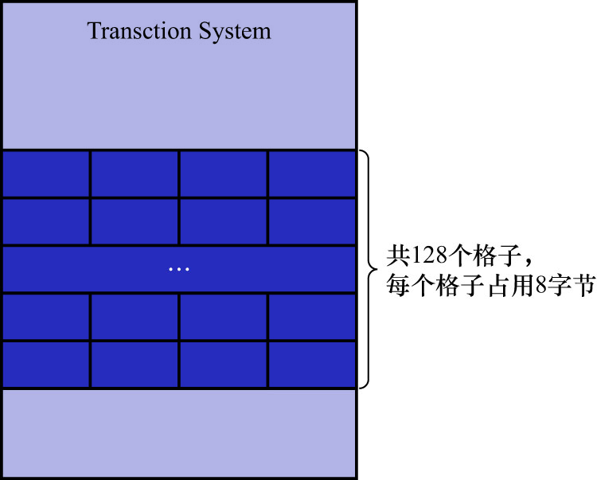

# 3. 多个回滚段

前面讲到过,1个事务在执行过程中,最多分配4个`Undo`页面链表,可是1个回滚段中只能存储1024个`undo slot`,很显然`undo slot`的数量
有点少.即使假设1个读写事务在执行过程中只分配1个`Undo`页面链表,那么1024个`undo slot`也只能支持1024个读写事务同时执行,再多了就崩溃了.

这就相当于: 会议室只能容纳1024个班长同时开会,若有几千人同时到会议室开会,那后来的人就没地方坐了,只能等待前面的人开完会离开之后,自己再进去开.

在InnoDB的早期发展阶段,确实只有1个回滚段.但是InnoDB的设计者后来意识到了这个问题.解决方案其实也很简单: 会议室不够,多盖几间会议室即可.
所以InnoDB的设计者定义了128个回滚段,也就相当于有了`128 * 1024 = 131072`个`undo slot`.假设1个读写事务在执行过程中只分配1个`Undo`页面链表,
则可以同时支持131072个读写事务并发执行.这个数量级的事务在1台机器上并发执行,这种场面几乎是不太可能出现的.

1个回滚段对应着1个`Rollback Segment Header`结构,有128个回滚段,自然就有128个`Rollback Segment Header`结构,而存储1个
`Rollback Segment Header`结构又需要使用1个页面,这些页面的地址(这里说的地址是指`表空间ID + 页号`的组合)需要存储在某个地方.
于是InnoDB的设计者在系统表空间的第5号页面(类型为`TRX_SYS`的页面)的某个区域中,设计了128个8字节大小的格子,如下图示:

每个8字节的格子的结构如下图示:

如上图示,每个8字节的格子由2部分组成:

- `Space ID`(4字节): 表示1个表空间的ID
- `Page number`(4字节): 表示1个页号

即: 每个8字节大小的格子相当于一个指针,指向某个表空间中的某个页面,该页面中存储的就是`Rollback Segment Header`结构.

注意: 从这个格子的结构中可以看出,要定位一个`Rollback Segment Header`结构,除页号外,还需要知道对应的表空间ID,这也就意味着
**不同的回滚段可能分布在不同的表空间中**.

所以通过上边的叙述大致可知:

- 在系统表空间的第5号页面(类型为`TRX_SYS`的页面)中存储了128个页面地址
  - 这些页面用于存储`Rollback Segment Header`结构,每个页面存储1个`Rollback Segment Header`结构
  - 这里说的"页面地址",其实是`表空间ID + 页号`的组合,用于定位该页面
- 1个`Rollback Segment Header`结构表示了1个回滚段
  - 1个`Rollback Segment Header`结构中包含1024个`undo slot`
  - 1个`undo slot`对应1个`Undo`页面链表
    - 实际上`undo slot`中存储的是`Undo`页面链表的`first undo page`的页号

