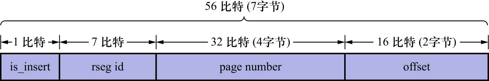

# 5. `roll_pointer`的组成

聚簇索引记录中包含一个名为`roll_pointer`的隐藏列.有些类型的`undo`日志包含一个名为`roll_pointer`的属性,比如:

- [`TRX_UNDO_DEL_MARK_REC`](https://github.com/rayallen20/howDoesMySQLWork/blob/main/%E7%AC%AC20%E7%AB%A0%20%E5%90%8E%E6%82%94%E4%BA%86%E6%80%8E%E4%B9%88%E5%8A%9E--undo%E6%97%A5%E5%BF%97/3.%20undo%E6%97%A5%E5%BF%97%E6%A0%BC%E5%BC%8F/2.%20DELETE%E6%93%8D%E4%BD%9C%E5%AF%B9%E5%BA%94%E7%9A%84undo%E6%97%A5%E5%BF%97/2.%20DELETE%E6%93%8D%E4%BD%9C%E5%AF%B9%E5%BA%94%E7%9A%84undo%E6%97%A5%E5%BF%97%E7%9A%84%E7%BB%93%E6%9E%84.md)(`DELETE`操作对应的`undo`日志的结构)
- [`TRX_UNDO_UPD_EXIST_REC`](https://github.com/rayallen20/howDoesMySQLWork/blob/main/%E7%AC%AC20%E7%AB%A0%20%E5%90%8E%E6%82%94%E4%BA%86%E6%80%8E%E4%B9%88%E5%8A%9E--undo%E6%97%A5%E5%BF%97/3.%20undo%E6%97%A5%E5%BF%97%E6%A0%BC%E5%BC%8F/3.%20UPDATE%E6%93%8D%E4%BD%9C%E5%AF%B9%E5%BA%94%E7%9A%84undo%E6%97%A5%E5%BF%97/1.%20%E4%B8%8D%E6%9B%B4%E6%96%B0%E4%B8%BB%E9%94%AE/3.%20%E7%B1%BB%E5%9E%8B%E4%B8%BATRX_UNDO_DEL_MARK_REC%E7%9A%84undo%E6%97%A5%E5%BF%97%E7%BB%93%E6%9E%84.md)(`UPDATE`操作不更新主键的`undo`日志的结构)

该属性本质上就是一个指针,它指向一条`undo`日志的地址.`roll_pointer`由7字节组成,共包含4个属性,如下图示:

各属性含义如下:

- `is_insert`(1bit): 表示该指针指向的`undo`日志是否是[`TRX_UNDO INSERT`](https://github.com/rayallen20/howDoesMySQLWork/blob/main/%E7%AC%AC20%E7%AB%A0%20%E5%90%8E%E6%82%94%E4%BA%86%E6%80%8E%E4%B9%88%E5%8A%9E--undo%E6%97%A5%E5%BF%97/5.%20FIL_PAGE_UNDO_LOG%E9%A1%B5%E9%9D%A2.md)大类的`undo`日志
- `rseg_id`(7bit): 表示该指针指向的`undo`日志的回滚段编号
  - 这里所说的回滚段编号,即该组`undo`日志所在的`Undo`页面链表,对应的`undo slot`所在的`Rollback Segment Header`结构的编号
  - 最多有128个回滚段,它们的编号范围是0-127,所以用7bit就足够表示了
- `page number`: 表示该指针指向的`undo`日志所在页面的页号
- `offset`: 表示该指针指向的`undo`日志在页面中的偏移量

因为`roll pointer`由这几个部分(`段 -> 页号 -> 偏移量`)组成,所以可以很轻松地根据它定位到一条具体的日志
