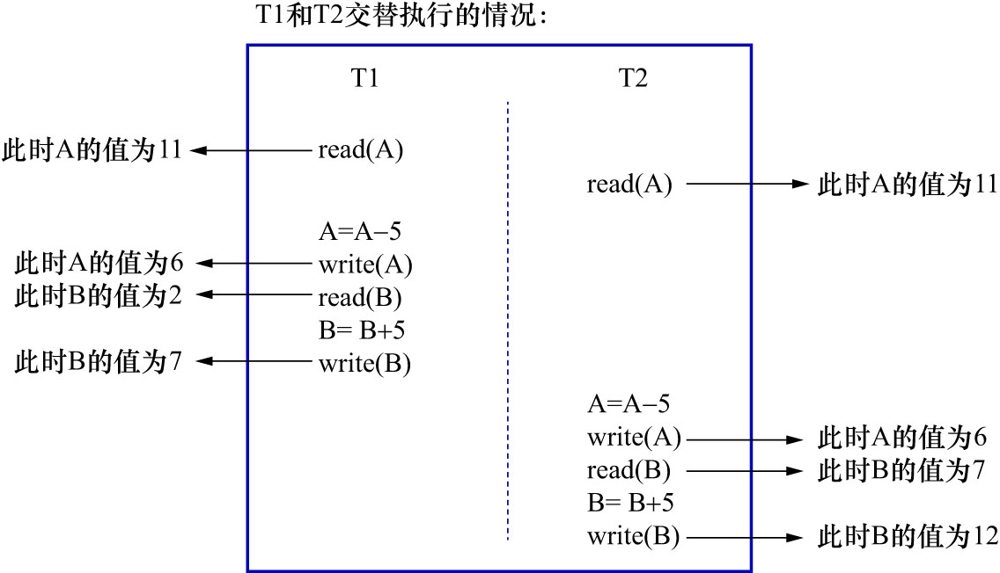

# 0. 前言

MySQL 是一个客户端／服务器架构的软件.对于同一个服务器来说,可以有多个客户端与之连接.每个客户端与服务器建立连接后,就形成了一个会话(Session).
个客户端都可以在自己的会话中向服务器发出请求语句,一个请求语句可能是某个事务的一部分.服务器可以同时处理来自多个客户端的多个事务.

在第18章中提到过:1个事务就对应着现实世界的一次状态转换.事务执行之后必保证数据符合现实世界的所有规则,这个规则就是一直在强调的一致性.
数据库管理系统提供的一系列约束,比如:

- 主键
- 唯一索引
- 外键
- 声明某个列不允许插入`NULL`值
- 等

这些约束可以解决一部分一致性需求.但这些约束在"现实世界的所有规则"这个大范围中只是很小的一部分,更多的一致性需求需要开发人员人为地保证.
数据库管理系统通过:

- `redo`日志
- `undo`日志

这些手段来保证事务的原子性.开发人员只要将现实世界的状态转换所对应的数据库操作,都写到一个事务中,则该事务执行完成后,必然从一个一致性状态转移
到下一个一致性状态(原子性保证即使事务执行失败,也只会返回到最初的一致性状态).

在第18章中,举过一个转账的例子.狗哥向猫爷转账5元钱就是现实世界的一次状态转换,当时粗略地将这次状态转换对应到下面这几个操作:

1. 读取狗哥账户的余额到变量`A`中: 简写为`read(A)`
    - 可以把该过程对应到1条`SELECT`语句,将读取到的结果存储到变量`A`
2. 将狗哥账户的余额减去转账金额: 简写为`A = A - 5`
    - 可以把该过程理解为在程序侧将变量`A`的值减5
3. 将狗哥账户修改过的余额写到磁盘中: 简写为`write(A)`
    - 可以把该过程对应到1条`UPDATE`语句
4. 读取猫爷账户的余额到变量`B`中: 简写为`read(B)`
    - 可以把该过程对应到1条`SELECT`语句,将读取到的结果存储到变量`B`
5. 将猫爷账户的余额加上转账金额: 简写为`B = B + 5`
    - 可以把该过程理解为在程序侧将变量`B`的值加5
6. 将猫爷账户修改过的余额写到磁盘中: 简写为`write(B)`
    - 可以把该过程对应到1条`UPDATE`语句

注: 在讲过`redo`日志之后可知,其实`write(A)`/`write(B)`操作不一定要将修改过的余额写到磁盘中,写到内存中的页面中就可以了.

在该转账事务中,**必须保证参与转账的账户的总余额保持不变,这就是该转账事务的一致性需求**.开发人员只要把上述步骤都放在1个事务中执行,
在事务的原子性的保护下,这些操作执行完肯定是能满足一致性需求.

如果事务是以单个的形式一个接一个地执行,那么在一个事务开始时,面对的就是上一个事务执行结束后留下的一致性状态,
该事务执行之后又会产生下一个一致性状态.

在多个事务并发执行时,情况就变得比较复杂了:

- 若并发执行的多个事务不会访问相同的数据

    比如,现有2个事务:
    
    - "狗哥给猫爷转账"的事务
    - "张三给李四转账"的事务
    
    这2个事务并发执行时,由于这2个事务并不会访问相同的账户,所以这2个事务并发执行并不会带来一致性问题.即:"最终参与转账的账户的总余额保持不变"
    这个一致性需求是可以保证的.

- 若并发执行的多个事务会访问相同的数据

    就可能导致不能满足"最终参与转账的账户的总余额保持不变"这个一致性需求了.
    
    在第18章中也举了[一个例子]():狗哥一开始有11元,猫爷有2元,他们的账户总余额为13元.狗哥向猫爷同时进行2次转账,这2次转账对应的事务分别命名为`T1`
    和`T2`,若`T1`和`T2`中的各个步骤的执行顺序如下图示:
    
    
    
    则会引发一致性问题.
    
    若按上图中的执行顺序来进行2次转账,最终狗哥的账户里还剩6元钱,相当于扣了5元钱,但是猫爷的账户里却成了12元钱,相当于多了10元钱.
    他们的账户总余额变为了18元.这显然违背了"最终参与转账的账户的总余额保持不变"的一致性需求.

这就需要使用某种手段:

- 强制让这些并发执行且访问相同数据的事务,按照顺序一个一个单独地执行
- 或最终执行的效果和单独执行一样

也就是说需要让这些事务"隔离"地执行,互不干涉.这也就是事务的隔离性.

实现隔离性的最粗暴方式就是: 在系统中,同一时刻最多只允许1个事务运行(比如强制让所有事务在1个线程中执行).其他事务只有在该事务执行完之后,
才可以开始运行.这种多个事务的执行方式称为**串行执行**.但是串行执行太严格了:

- 串行执行会严重降低系统吞量和资源利用率
- 串行执行会增加事务的等待时间

因此需要改进.

**并发事务之所以可能影响一致性,是因为它们在执行过程中可能访问相同的数据**.可以更人性化一些,比如**在某个事务访问某个数据时,对其他试图访问
相同数据的事务进行限制,让它们进行排队.当该事务提交之后,其他事务才能继续访问该数据**.这样可以**让并发执行的事务的执行结果与串行执行的结果一样**,
种多个事务的执行方式称为**可串行化执行**.

注: 2个并发的事务在执行过程中访问相同数据的情况有:

- `读-读`情况: 即2个事务对该数据都进行读操作
- `读-写`情况: 即1个事务对该数据进行读操作,另1个事务对该数据进行写操作
- `写-读`情况: 即1个事务对该数据进行写操作,另一个事务对该数据进行读操作
- `写-写`情况: 即2个事务对该数据都进行写操作

若是`读-读`操作,由于单纯的读操作并不会影响数据的状态,所以`读-读`操作并不会带来一致性问题.只有在至少一个事务对数据进行写操作时,即:

- `读-写`情况
- `写-读`情况
- `写-写`情况

才可能带来一致性问题(本章后续内容会详细分析几种可能引发一致性问题的现象).所以在实现多个事务的可串行化执行时,仅需要在多个事务对相同数据的访问为:

- `读-写`情况
- `写-读`情况
- `写-写`情况

时,对这些事务进行排队即可(这通常是通过加锁实现的,后续内容会讲到).

不过即使是可串行化执行,性能上也会有一定的损失.是否可以牺牲一部分隔离性来换取性能上的提升呢(即使这样可能会出现一些一致性问题)?
是的,当然可以.但是首先需要知道,多个事务在不进行可串行化执行的情况下,会出现哪些一致性问题?
