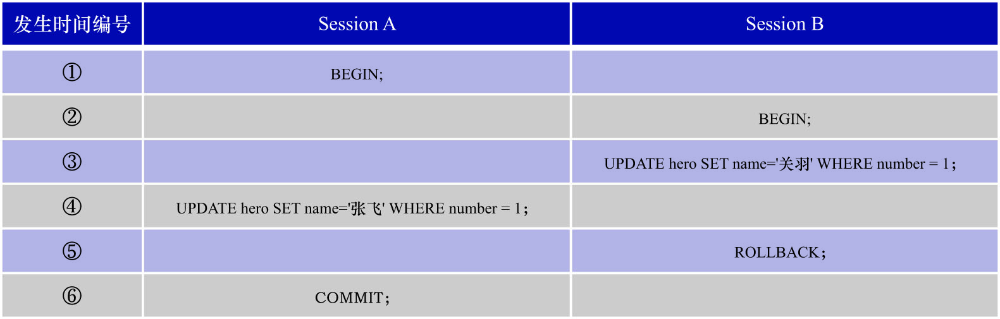

# 1. 脏写(`Dirty Write`)

脏写: **若一个事务修改了另一个未提交事务修改过的数据**,则表示发生了脏写现象.脏写现象简称为P0.

假设现在事务T1和T2并发执行,它们都要访问数据项x(这里可以将数据项x当作1条记录的某个字段).则P0对应的操作执行序列如下:



```
P0: w1[x]...w2[x]...((c1 or a1) and (c2 or a2) in any order)
```

其中:

- `w1[x]`: 表示事务T1修改了数据项x的值
- `w2[x]`: 表示事务T2修改了数据项x的值
- `c1`: 表示事务T1的提交(commit)
- `a1`: 表示事务T1的中止(abort)
- `c2`: 表示事务T2的提交(commit)
- `a2`: 表示事务T2的中止(abort)
- `...`: 表示其他的一些操作

从P0的操作执行序列中可以看出: 事务T2修改了事务T1(事务T1是未提交事务)修改过的数据,因此发生了脏写现象.

**脏写现象可能引发一致性问题**.例如:事务T1和T2要修改x和y这2个数据项(修改不同的数据项就相当于修改不同记录的字段).

该场景下的一致性需求为:**让x的值和y的值始终相同**

现有并发执行事务T1和事务T2,它们的操作执行序列如下:

```
w1[x=1] -> w2[x=2] -> w2[y=2] -> c2 -> w1[y=1] -> c1
```

很显然,事务T2修改了尚未提交的事务T1的数据项x,此时发生了脏写现象.若允许脏写现象的发生,则在事务T1和事务T2全部提交之后,x的值为2,y的值为1,
不符合一致性需求(即:**x的值和y的值不是始终相同的**).

**脏写现象也可能破坏原子性和持久性**.例如:有x和y这2个数据项,它们初始的值都是0.2个并发执行的事务T1和事务T2的操作执行序列如下:

```
w1[x=2] -> w2[x=3] -> w2[y=3] -> c2 -> a1
```

即:

- step1. 事务T1修改了数据项x
- step2. 事务T2修改了数据项x和数据项y
- step3. 事务T2提交
- step4. 事务T1中止

核心问题在于: 当事务T1中止时,需要将该事务对数据库所做的修改回滚到该事务开启时的状态.即:将数据项x的值修改为0.但此时事务T2已经修改过
数据项x并且提交了,若要将事务T1回滚,有2种思路:

- 思路1: 把事务T2对数据库所做的修改进行部分回滚(即: 只回滚事务T2对数据项x所做的修改,而不回滚事务T2对数据项y所做的修改)
  - 这就违反了事务的原子性
- 思路2: 把事务T2对数据库所做的修改全部回滚
  - 若这样做,很明显事务T2已经提交了,该事务对数据库所做的修改应该具有持久性.但这种持久性却因为一个未提交的事务(即事务T1)而被破坏了
  - 这种思路似乎也不太对

注: 就算是回滚,数据项x也只可能`从3回滚到0`,不可能`从3回滚到2 -> 再从2回滚到0`.因为回滚执行的是事务T1的`undo`日志,而操作`将数据项x的值从2修改为3`是
出现在事务T2中的,事务T1的`undo`日志中并没有该操作.

结论: **脏写现象可能引发一致性问题,也可能破坏原子性和持久性**.

示例: 使用InnoDB作为存储引擎时,无论何种隔离级别,都不可能发生脏写现象.因为对同1行的更新会加排他锁(X锁,后边会讲到).此处只能举个例子来演示脏写现象.

开启2个会话,以下称为会话A和会话B.

- 会话A:

```sql
-- 假设会话A中执行的事务为T1
BEGIN;
-- T1对 number=1 这行数据持有排他锁 且此时T1未提交
UPDATE hero SET name = '赵云' WHERE number = 1;
```

- 会话B:

```sql
-- 假设会话B中执行的事务为T2
BEGIN;
-- T2尝试写同一行:会被阻塞在这里等待T1释放锁 
UPDATE hero SET name = '关羽' WHERE number = 1;
/* T2会"卡在"这条语句不返回 直到超时 */
```

超时后,会话B会报错:

```
ERROR 1205 (HY000): Lock wait timeout exceeded; try restarting transaction
```

然后事务T2会被回滚,不会修改数据.

由于T1在提交或回滚之前,T2永远不可能写入更新,所以不会出现"T2覆盖T1的未提交值"的脏写情况.
