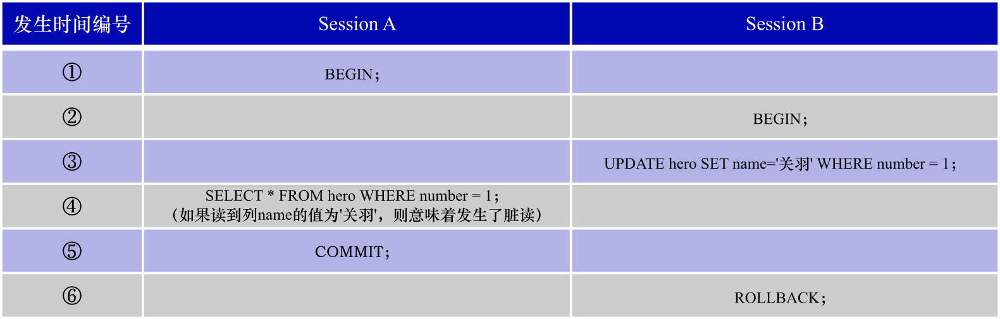

# 2. 脏读(`Dirty Read`)

脏读: **若一个事务读取了另一个未提交事务修改过的数据**,则表示发生了脏读现象.脏读现象简称为P1.



假设现在事务T1和T2并发执行,它们都要访问数据项x.那么P1对应的操作执行序列如下:

```
p1: w1[x]...r2[x]...((c1 or a1) and (c2 or a2) in any order)
```

其中:

- `w1[x]`: 表示事务T1修改了数据项x的值
- `r2[x]`: 表示事务T2读取到了事务T1修改过的数据项x的值
- `c1`: 表示事务T1的提交(commit)
- `a1`: 表示事务T1的中止(abort)
- `c2`: 表示事务T2的提交(commit)
- `a2`: 表示事务T2的中止(abort)
- `...`: 表示其他的一些操作

从P1的操作执行序列中可以看出: 事务T2读取到了事务T1(事务T1是未提交事务)修改过的数据,因此发生了脏读现象.

**脏读现象也可能引发一致性问题**.例如:事务T1和事务T2中,都要访问x和y这2个数据项.

该场景下的一致性需求为:**让x的值和y的值始终相同**.x和y的初始值都是0.

现在并发执行事务T1和事务T2,它们的操作执行序列如下:

```
w1[x=1] -> r2[x=1] -> r2[y=0] -> c2 -> w1[y=1] -> c1
```

很显然事务T2是一个只读事务,依次读取x和y的值.但是由于事务T2读取的数据项x,是事务T1(事务T1是未提交事务)修改过的值,所以导致事务T2读取到的
数据项x和y的情况为: `x = 1, y = 0`.虽然最终数据库状态还是一致的(最终`x = 1, y = 1`),但是事务T2却得到了一个不一致的状态.**数据库的
不一致状态是不应该暴露给用户的**.

P1描述的事务的操作执行序列,是脏读的广义解释.针对脏读还有一种严格解释.为与广义解释进行区分,把脏读的严格解释称为A1.A1对应的操作执行序列如下:

```
A1: w1[x]...r2[x]...(a1 and c2 in any order)
```

其中:

- `w1[x]`: 表示事务T1修改了数据项x的值
- `r2[x]`: 表示事务T2读取到了事务T1修改过的数据项x的值
- `a1`: 表示事务T1的中止(abort)
- `c2`: 表示事务T2的提交(commit)

即:

- 事务T1先修改了数据项x的值
- 事务T2读取到了事务T1(事务T1是未提交事务)修改过的数据项x的值
- 事务T1中止
- 事务T2提交

这表示: **事务T2读取到了一个根本不存在的值**.这是脏读的严格解释.很显然脏读的广义解释是包含严格解释的.

示例: 把读取方的事务隔离级别降为`READ UNCOMMITTED`,才可能读到未提交事务的修改

- 会话A: 修改但不提交

```sql
-- 假设会话A中执行的事务为T1
BEGIN;
UPDATE hero SET country = '吴' WHERE number = 1;
/* 此时事务T1尚未提交,该行数据已经被事务T1修改为 country = '吴',但这个修改尚未被提交 */
```

- 会话B: 将隔离级别设置为`READ UNCOMMITTED`,然后读取

```sql
-- 将事务隔离级别设置为 READ UNCOMMITTED
SET SESSION TRANSACTION ISOLATION LEVEL READ UNCOMMITTED;
-- 假设会话B中执行的事务为T2
BEGIN;
-- 读取到了未提交事务T1的修改
SELECT * FROM hero WHERE number = 1;
```

```
mysql> SELECT * FROM hero WHERE number = 1;
+--------+--------+---------+
| number | name   | country |
+--------+--------+---------+
|      1 | 刘备   | 吴      |
+--------+--------+---------+
1 row in set (0.00 sec)
```

- 会话A: 回滚,以便证明会话B读取到的是未被提交的值

```sql
ROLLBACK;
```

- 会话B: 再次读取

```sql
SELECT * FROM hero WHERE number = 1;
```

```
mysql> SELECT * FROM hero WHERE number = 1;
+--------+--------+---------+
| number | name   | country |
+--------+--------+---------+
|      1 | 刘备   | 蜀      |
+--------+--------+---------+
1 row in set (0.00 sec)
```
