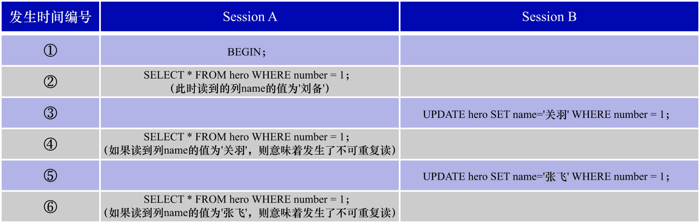

# 3. 不可重复读(`Non-Repeatable Read`)

- 不可重复读:**若一个事务修改了另一个未提交事务读取的数据,则表示发生了不可重复读现象**,或者叫模糊读(`Fuzzy Read`)现象.不可重复读现象简称为`P2`.



假设现在事务T1和事务T2并发执行,它们都要访问数据项x.则P2对应的操作执行序列如下:

```
P2: r1[x]...w2[x]...((c1 or a1) and (c2 or a2) in any order)
```

其中:

- `r1[x]`: 表示事务T1读取了数据项x的值
- `w2[x]`: 表示事务T2修改了数据项x的值
- `c1`: 表示事务T1的提交(commit)
- `a1`: 表示事务T1的中止(abort)
- `c2`: 表示事务T2的提交(commit)
- `a2`: 表示事务T2的中止(abort)
- `...`: 表示其他的一些操作

**不可重复读现象也可能引发一致性问题**.例如: 事务T1和事务T2,都要访问x和y这2个数据项.

该场景下的一致性需求为:**让x的值和y的值始终相同**.x和y的初始值都是0.

现在并发执行事务T1和事务T2,它们的操作执行序列如下:

```
r1[x=0] -> w2[x=1] -> w2[y=1] -> c2 -> r1[y=1] -> c1
```

很显然,事务T1是一个只读事务,依次读取x和y的值.但是由于事务T1在读取数据项x后,事务T2接着修改了数据项x和y的值并提交,之后事务T1再读取数据项y.
这个过程中虽未发生脏写和脏读(首先肯定没有脏写,因为T1是只读事务;其次也没有脏读,因为`r1[y=1]`是在`c2`之后执行的,所以该读取操作并不是读取了
事务T2未提交的修改),但最终事务T1读取的结果为`x = 0, y = 1`.很显然这是一个不一致的状态.**数据库的不一致状态是不应该暴露给用户的**.

P2描述的事务的操作执行序列,是不可重复读的广义解释,针对不可重复读还有严格解释.为与广义解释进行区分,将不可重复读的严格解释称为A2.
A2对应的操作执行序列如下:

```
A2: r1[x]...w2[x]...c2...r1[x]...c1
```

即:

- 事务T1读取了数据项x的值
- 事务T2修改了事务T1(事务T1是未提交事务)读取的数据项x的值
- 事务T2提交
- 事务T1再次读取数据项x的值(此时读取到的数据项x的值和第1次读取到的值不同)
- 事务T1提交

这表示: **事务T1的2次读取,得到的值是不同的**.这是不可重复读的严格解释.很显然不可重复读的广义解释是包含严格解释的.
