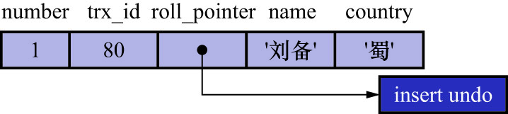
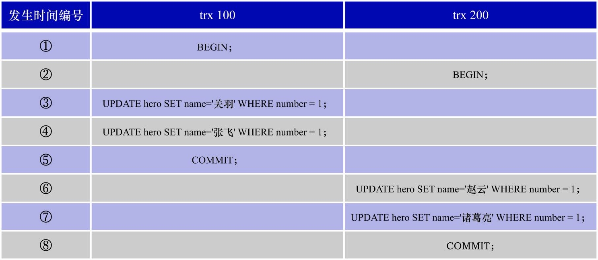
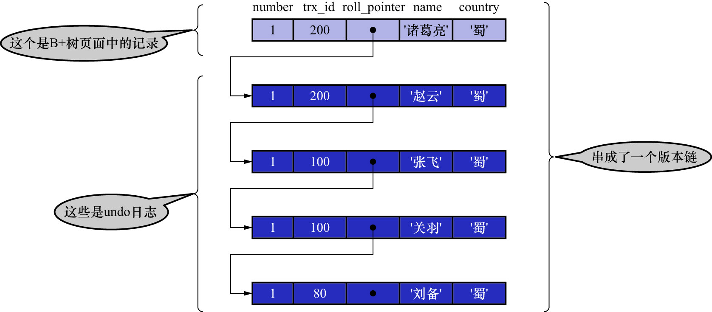

# 1. 版本链

对于使用InnoDB存储引擎的表而言,它的聚簇索引记录中都包含以下2个必要的隐藏列:

- `trx_id`: 1个事务每次对某条聚簇索引记录进行改动时,都会把该事务的事务id赋值给隐藏列`trx_id`
- `roll_pointer`: 每次对某条聚簇索引记录进行改动时,都会把旧的版本写入到`undo`日志中.该隐藏列就相当于1个指针,可以通过该指针找到该记录修改前的信息

注: `row_id`并不是必要的.在创建的表中有主键或有不允许为NULL的UNIQUE键时,都不会包含`row_id`列

比如,表`hero`中现在只包含1条记录:

```
mysql> SELECT * FROM `hero`;
+--------+--------+---------+
| number | name   | country |
+--------+--------+---------+
|      1 | 刘备   | 蜀      |
+--------+--------+---------+
1 row in set (0.00 sec)
```

假设插入该记录的事务id为80,则此刻该条记录的示意图如下:



注: 

实际上`insert undo`日志只在事务回滚时发生作用.当事务提交后,该类型的`undo`日志就没用了,它占用的`Undo Log Segment`也会被系统回收(
即:该`undo`日志占用的`Undo`页面链表要么被重用,要么被释放).虽然真正的`insert undo`日志占用的存储空间被回收了,但是`roll_pointer`
的值并不会被清除.`roll_pointer`属性占用7字节,第1个比特就标记着它指向的`undo`日志的类型.若该比特的值为1,则表示`roll_pointer`指向的
`undo`日志属于`TRX_UNDO_INSERT`大类,即该`undo`日志为`insert undo`日志.

后续内容是为了展示`undo`日志在MVCC中的应用,而非在事务回滚中的应用.因此后续内容的图中都会把`insert undo`日志去掉,大家需要留意.

假设之后2个事务id分别为

- 100的事务
- 200的事务

对该条记录进行UPDATE操作,操作流程如下图示:



即:

```
w1[x] -> w1[x] -> c1 -> w2[x] -> w2[x] -> c2
```

注:

不可以在2个事务中交又更新同1条记录.这种情况下就成了:一个事务修改了另一个未提交事务修改过的数据,即脏写现象.InnoDB使用锁来保证不会出现脏写现象.
即: 

- 在第1个事务更新某条记录前,就会给该条记录加锁
- 另1个事务再次更新该条记录时,就需要等待第1个事务提交,把锁释放之后才可以继续更新

关于锁的更多细节,后续会讲到.

每对记录进行1次改动,都会记录1条`undo`日志.每条`undo`日志也都有一个`roll_pointer`属性(INSERT操作对应的`undo`日志没有该属性,
因为INSERT操作的记录并没有更早的版本).通过该属性可以将这些`undo`日志串成1个链表,如下图示:



**在每次更新该记录后,都会将旧值放到1条`undo`日志中(就算是该记录的1个旧版本),随着更新次数的增多,所有的版本都会被`roll_pointer`属性连接成1个链表,
这个链表称为版本链**.版本链的头节点就是当前记录的最新值.另外,每个版本中还包含生成该版本时对应的事务id.这个信息很重要,之后会**利用该记录的版本链
来控制并发事务访问相同记录时的行为**.这种机制被称为多版本并发控制(Multi-Version Concurrency Control, MVCC).

注:

在UPDATE操作产生的`undo`日志中,只会记录

- 索引列
- 被更新的列

的信息,并不会记录所有列的信息.在上图展示的`undo`日志中,将1条记录的全部列的信息都画出来,是为了方便理解(
因为这样很直观地显示了该版本中各个列的值都是什么).例如,对于`trx_id`为80的那条`undo`日志来说,本身是没有记录`country`列的信息的,那该如何确认
该版本中的`country`列的值?没有更新该列说明该列和上一个版本中的值相同.若上1个版本的`undo`日志也没有记录该列的值,则该列的值与上上个版本中该列的
值相同.若各个版本的`undo`日志都没有记录该列的值,则说明该列从未被更新过,那么`trx_id`为80的那个版本的country列的值就和数据页中的聚簇索引记录
的`country`列的值相同.
