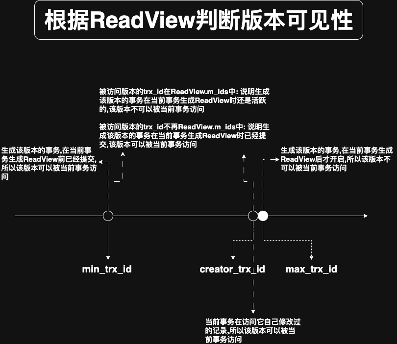

# 0. 概述

- 使用`READ UNCOMMITTED`隔离级别的事务: 因为可以读到未提交事务修改过的记录,所以直接读取记录的最新版本即可
- 使用`SERIALIZABLE`隔离级别的事务: InnoDB的设计者规定,使用加锁的方式来访问记录(加锁会在后续介绍)
- 使用`READ COMMITTED`和`REPEATABLE READ`隔离级别的事务: 都必须保证读到已经提交的事务修改过的记录
  - 即: 若另一个事务已经修改了记录但是尚未提交,则不能直接读取最新版本的记录

这里的核心问题是: 需要判断版本链中的哪个版本是当前事务可见的

为此,InnoDB的设计者提出了`ReadView`(有的地方翻译成"一致性视图")的概念.`ReadView`中主要包含4个比较重要的内容:

- `m_ids`: 在生成`ReadView`时,当前系统中活跃的读写事务的事务id列表
  - 注意: 读事务不分配事务id,读事务的事务id为0.只有在对表中的记录进行改动时(执行`INSERT`/`DELETE`/`UPDATE`这些语句时)才会为事务分配唯一的事务id,否则一个事务的事务id值都默认为0
  - 注意: `m_ids`中不包含当前事务(即生成该`ReadView`的事务)的事务id
- `min_trx_id`: 在生成`ReadView`时,当前系统中活跃的读写事务中最小的事务id,即`m_ids`中的最小值
  - 若`m_ids`为空,则`min_trx_id`的值为: `当前系统中已经分配的最大事务id + 1`,即`max_trx_id`
- `max_trx_id`: 在生成`ReadView`时,系统应分配给下一个事务的事务id值
  - 注意: `max_trx_id`不是`m_ids`中的最大值

    事务id是递增分配的.比如:现有事务id分别为1/2/3的这3个事务,之后事务id为3的事务提交了,则一个新的读事务(注意是读事务,该事务没有被分配事务id)
    在生成`ReadView`时:
    
    - `m_ids`的值: `[1, 2]`
    - `min_trx_id`的值: 1
    - `max_trx_id`的值: 4
  - 可以认为`max_trx_id`是事务何时开启的标志

- `creator_trx_id`: 生成该`ReadView`的事务的事务id

有了`ReadView`概念后,在访问某条记录时,只需按照如下步骤来判断记录的某个版本是否可见即可:

- 若`被访问版本的trx_id == ReadView.creator_trx_id`: 意味着当前事务在访问它自己修改过的记录,所以该版本可以被当前事务访问
- 若`被访问版本的trx_id < ReadView.min_trx_id`: 表示生成该版本的事务,在当前事务生成`ReadView`前已经提交,所以该版本可以被当前事务访问
- 若`被访问版本的trx_id ≥ ReadView.max_trx_id`: 表示生成该版本的事务,在当前事务生成`ReadView`后才开启,所以该版本不可以被当前事务访问
- 若`ReadView.min_trx_id ≤ 被访问版本的trx_id < ReadView.max_trx_id`: 说明生成该版本的事务在当前事务生成`ReadView`时是活跃的,需要进一步判断:
  - `被访问版本的trx_id ∈ ReadView.m_ids`: 说明生成该版本的事务在当前事务生成`ReadView`时还是活跃的,该版本不可以被当前事务访问
  - `被访问版本的trx_id ∉ ReadView.m_ids`: 说明生成该版本的事务在当前事务生成`ReadView`时已经提交,该版本可以被当前事务访问



若某个版本的数据对当前事务不可见,则顺着版本链找到下一个版本的数据,并继续执行上面的步骤来判断记录的可见性.依此类推,直到版本链中的最后一个版本.
若记录的最后一个版本也不可见,则表示该条记录对当前事务完全不可见,查询结果则不包含该记录.

在MySQL中,`READ COMMITTED`与`REPEATABLE READ`隔离级别之间一个非常大的区别就是它们生成`ReadView`的时机不同.此处还是以表`hero`为例来说明:
假设现在表`hero`中只有1条由事务id为80的事务插入的记录:

```
mysql> SELECT * FROM hero;
+--------+--------+---------+
| number | name   | country |
+--------+--------+---------+
|      1 | 刘备   | 蜀      |
+--------+--------+---------+
1 row in set (0.00 sec)
```

接下来看一下在`READ COMMITTED`和`REPEATABLE READ`隔离级别下,生成`ReadVew`的时机不同到底是在哪里不同.
