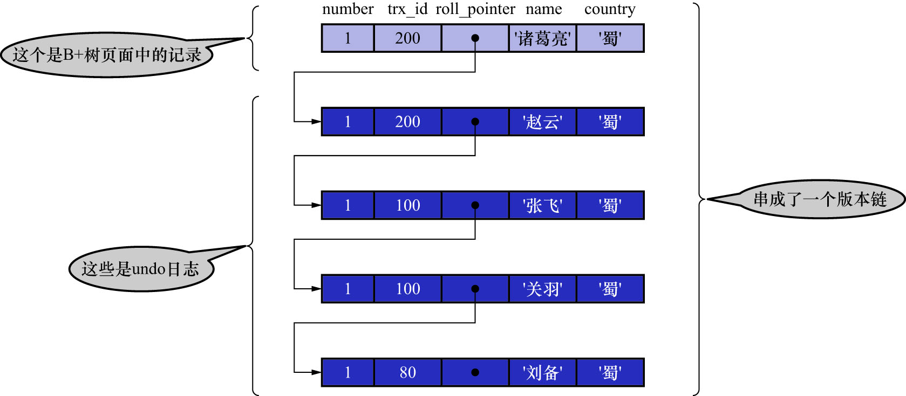

# 1. `READ COMMITED`--每次读取数据前都生成一个`ReadView`

比如:现在系统中有2个事务id分别为

- 100
- 200

的事务正在执行:

```
# Transaction 100
BEGIN;
UPDATE hero SET name = '关羽' WHERE number = 1;
UPDATE hero SET name = '张飞' WHERE number = 1;
```

```
# Transaction 200
BEGIN;
# 更新了一些别的表的记录
```

注: 这2个事务是同时执行的,并不是先后执行

注: 再次强调,在事务执行过程中,只有在第1次真正修改记录时(比如使用INSERT/DELETE/UPDATE语句),才会分配一个唯一的事务id,
且该事务id是递增的.所以在事务id为200的事务中更新一些别的表的记录,目的是为该事务分配事务id.

此时,表`hero`中`number`为1的记录对应的版本链表如下图示:


假设现在有1个使用`READ COMMITTED`隔离级别的新事务开始执行(注意是新事务,不是事务id为100/200的那2个事务):

```
# 使用READ COMMITTED隔离级别的新事务
BEGIN;
# SELECT1: Transaction 100/200均未提交
SELECT * FROM hero WHERE number = 1;    # 得到的列name值为'刘备'
```

SELECT1的执行过程如下:

- 步骤1

    在执行SELECT语句时先生成1个ReadView.该`ReadView`的:
    
    - `m_ids`:`[100,200]`
    - `min_trx_id`: 100
    - `max_trx_id`: 201
    - `creator_trx_id`: 0
    
    这个新开启的事务并没有对任何记录进行任何改动,所以系统并不会为该事务分配唯一的事务id,该事务的事务id是默认的0.这也就导致生成的`ReadView`的
    `creator_trx_id`值为0

- 步骤2

    然后从版本链中挑选可见的记录.从上图中可以看出,最新版本的`name`列的内容是`'张飞'`,该版本的`trx_id`值为100.在`m_ids`列表内,
    因此不符合可见性要求.根据`roll_pointer`跳到下一个版本

- 步骤3

    下一个版本的`name`列的内容是`'关羽'`,该版本的`trx_id`值也为100,也在`m_ids`列表内,因此也不符合要求.继续跳到下一个版本

- 步骤4

    下一个版本的`name`列的内容是`'刘备'`,该版本的`trx_id`值为80,小于`ReadView`中的`min_trx_id`值100,所以该版本是符合要求的.
    最后返回给用户的版本就是这条`name`列为`'刘备'`的记录

之后,把事务id为100的事务进行提交:

```
# Transaction 100
BEGIN;
UPDATE hero SET name = '关羽' WHERE number = 1;
UPDATE hero SET name = '张飞' WHERE number = 1;
COMMIT;
```

然后再到事务id为200的事务中更新表`hero`中`number`为1的记录:

```
# Transaction 200
BEGIN;
# 更新了一些别的表的记录
UPDATE hero SET name = '赵云' WHERE number = 1;
UPDATE hero SET name = '诸葛亮' WHERE number = 1;
```

此时,表`hero`中`number`为1的记录对应的版本链表如下图示:



然后再到刚才使用`READ COMMITTED`隔离级别的事务中执行SELECT2,继续查找这个`number为1`的记录,如下:

```
# 使用READ COMMITTED隔离级别的新事务
BEGIN;
# SELECT1: Transaction 100/200均未提交
SELECT * FROM hero WHERE number = 1;    # 得到的列name值为'刘备'
# SELECT2: Transaction 100已提交,Transaction 200未提交
SELECT * FROM hero WHERE number = 1;    # 得到的列name值为'张飞'
```

SELECT2的执行过程如下:

- 步骤1

    **在执行SELECT语句时又会单独生成1个`ReadView`**.该`ReadView`的:
    
    - `m_ids`: `[200]`
    - 事务id为100的那个事务已经提交了,所以再次生成`ReadView`时就没有它了
    - `min_trx_id`: 200
    - `max_trx_id`: 201
    - `creator_trx_id`: 0

- 步骤2

    从版本链中挑选可见的记录.从上图可以看出,最新版本的`name`列的内容是`'诸葛亮'`,该版本的`trx_id`值为200,在`m_ids`列表内,因此不符合可见性要求.根据`roll_pointer`跳到下一个版本

- 步骤3

    下一个版本的`name`列的内容是`'赵云'`,该版本的`trx_id`值为200,也在`m_ids`列表内,因此也不符合要求.继续跳到下一个版本

- 步骤4

    下一个版本的`name`列的内容是`'张飞'`,该版本的`trx_id`值为100,小于`ReadView`中的`min_trx_id`值200,所以该版本是符合要求的.
    最后返回给用户的版本就是这条`name`列为`'张飞'`的记录

依此类推,若之后事务id为200的事务也提交了,再次在使用`READ COMMITTED`隔离级别的事务中査询表`hero`中`number`值为1的记录时,得到的结果就是`'诸葛亮'`了
具体流程这里就不分析了.

总结: **使用`READ COMMITTED`隔离级别的事务,在每次查询开始时都会生成1个独立的ReadView**
