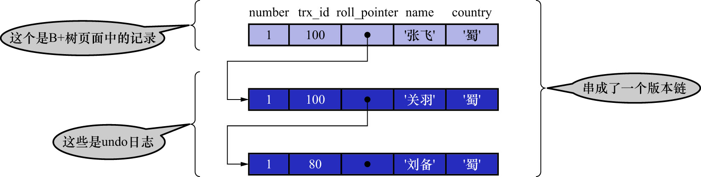
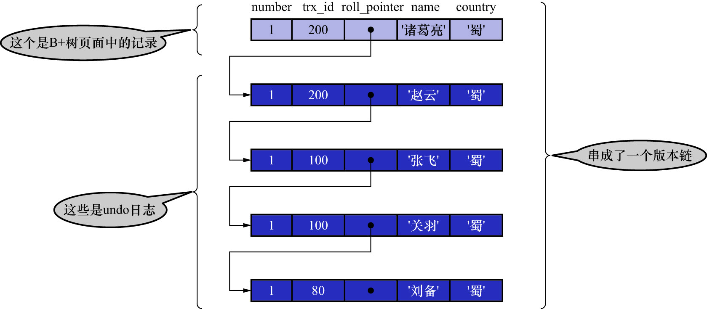

# 2. `REPEATABLE READ`--在第一次读取数据时生成一个`ReadView`

使用`REPEATABLE READ`隔离级别的事务,**只会在第1次执行査询语句时生成1个`ReadView`,之后的査询就不会重复生成`ReadView`了**.

还是用例子来看效果.比如:现在系统中有2个事务id分别为

- 100
- 200

的事务正在执行:

```
# Transaction 100
BEGIN;
UPDATE hero SET name = '关羽' WHERE number = 1;
UPDATE hero SET name = '张飞' WHERE number = 1;
```

```
# Transaction 200
BEGIN;
# 更新了一些别的表的记录
```

注: 这2个事务是同时执行的,并不是先后执行

此时,表`hero`中`number`为1的记录的版本链表如下图示:



假设现在有一个使用`REPEATABLE READ`隔离级别的新事务开始执行:

```
# 使用REPEATABLE READ隔离级别的新事务
BEGIN;
# SELECT1: Transaction 100/200均未提交
SELECT * FROM hero WHERE number = 1;    # 得到的列name值为'刘备'
```

SELECT1的执行过程如下:

- 步骤1

    在执行SELECT语句时会先生成1个`ReadView`.`ReadView`的:
    
    - `m_ids`: `[100,200]`
    - `min_trx_id`: 100
    - `max_trx_id`: 201
    - `creator_trx_id`: 0

- 步骤2

    然后从版本链中挑选可见的记录.从上图中可以看出,最新版本的`name`列的内容是`'张飞'`,该版本的`trx_id`值为100,在`m_ids`列表内,
    因此不符合可见性要求.根据`roll_pointer`跳到下一个版本.

- 步骤3

    下一个版本的`name`列的内容是`'关羽'`,该版本的`trx_id`值也为100,也在`m_ids`列表内,因此也不符合要求,继续跳到下一个版本.

- 步骤4

    下一个版本的`name`列的内容是`'刘备'`,该版本的`trx_id`值为80,小于`ReadView`中的`min_trx_id`值100,所以该版本是符合要求的.
    最后返回给用户的版本就是这条`name`列为`'刘备'`的记录

之后,把事务id为100的事务进行提交:

```
# Transaction 100
BEGIN;
UPDATE hero SET name = '关羽' WHERE number = 1;
UPDATE hero SET name = '张飞' WHERE number = 1;
COMMIT;
```

```
# Transaction 200
BEGIN;
# 更新了一些别的表的记录
UPDATE hero SET name = '赵云' WHERE number = 1;
UPDATE hero SET name = '诸葛亮' WHERE number = 1;
```

此时,表`hero`中`number`为1的记录对应的版本链表如下图示:



然后再到刚才使用`REPEATABLE READ`隔离级别的事务中继续査找这个`number`为1的记录,如下:

```
# 使用REPEATABLE READ隔离级别的新事务
BEGIN;
# SELECT1: Transaction 100/200均未提交
SELECT * FROM hero WHERE number = 1;    # 得到的列name值为'刘备'
# SELECT2: Transaction 100已提交,Transaction 200未提交
SELECT * FROM hero WHERE number = 1;    # 得到的列name值为'刘备'
```

SELECT2的执行过程如下:

- 步骤1

    因为当前事务的隔离级别为`REPEATABLE READ`,而之前在执行SELECT1时已经生成过`ReadView`了,所以此时直接复用之前的`ReadView`:

    - `m_ids`: `[100,200]`
    - `min_trx_id`: 100
    - `max_trx_id`: 201
    - `creator_trx_id`: 0

- 步骤2

    然后从版本链中挑选可见的记录.从上图中可以看出,最新版本的`name`列的内容是`'诸葛亮'`,该版本的`trx_id`值为200,在`m_ids`列表内,因此不符合可见性要求.
    根据`roll_pointer`跳到下一个版本

- 步骤3

    下一个版本的`name`列的内容是`'赵云'`,该版本的`trx id`值为200,也在`m_ids`列表内,因此也不符合要求,继续跳到下一个版本

- 步骤4

    下一个版本的`name`列的内容是`'张飞'`,该版本的`trx_id`值为100,而`m_ids`列表中是包含值为100的事务id的,因此该版本也不符合要求.
    同理,下一个`name`列的内容是`'关羽'`的版本也不符合要求,继续跳到下一个版本

- 步骤5

    下一个版本的`name`列的内容是`'刘备'`,该版本的`trx_id`值为80,小于ReadView中的`min_trx_id`值100,所以这个版本是符合要求的.
    最后返回给用户的版本就是这条`name`列为`'刘备'`的记录

即: 在`REPEATABLE READ`隔离级别下,事务的2次査询得到的结果是一样的,记录的`name`列值都是`'刘备'`.这就是可重复读的含义.
若之后再把事务id为200的记录进行提交,然后再到刚才使用`REPEATABLE READ`隔离级别的事务中继续査找这个`number为1的记录,得到的结果还是`'刘备'`

另外,在第18章中介绍`START TRANSACTION`语法时提到过[`WITH CONSISTENT SNAPSHOT`修饰符](https://github.com/rayallen20/howDoesMySQLWork/blob/main/%E7%AC%AC18%E7%AB%A0%20%E4%BB%8E%E7%8C%AB%E7%88%B7%E5%80%9F%E9%92%B1%E8%AF%B4%E8%B5%B7--%E4%BA%8B%E5%8A%A1%E7%AE%80%E4%BB%8B/3.%20MySQL%E4%B8%AD%E4%BA%8B%E5%8A%A1%E7%9A%84%E8%AF%AD%E6%B3%95/1.%20%E5%BC%80%E5%90%AF%E4%BA%8B%E5%8A%A1.md).在隔离级别为`REPEATABLE READ`时,
若使用`START TRANSACTION WITH CONSISTENT SNAPSHOT`语句开启事务,会在执行该语句后立即生成1个`ReadView`,而不是在执行第1条`SELECT`语句时才生成.

