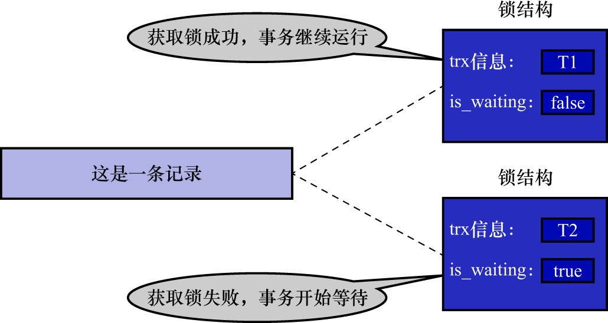
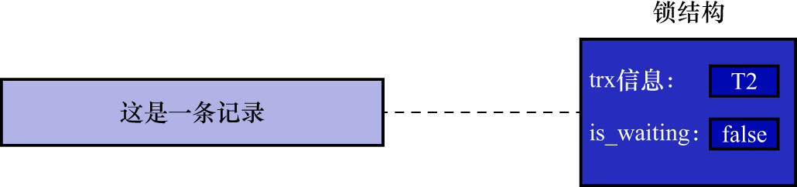

# 1. 写-写情况

前面章节说过,在写-写情况下会发生脏写的现象,任何一种隔离级别都不允许这种现象的发生.所以在多个未提交事务相继对一条记录进行改动时,需要让它们排队执行.
这个排队的过程其实是通过为该记录加锁来实现的.这个"锁"本质上是一个内存中的结构,在事务执行之前本来是没有锁的,也就是说一开始是没有锁结构与记录进行关联的,
如下图示:

当一个事务想对这条记录进行改动时,要先检查内存中是否存在与这条记录关联的锁结构,若不存在,则会在内存中生成一个锁结构与该条记录关联.
比如,事务T1要对该条记录进行改动,就需要生成一个锁结构与之关联,如下图示:

锁结构中有很多信息,为方便理解,现在只把2个比较重要的属性拿出来:

- `trx`信息: 表示该锁结构是与哪个事务关联的
- `is_waiting`: 表示当前事务是否在等待

如上图示,在事务T1改动这条记录前,就生成了一个锁结构与该记录关联.因为之前没有别的事务为这条记录加锁,所以`is_waiting`属性值为`false`.
这种情况称为**获取锁成功**或**加锁成功**,然后就可以继续执行操作了.

在事务T1提交之前,另一个事务T2也想对该记录进行改动,那么T2也要要先检查内存中是否存在与这条记录关联的锁结构.在发现有一个锁结构与之关联后,
T2也生成了一个锁结构与这条记录关联,不过锁结构的`is_waiting`属性值为`true`,表示需要等待.这种情况称为**获取锁失败**,或者**加锁失败**,
或者**没有成功地获取到锁**.如下图示:

事务T1提交后,会把该事务生成的锁结构释放掉,然后检测是否嗨存在与该记录关联的锁结构.发现事务T2还在等待获取锁,所以把事务T2对应的锁结构的
`is_waiting`属性设置为`false`,然后唤醒该事务对应的线程,让T2继续执行.此时事务T2就算获取到锁了.如下图示:

总结:

- 获取锁成功/加锁成功: 在内存中生成了对应的锁结构,且锁结构的`is_waiting`属性值为`false`,即事务可以继续执行操作
  - 当然并不是所有的加锁操作都需要生成对应的锁结构,有时候会有一种"加隐式锁"的说法
  - 隐式锁并不会生成实际的锁结构,但是仍然可以起到保护记录的作用
  - 为记录添加隐式锁的情况也认为是获取锁成功(后文会详细讲解隐式锁)
- 获取锁失败/加锁失败/没有获取到锁: 在内存中生成了对应的锁结构,但是锁结构的`is_waiting`属性值为`true`,即事务需要等待,不可以继续执行操作
- 不加锁: 不需要在内存中生成对应的锁结构,可以直接执行操作
  - 不包括为记录加隐式锁的情况

注: 这里只是对锁结构做了一个非常简单的描述,后面会详细讲解锁结构
