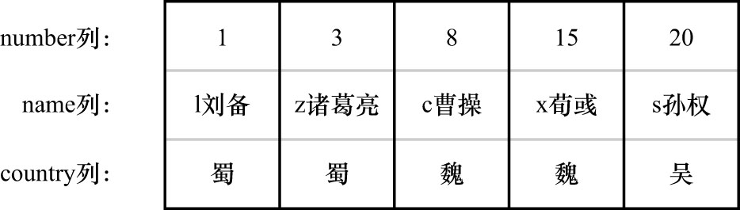

# 0. 准备工作

行锁,也称为记录锁,顾名思义就是在记录上加的锁.InnoDB的设计者把行锁分成了各种类型,即使对同一条记录加行锁,若类型不同,则起到的功效也是不同的.
为了故事的顺利发展,我们还是先将之前讲MVCC时用到的表抄一遍:

```sql
CREATE TABLE hero (
    number INT,
    name VARCHAR(100),
    country varchar(100),
    PRIMARY KEY (number),
    KEY idx_name (name)
) Engine=InnoDB CHARSET=utf8mb4;
```

使用该表存储三国时的英雄,向这个表里插入几条记录:

```sql
INSERT INTO hero VALUES
    (1, 'l刘备', '蜀'),
    (3, 'z诸葛亮', '蜀'),
    (8, 'c曹操', '魏'),
    (15, 'x荀彧', '魏'),
    (20, 's孙权', '吴');
```

该表现在数据如下:

```
mysql> SELECT * FROM hero;
+--------+------------+---------+
| number | name       | country |
+--------+------------+---------+
|      1 | l刘备      | 蜀      |
|      3 | z诸葛亮    | 蜀      |
|      8 | c曹操      | 魏      |
|     15 | x荀彧      | 魏      |
|     20 | s孙权      | 吴      |
+--------+------------+---------+
5 rows in set (0.01 sec)
```

注: 之所以要在名字前面加上一个字母,是因为我们采用`utf8mb4`字符集,该字符集并没有对应的按照汉语拼音进行排序的比较规则,
也就是说`'刘备'`/`'曹操'`/`'孙权'`这几个字符串的排序并不是按照它们汉语拼音进行排序的,为便于理解,所以在汉字前边加上了汉字对应的拼音的第一个字母,
这样在排序时就是按照汉语拼音进行排序了.

另外,这里故意把各条记录`number`列的值搞得很分散,后边会用到

`hero`表中的聚簇索引的示意图如下:



图中把B+树的索引结构做了一个超级简化,只把聚簇索引叶子节点中的记录给拿了出来,因为这里只是想强调:**聚簇索引中的记录是按照主键大小排序的**,
并且省略掉了聚簇索引中的隐藏列.

现在准备工作做完了,下面来看看都有哪些常用的行锁类型.
