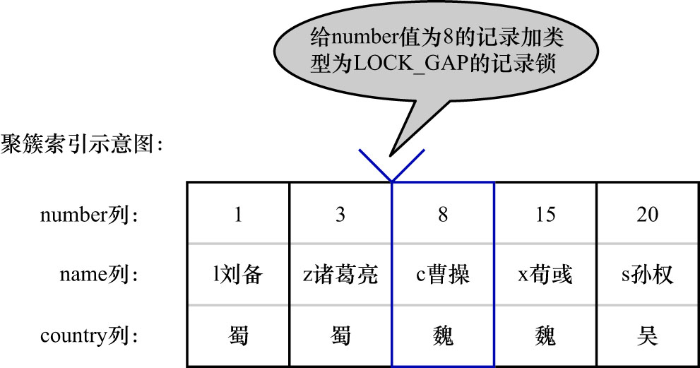
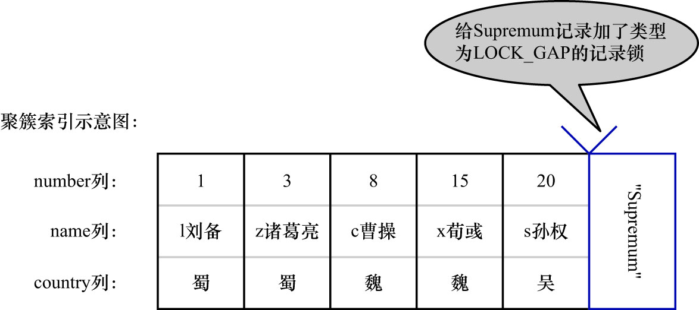

# 2. `Gap Lock`

前面讲过,MySQL在`REPEATABLE READ`隔离级别下是可以解决幻读问题的,解决方案有2种:

- 使用MVCC方案解决
- 使用加锁方案解决

但是在使用加锁方案解决时有个大问题: 事务在第一次执行读取操作时,那些幻影记录尚不存在,无法给这些幻影记录加上`LOCK_REC_NOT_GAP`锁.
InnoDB的设计者提出了一种称为`Gap Lock`的锁,官方的类型名称为: `LOCK_GAP`,也可以简称为gap锁

比如: 把`number`值为8的那条记录加一个gap锁的示意图如下:

如图,为`number`值为8的记录加了gap锁,这表示不允许别的事务**在`number`值为8的记录前边的间隙**插入新记录,其实就是`number列的值 ∈ (3, 8)`
这个区间的新记录是不允许立即插入的.

比如: 有另外一个事务再想插入一条`number`值为4的新记录:

- step1. 它定位到该条新记录的下一条记录的`number`值为8
- step2. 这条`number`值为8的记录上有一个gap锁,所以就会阻塞插入操作
- step3. 直到拥有这个gap锁的事务提交了之后,`number列的值 ∈ (3, 8)`中的新记录才可以被插入

gap锁**仅仅是为了防止插入幻影记录而提出的**,虽然有:

- 共享gap锁
- 独占gap锁

这样的说法,但是它们起到的作用都是相同的.且如果对一条记录加了gap锁(无论是共享gap锁还是独占gap锁),
并不会限制其他事务对这条记录加`LOCK_REC_NOT_GAP`锁或者继续加gap锁.再强调一遍,gap锁的作用**仅仅是为了防止插入幻影记录**.

注: 其实gap锁只是一个逻辑上的标记(InnoDB锁管理器中的逻辑锁元数据),并不是OS/硬件层面的真正的锁

给一条记录加了gap锁只是不允许其他事务向这条记录前边的间隙插入新记录,那对于最后一条记录之后的间隙,即`hero`表中`number`值为20的记录之后的
间隙该怎么办?即: 给哪条记录加gap锁才能阻止其他事务插入`number列的值 ∈ (20, +∞)`这个区间的新记录?这时就用到讲数据页时介绍的2条伪记录了:

- `Infimum`记录: 表示该页面中最小的记录
- `Supremum`记录: 表示该页面中最大的记录

为了实现阻止其他事务插入`number列的值 ∈ (20, +∞)`这个区间的新记录,可以给索引中的最后一条记录(即`number`值为20的那条记录)所在页面的
`Supremum`记录加上一个gap锁,示意图如下:

这样就可以阻止其他事务插入`number列的值 ∈ (20, +∞)`这个区间的新记录.为理解方便,之后的索引示意图中都会把`Supremum`记录画出来
