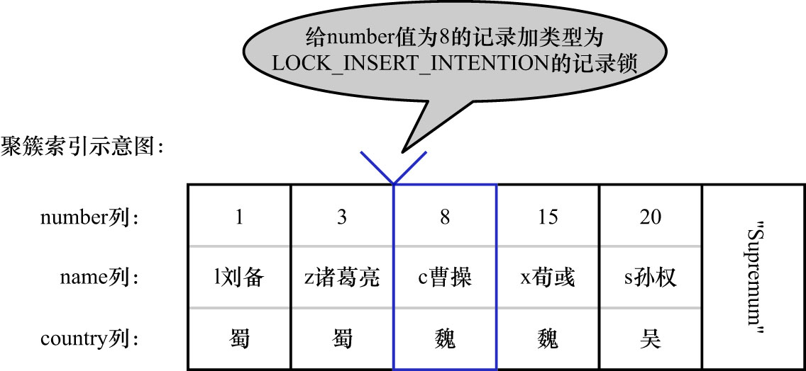
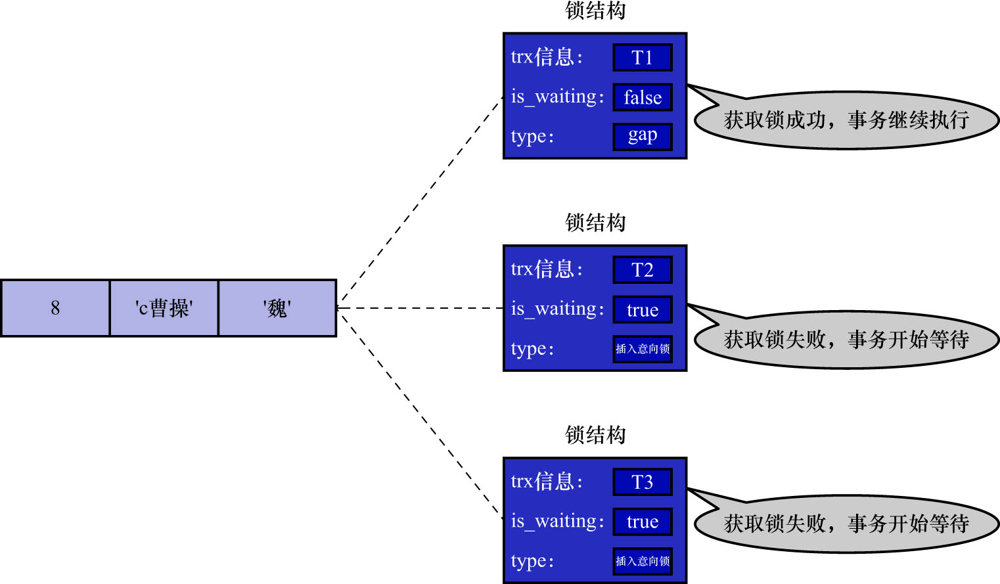

# 4. `Insert Intention Lock`

一个事务在插入一条记录时,需要判断插入位置是否被别的事务加了gap锁(`next-key`锁也包含gap锁,后边就不强调了).如果有的话,插入操作需要等待,
直到持有gap锁的那个事务提交.

但是InnoDB的设计者规定: **事务在等待时也需要在内存中生成一个锁结构,表明有事务想在某个间隙中插入新记录,但是现在处于等待状态**.InnoDB的设计者
把这种类型的锁命名为`Insert Intention Lock`,官方的类型名称为: `LOCK_INSERT_INTENTION`,也可以称为插入意向锁

比如: 把`number`值为8的那条记录加一个插入意向锁的示意图如下:

为彻底理解插入意向锁的功能,这里举个例子然后画个图表示一下.比如:

- 现在事务T1为`number`值为8的记录加了一个gap锁
- 然后事务T2和事务T3分别想向`hero`表中插入`number`值分别为4/5的2条记录

所以现在为`number`值为8的记录加的锁的示意图如下:

注: 图中在锁结构中又新添了一个`type`属性,表明该锁的类型.后续介绍InnoDB存储引擎中的锁结构

注: 可以看出,插入意向锁和gap锁一样,都是加在间隙的右边界上的

从图中可以看到:

- 由于事务T1持有gap锁,所以事务T2和事务T3需要生成一个插入意向锁的锁结构并且处于等待状态
- 当事务T1提交后,会把它获取到的锁都释放掉,这样事务T2和事务T3就能获取到对应的插入意向锁了
  - 本质上就是把插入意向锁对应锁结构的`is_waiting`属性改为`false`
- 事务T2和事务T3之间也并不会相互阻塞,它们可以同时获取到`number`值为8的插入意向锁,然后执行插入操作
  - 事实上插入意向锁并不会阻止别的事务继续获取该记录上任何类型的锁(插入意向锁就是这么鸡肋)
