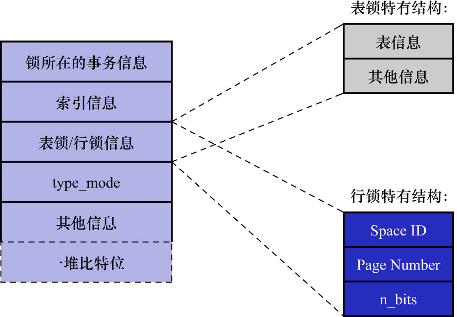

# 1. 内存结构讲解

前文说过,**对一条记录加锁的本质就是在内存中创建一个锁结构与该条记录关联(隐式锁除外)**.那么,一个事务对多条记录加锁时,是不是就要创建多个锁结构呢?

比如事务T1要执行下面这个语句:

```sql
-- 事务T1
SELECT * FROM hero LOCK IN SHARE MODE;
```

很显然,这条语句需要为`hero`表中的所有记录进行加锁,那是不是需要为每条记录都生成一个锁结构呢? 其实理论上创建多个锁结构没问题,反而更容易理解,
但是谁知道你在一个事务里想对多少记录加锁呢,如果一个事务要获取10000条记录的锁,要生成10000个这样的结构就太亏了.所以InnoDB的设计者为节约资源,
决定在对不同记录加锁时,如果符合下边这些条件:

- 在同一个事务中进行加锁操作
- 被加锁的记录在同一个页面中
- 加锁的类型是一样的
- 等待状态是一样的

则这些记录的锁就可以被放到1个锁结构中.InnoDB存储引擎中的锁结构如下图示:



锁结构中的各种信息的含义如下:

- 锁所在的事务信息: 无论是表锁还是行锁,**1个锁属于1个事务**,这里记载着该锁对应的事务信息

注: 实际上这个"锁所在的事务信息"在内存结构中只是一个指针,并不会占用太大的内存空间,通过指针可以找到内存中关于该事务的更多信息,比如事务id.
下边介绍的"索引信息"其实也是指针

- 索引信息: 对于行锁来说,需要记录加锁的记录属于哪个索引
- 表锁/行锁信息:表级锁结构和行级锁结构在这个位置的内容是不同的,具体表现为:
  - 表锁记载着这是对哪个表加的锁,还有其他的一些信息
  - 行锁记载了以下3个重要信息:
    - Space ID: 记录所在的表空间
    - Page Number: 记录所在的页号
    - `n_bits`: 
      - 对于行锁来说,1条记录对应着1个比特
      - 一个页面中包含很多条记录,用不同的比特来区分到底是为哪一条记录加了锁
      - 为此在行锁结构的末尾放置了一堆比特,这个`n_bits`属性表示使用了多少比特
      - 简单理解: 这个`n_bits`记录的就是图中的"一堆比特位"的比特位数量

注: 并不是该页面中有多少记录,`n_bits`属性的值就是多少.为了之后在页面中插入新记录时不会导致重新分配锁结构,`n_bits`的值一般都比页面中记录条数多一些

- `type_mode`: 这是一个32比特的数,被分成3个部分:
    - `lock_mode`
    - `lock_type`
    - `rec_lock_type`

    如下图示:

    

    各部分的含义如下:
    
    - `lock_mode`: 锁模式,占用低4比特,可选值如下:
        - `LOCK_IS`(十进制的0): 表示共享意向锁,即IS锁
        - `LOCK_IX`(十进制的1): 表示独占意向锁,即IX锁
        - `LOCK_S`(十进制的2): 表示共享锁,即S锁
        - `LOCK_X`(十进制的3): 表示独占锁,即X锁
        - `LOCK_AUTO_INC`(十进制的4): 表示`AUTO-INC`锁
    
      注:
    
      在InnoDB存储引擎中:
    
      - `LOCK_IS`/`LOCK_IX`/`LOCK_AUTO_INC`都算是表锁的模式
      - `LOCK_S`和`LOCK_X`既可以算是表锁的模式,也可以是行锁的模式

    - `lock_type`: 锁类型,占用第5-8位,不过现阶段只用到了第5比特和第6比特:
        - `LOCK_TABLE`(十进制的16): 当第5比特设置为1时,表示表级锁
        - `LOCK_REC`(十进制的32): 当第6比特设置为1时,表示行级锁

    - `rec_lock_type`(行锁的具体类型)使用其余的位来表示.只有在`lock_type`的值为`LOCK_REC`(即只有在该锁为行锁)时,才会细分出更多的类型:
        - `LOCK_ORDINARY`(十进制的0,注意是0不是256): 表示`next-key`锁
        - `LOCK_GAP`(十进制的512): 当第10比特设置为1时,表示gap锁
        - `LOCK_REC_NOT_GAP`(十进制的1024): 当第11比特设置为1时,表示`LOCK_REC_NOT_GAP`锁
        - `LOCK_INSERT_INTENTION`(十进制的2048): 当第12比特设置为1时,表示插入意向锁
        - 其他的类型: 还有一些不常用的类型,这里就不多说了

    - `is_waiting`属性: InnoDB的设计者不想浪费内存,所以把`is_waiting`属性也放到了`type_mode`这个32位的字段中
        - `LOCK_WAIT`(十进制的256):
            - 当第9比特设置为1时,表示`is_waiting`为`true`,即当前事务尚未获取到锁,处在等待状态
            - 当第9比特设置为0时,表示`is_waiting`为`false`,即当前事务获取锁成功

- 其他信息: 为更好地管理系统运行过程中生成的各种锁结构,而设计了各种哈希表和链表.为了简化讨论,忽略这部分信息
- 一堆比特位: 如果是行级锁结构的话(即`lock_type`的值为`LOCK_REC`),则在该锁结构末尾还放置了一堆比特位.比特位的数量使用前面提到的`n_bits`属性来表示

前文在讲InnoDB记录结构时说过,页面中的每条记录在记录头信息中都包含一个[`heap_no`属性](https://github.com/rayallen20/howDoesMySQLWork/blob/main/%E7%AC%AC5%E7%AB%A0%20%E7%9B%9B%E6%94%BE%E8%AE%B0%E5%BD%95%E7%9A%84%E5%A4%A7%E7%9B%92%E5%AD%90--InnoDB%E6%95%B0%E6%8D%AE%E9%A1%B5%E7%BB%93%E6%9E%84/3.%20%E8%AE%B0%E5%BD%95%E5%9C%A8%E9%A1%B5%E4%B8%AD%E7%9A%84%E5%AD%98%E5%82%A8/1.%20%E8%AE%B0%E5%BD%95%E5%A4%B4%E4%BF%A1%E6%81%AF/4.%20heap_no.md):

- `Infimum`记录的`heap_no`值为0
- `Supremum`记录的`heap_no`值为1
- 之后每申请一条新记录占用的存储空间,`heap_no`值就增1

锁结构最后的一堆比特位对应着一个页面中的记录,1个比特位映射1个`heap_no`,不过为了编码方便,映射方式有点怪,如下图示:


注: 这么怪的映射方式纯粹是为了编写代码方便,这里只需要知道1个比特位映射到页内的1条记录即可
