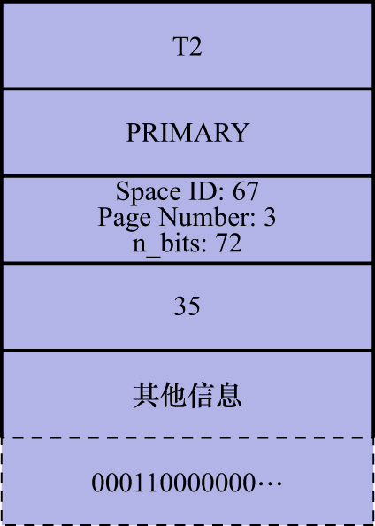
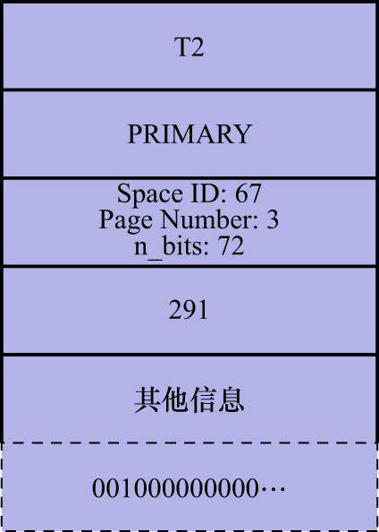

# 2. 举例说明

这里再重复一下`hero`表中的数据:

```
mysql> SELECT * FROM hero;
+--------+------------+---------+
| number | name       | country |
+--------+------------+---------+
|      1 | l刘备      | 蜀      |
|      3 | z诸葛亮    | 蜀      |
|      8 | c曹操      | 魏      |
|     15 | x荀彧      | 魏      |
|     20 | s孙权      | 吴      |
+--------+------------+---------+
5 rows in set (0.01 sec)
```

比如,现在有T1和T2这2个事务想对`hero`表中的记录进行加锁.`hero`表中的记录比较少(只有5条),假设这些记录都存储在:

- 表空间号为67
- 页号为3的页面上

若T1想为`number`值为15的这条记录加S型`LOCK_REC_NOT_GAP`锁,则在对记录加行级锁之前,需要先加表级别的IS锁,也就是会生成一个表级锁的内存结构.
不过这里并不关心表级锁,所以直接忽略掉.接下来分析一下生成行级锁结构的过程:

1. 事务TI要进行加锁,所以锁结构的"锁所在的事务信息"指的就是T1
2. 直接对聚簇索引进行加锁,所以索引信息指的其实就是PRIMARY索引
3. 由于是行级锁,所以接下来需要记录的是3个重要的信息(即锁结构示意图中的表锁/行锁信息部分)
    - Space ID: 表空间号为67
    - Page Number: 页号为3
    - `n_bits`: hero表中现在只插入了5条用户记录,但是在初始分配比特时会多分配一些,这主要是为了在之后新增记录时不用频繁分配比特

`n_bits`的计算公式如下:

```
n_bits = ( 1 + ( ( n_recs + LOCK_PAGE_BITMAP_MARGIN ) / 8 ) ) * 8
```

其中:

- `n_recs`: 指的是当前页面中一共有多少条记录(包含伪记录以及在垃圾链表中的记录)
  - 比如现在`hero`表一共有7条记录(5条用户记录和2条伪记录),所以`n_recs`的值就是7
- `LOCK_PAGE_BITMAP_MARGIN`: 是一个固定的值64

所以本次加锁生成的锁结构的`n_bits`值为:

```
n_bits = ( 1 + ( ( 7 + 64 ) / 8 ) ) * 8 = 72
```

`type_mode`是由3部分组成的:

- `lock_mode`: 这是对记录加S锁,它的值为`LOCK_S`(十进制的2)
- `lock_type`: 这是对记录进行加锁,也就是行锁,所以它的值为`LOCK_REC`(十进制的32)
- `rec_lock_type`: 这是对记录加类型为`LOCK_REC_NOT_GAP`的锁(十进制的1024)
- 由于当前没有其他事务对该记录加锁,所以应当获取到锁,即`LOCK_WAIT`代表的二进制位应该是0(十进制的0)

综上所述,此次加锁的`type_mode`的值为:

```
type_mode = LOCK_S | LOCK_REC | LOCK_REC_NOT_GAP (如果按照type_mode的示意图,则应该是 LOCK_REC_NOT_GAP | LOCK_REC | LOCK_S)
```
也就是：

```
type_mode = 2 | 32 | 1024 = 1058
```

注: 这里的`|`并不是按位或运算,而是简单的数学加法(因为这里每个字段所使用的比特都是不重叠的,所以结果上和加法是一样的)

- 其他信息: 略
- 一堆比特位: 因为`number`值为15的记录`heap_no`值为5,根据之前列举的比特位和`heap_no`的映射图来看,是第1个字节从低位往高位数第6个比特位被置为1,如下图示:


综上所述,事务T1为`number`值为15的记录加锁时,生成的锁结构如下图示:


若T2想对`number`值为3/8/15的这3条记录加X型的`next-key`锁,在对记录加行级锁之前,需要先加表级别的IX锁,也就是会生成一个表锁的内存结构.
不过这里不关心表锁,所以就直接忽略掉了.

这里再重复一下多条记录的锁就可以被放到1个锁结构中的条件:

- 在同一个事务中进行加锁操作
- 被加锁的记录在同一个页面中
- 加锁的类型是一样的
- 等待状态是一样的

现在T2要为这3条记录加锁:

- `number`为3/8的2条记录由于没有其他事务加锁,所以T2可以成功获取到相应记录的X型`next-key`锁,也就是生成的锁结构的`is_waiting`属性值为`false`
- `number`为15的记录已经被T1加了S型`LOCK_REC_NOT_GAP`锁,T2不能获取到该记录的X型`next-key`锁,也就是生成的锁结构的`is_waiting`属性值为`true`

因为等待状态不相同,所以此时会生成2个锁结构.这2个锁结构中相同的属性如下:

- 事务T2要进行加锁,所以锁结构的"锁所在的事务信息"指的就是T2
- 直接对聚簇索引进行加锁,所以索引信息指的其实就是PRIMARY索引
- 由于是行锁,所以接下来需要记录3个重要的信息
  - `Space ID`: 表空间号为67
  - `Page Number`: 页号为3
  - `n_bits`: 该属性生成策略和事务T1的相同,该属性的值为72

`type_mode`是由3部分组成的:
  
- `lock_mode`: 这是对记录加X锁,它的值为`LOCK_X`(十进制的3)
- `lock_type`: 这是对记录进行加锁,也就是行锁,所以它的值为`LOCK_REC`(十进制的32)
- `rec_lock_type`: 这是对记录加`next-key`锁,也就是类型为`LOCK_ORDINARY`的锁(十进制的0)

这2个锁结构中不同的属性如下:

- 为`number`值为3/8的2条记录生成的锁结构:
  - `type_mode`值

    由于可以获取到锁,所以`is_waiting`属性值为`false`,也就是`LOCK_WAIT`代表的二进制位被置0,所以:
    
    ```
    type_mode = LOCK_X | LOCK_REC |LOCK_ORDINARY (如果按照type_mode的示意图,则应该是 LOCK_ORDINARY | LOCK_REC | LOCK_X)
    也就是
    type_mode = 3 | 32 | 0 = 35
    ```

  - 一堆比特位: 因为`number`值为3/8的记录对应的`heap_no`值分别为3/4,根据前面列举的比特和`heap_no`的映射图来看,应该是第1个字节从低位往高位数第4/5比特被置为1,如下图示

    

    综上所述,事务T2为`number`值为3/8这2条记录加锁时,生成的锁结构如下图示:

    

- 为`number`值为15的记录生成的锁结构:
  - `type_mode`值

    由于不能获取到锁,所以`is_waiting`属性值为`true`,也就是`LOCK_WAIT`代表的二进制位被置1,所以:
    
    ```
    type_mode = LOCK_X | LOCK_REC | LOCK_ORDINARY | LOCK_WAIT (如果按照type_mode的示意图,则应该是 LOCK_ORDINARY | LOCK_WAIT | LOCK_REC | LOCK_X)
    也就是
    type_mode = 3 | 32 | 0 | 256 = 291
    ```
    
    - 一堆比特位: 因为`number`值为15的记录对应的`heap_no`值为5,根据前面列举的比特和`heap_no`的映射图来看,应该是第1个字节从低位往高位数第6比特被置为1,如下图示:

    

    综上所述,事务T2为`number`值为15的记录加锁时,生成的锁结构如下图示:

    

综上所述:

- 事务T1先获取`number`值为15的S型`LOCK_REC_NOT_GAP`锁
- 然后事务T2获取`number`值为3/8/15的X型`next-key`锁

整个过程共需要生成3个行锁结构

注: 事务T2在对`number`值分别为3/8/15的这3条记录加锁的场景中,是按照如下顺序的:

- 先对`number`值为3的记录加锁
- 再对`number`值为8的记录加锁
- 最后对`number`值为15的记录加锁

若一开始就对`number`值为15的记录加锁: 则该事务在为`number`值为15的记录生成一个锁结构后,直接进入等待状态,就不再为`number`值为3/8的两条记录生成锁结构了.
在事务T1提交后会把在`number`值为15的记录上获取的锁释放掉,然后事务T2就可以获取该记录上的锁,这时再对`number`值为3/8的两条记录加锁时,就可以复用
之前为`number`值为15的记录加锁时生成的锁结构了(也就是说这种情况下,T2的整个过程只需要生成1个行锁结构)
