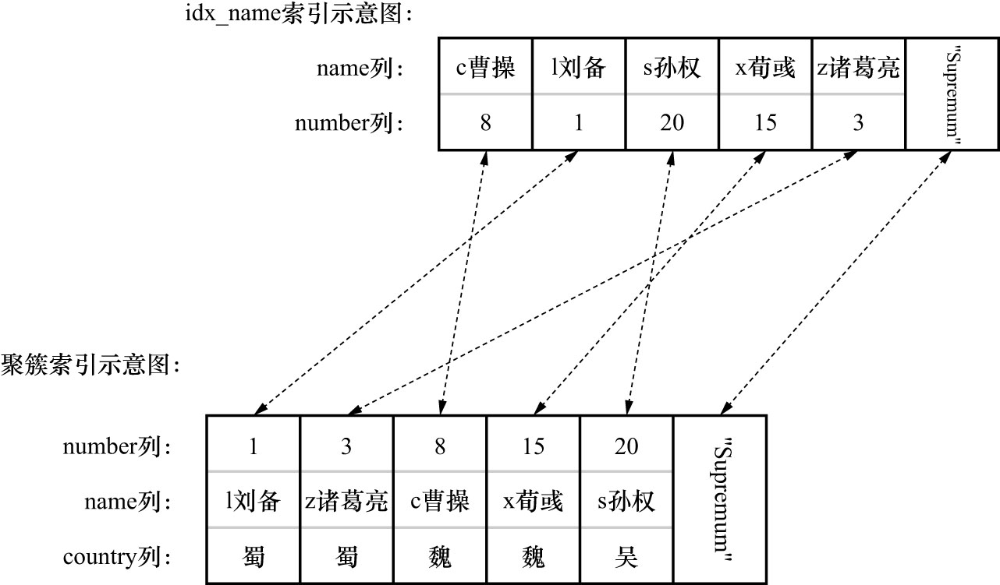

# 0. 准备工作

给`hero`表的`name`列建一个索引:

```sql
ALTER TABLE hero ADD INDEX idx_name (name);
```

现在`hero`表就有了2个索引(1个二级索引,1个聚簇索引),如下图示:



这里把语句分为4大类:

- 普通的SELECT语句
- 锁定读的语句
- 半一致性读的语句
- INSERT语句

下面分别详细讨论
