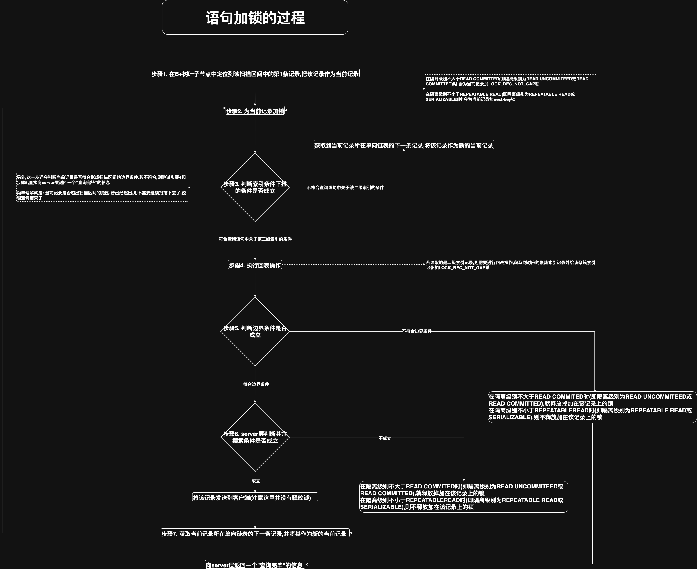

# 1. 具体过程

在了解了匹配模式和唯一性搜索的概念后,就要着手分析语句加锁的过程了.其实,"XXX语句该为哪些记录加什么锁"本身就是个伪命题.因为
语句在执行过程中可能需要访问多个扫描区间中的记录,在为这些记录加锁时也会受到很多条件的制约,比如以下制约:

- 事务的隔离级别
- 语句执行时使用的索引类型,如:
  - 聚簇索引
  - 唯一二级索引
  - 普通二级索引
- 是否是精确匹配
- 是否是唯一性搜索
- 具体执行的语句类型,如:
  - SELECT
  - INSERT
  - UPDATE
  - DELETE

由于在语句的执行过程中,对记录进行加锁的影响因素太多了,所以先分析在一般情况下,在语句执行过程中对记录进行加锁的过程,再列举一些比较特殊的情况进行分析

注意: 事务在执行过程中所获取的锁一般在事务提交或者回滚时才会释放,但是**在隔离级别不大于`READ COMMITTED`时(即隔离级别为`READ COMMITTED`或`READ UNCOMMITTED`),
在某些情况下也会提前将一些不符合搜索条件的记录上的锁释放掉**.这主要是考虑在较低的隔离级别中,可以允许事务更大程度地并发执行.这一点在稍后会强调

把锁定读的执行看成是**依次读取若干个扫描区间中的记录**(若是全表扫描,就把锁定读看成是在聚簇索引的扫描区间为`(-∞, +∞)`中的扫描操作),在一般情况下,
读取某个扫描区间中记录的过程如下所示:

- 步骤1. 快速在B+树叶子节点中定位到该扫描区间中的第1条记录,把该记录作为当前记录
- 步骤2. 为当前记录加锁

    一般情况下,对于锁定读的语句: 
    
    - 在隔离级别不大于`READ COMMITTED`(即隔离级别为`READ UNCOMMITEED`或`READ COMMITTED`)时,会为当前记录加`LOCK_REC_NOT_GAP`锁
    - 在隔离级别不小于`REPEATABLE READ`(即隔离级别为`REPEATABLE READ`或`SERIALIZABLE`)时,会为当前记录加`next-key`锁

- 步骤3. 判断索引条件下推的条件是否成立

    前文介绍过一个名为[索引条件下推(`Index Condition Pushdown`, ICP)](https://github.com/rayallen20/howDoesMySQLWork/blob/main/%E7%AC%AC15%E7%AB%A0%20%E6%9F%A5%E8%AF%A2%E4%BC%98%E5%8C%96%E7%9A%84%E7%99%BE%E7%A7%91%E5%85%A8%E4%B9%A6--EXPLAIN%E8%AF%A6%E8%A7%A3/1.%20%E6%89%A7%E8%A1%8C%E8%AE%A1%E5%88%92%E8%BE%93%E5%87%BA%E4%B8%AD%E5%90%84%E5%88%97%E8%AF%A6%E8%A7%A3/11.%20Extra/5.%20Using%20index%20condition.md)的功能,用于把查询中与被使用索引有关的搜索条件下推到存储引擎中判断,
    而不是返回到server层再判断(简单理解就是: 所有回表的记录都是符合查询语句中关于被使用索引的搜索条件的记录,从而减少回表的次数)
    
    注意: 索引条件下推只是为了减少回表次数,也就是减少读取完整的聚簇索引记录的次数,从而减少I/0操作.所以它只适用于二级索引,不适用于聚簇索引(因为聚簇索引已经读取了完整的记录).
    另外,**索引条件下推仅适用于SELECT语句,不适用于UPDATE/DELETE这些需要改动记录的语句**

    在存在索引条件下推的条件时:
    
    - 若当前记录符合查询语句中关于该二级索引的条件,则跳到步骤4继续执行
    - 若当前记录不符合查询语句中关于该二级索引的条件,则直接获取到当前记录所在单向链表的下一条记录,将该记录作为新的当前记录,并跳回步骤2
    
    另外,步骤3还会判断当前记录是否符合形成扫描区间的边界条件.若不符合,则跳过步骤4和步骤5,直接向server层返回一个"查询完毕"的信息
    (简单理解就是: 当前记录是否超出扫描区间的范围,若已经超出,则不需要继续扫描下去了,说明查询结束了)
    
    注意: **步骤3不会释放锁**

- 步骤4. 执行回表操作

    若读取的是二级索引记录,则需要进行回表操作,获取到对应的聚簇索引记录并给该聚簇索引记录加`LOCK_REC_NOT_GAP`锁
    
    有一个例外场景: 在使用[覆盖索引](https://github.com/rayallen20/howDoesMySQLWork/blob/main/%E7%AC%AC7%E7%AB%A0%20B%2B%E6%A0%91%E7%B4%A2%E5%BC%95%E7%9A%84%E4%BD%BF%E7%94%A8/5.%20%E6%9B%B4%E5%A5%BD%E5%9C%B0%E5%88%9B%E5%BB%BA%E5%92%8C%E4%BD%BF%E7%94%A8%E7%B4%A2%E5%BC%95/5.%20%E8%A6%86%E7%9B%96%E7%B4%A2%E5%BC%95.md)(即只查询了索引列)的场景中,对二级索引记录加S锁是不需要回表并给对应的聚簇索引记录加锁的

- 步骤5. 判断边界条件是否成立

  - 若该记录符合边界条件,则跳到步骤6继续执行
  - 若该记录不符合边界条件:
    - 在隔离级别不大于`READ COMMITED`时(即隔离级别为`READ UNCOMMITEED`或`READ COMMITTED`),就释放掉加在该记录上的锁
    - 在隔离级别不小于`REPEATABLEREAD`时(即隔离级别为`REPEATABLE READ`或`SERIALIZABLE`),则不释放加在该记录上的锁
    - 然后向server层返回一个"查询完毕"的信息

  注: 整体过程上讲,是先回表再判断边界条件的.这是为了避免不可重复读的现象(后边的例子中会讲到)

- 步骤6. server层判断其余搜索条件是否成立

    除了索引条件下推中的条件以外,server层还需要判断其他搜索条件是否成立:

    - 若成立,则将该记录发送到客户端
    - 若不成立:
      - 在隔离级别不大于`READ COMMITED`时(即隔离级别为`READ UNCOMMITEED`或`READ COMMITTED`),就释放掉加在该记录上的锁
      - 在隔离级别不小于`REPEATABLEREAD`时(即隔离级别为`REPEATABLE READ`或`SERIALIZABLE`),则不释放加在该记录上的锁

- 步骤7. 获取当前记录所在单向链表的下一条记录,并将其作为新的当前记录,并跳回步骤2

语句加锁过程示意图如下:

考虑到上面这些步骤都是文字描述,比较晦涩难懂,下面结合几个实例来演示一下
