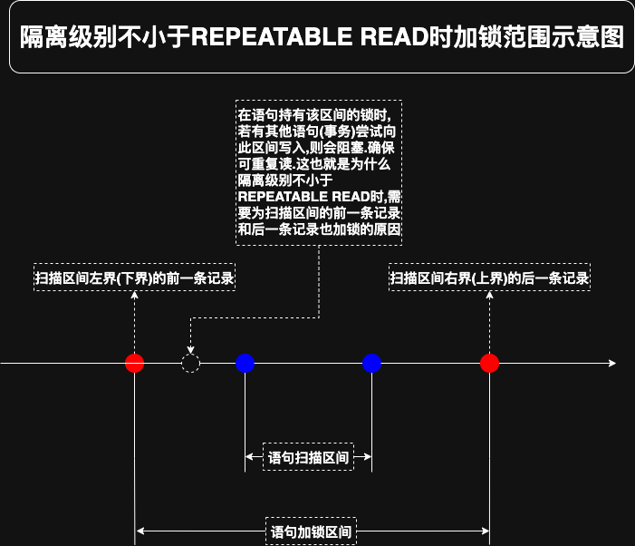

# 2. 实例1-使用聚簇索引进行查询的加锁过程

```sql
SELECT *
FROM hero
WHERE
    number > 1 
AND 
    number <= 15
AND 
    country= '魏' LOCK IN SHARE MODE;
```

在给定了一个语句后,此时并不清楚查询优化器将以什么方式来执行它,可通过`EXPLAIN`语句查看该语句的执行计划:

```
mysql> EXPLAIN SELECT * FROM hero WHERE number > 1 AND number <= 15 AND country= '魏' LOCK IN SHARE MODE;
+----+-------------+-------+------------+-------+---------------+---------+---------+------+------+----------+-------------+
| id | select_type | table | partitions | type  | possible_keys | key     | key_len | ref  | rows | filtered | Extra       |
+----+-------------+-------+------------+-------+---------------+---------+---------+------+------+----------+-------------+
|  1 | SIMPLE      | hero  | NULL       | range | PRIMARY       | PRIMARY | 4       | NULL |    3 |    16.67 | Using where |
+----+-------------+-------+------------+-------+---------------+---------+---------+------+------+----------+-------------+
1 row in set, 1 warning (0.02 sec)
```

从执行计划可以看出,查询优化器将通过[`range`访问方法](https://github.com/rayallen20/howDoesMySQLWork/blob/main/%E7%AC%AC10%E7%AB%A0%20%E6%9D%A1%E6%9D%A1%E5%A4%A7%E8%B7%AF%E9%80%9A%E7%BD%97%E9%A9%AC--%E5%8D%95%E8%A1%A8%E8%AE%BF%E9%97%AE%E6%96%B9%E6%B3%95/5.%20range.md)来读取聚簇索引记录中的一些记录.很显然,可以通过搜索条件`number >1 AND number <= 15`
来生成扫描区间`number ∈ (1,15]`,也就是需要扫描`number`值在`(1,15]`区间中的所有聚簇索引记录

这里再贴一下`hero`表中的数据:

```
mysql> SELECT * FROM hero;
+--------+------------+---------+
| number | name       | country |
+--------+------------+---------+
|      1 | l刘备      | 蜀      |
|      3 | z诸葛亮    | 蜀      |
|      8 | c曹操      | 魏      |
|     15 | x荀彧      | 魏      |
|     20 | s孙权      | 吴      |
+--------+------------+---------+
5 rows in set (0.00 sec)
```

先来分析该语句在隔离级别不大于`READ COMMITTED`时的加锁过程:

注意: 下面提到的具体步骤与之前讲到的的步骤是意义对应的.有些分析过程是直接从步骤2开始的,这是因为步骤7循环会回到步骤2

- 对`number = 3`的聚簇索引记录的加锁过程进行分析

    过程如下:
    
    - 步骤1. 读取在`number ∈ (1,15]`扫描区间的第1条聚簇索引记录,即`number = 3`的聚簇索引记录
    - 步骤2. 为`number = 3`的聚簇索引记录加S型`LOCK_REC_NOT_GAP`锁
      - 注意: 因为当前的事务隔离级别为不大于`READ COMMITTED`,所以为该记录加的是`LOCK_REC_NOT_GAP`锁
      - 若当前事务隔离级别为不小于`REPEATABLE READ`,则为该记录加的是`next-key锁`
    - 步骤3. 由于读取的是聚簇索引记录,所以没有索引条件下推的条件
    - 步骤4. 由于读取的本身就是聚簇索引记录,所以不需要执行回表操作
    - 步骤5. 形成扫描区间`number ∈ (1,15]`的边界条件是`number > 1 AND number <= 15`,很显然`number = 3`的聚簇索引记录符合该边界条件
    - 步骤6. server层继续判断`number = 3`的聚簇索引记录是否符合条件`number > 1 AND number <= 15 AND country='魏'`.很显然不符合,所以释放加在该记录上的锁
      - 注意: 若当前事务隔离级别为不小于`REPEATABLE READ`,则不会释放加在该记录上的锁
    - 步骤7. 获取`number = 3`的聚簇索引记录所在单向链表的下一条记录,即`number = 8`的聚簇索引记录

- 对`number = 8`的聚簇索引记录的加锁过程进行分析

    过程如下:
    
    - 步骤2. 为`number = 8`的聚簇索引记录加S型`LOCK_REC_NOT_GAP`锁
      - 注意: 因为当前的事务隔离级别为不大于`READ COMMITTED`,所以为该记录加的是`LOCK_REC_NOT_GAP`锁
      - 若当前事务隔离级别为不小于`REPEATABLE READ`,则为该记录加的是`next-key锁`
    - 步骤3. 由于读取的是聚簇索引记录,所以没有索引条件下推的条件
    - 步骤4. 由于读取的本身就是聚簇索引记录,所以不需要执行回表操作
    - 步骤5. 形成扫描区间`number ∈ (1,15]`的边界条件是`number > 1 AND number <= 15`,很显然`number = 8`的聚簇索引记录符合该边界条件
    - 步骤6. server层继续判断`number = 8`的聚簇索引记录是否符合条件`number > 1AND number <= 15 AND country='魏'`.很显然符合,所以将其发送到客户端,且不释放加在该记录上的锁
    - 步骤7. 获取`number = 8`的聚簇索引记录所在单向链表的下一条记录,也就是`number = 15`的聚簇索引记录

- 对`number = 15`的聚簇索引记录的加锁过程进行分析

    过程如下:
    
    - 步骤2. 为`number = 15`的聚簇索引记录加S型`LOCK_REC_NOT_GAP`锁
      - 注意: 因为当前的事务隔离级别为不大于`READ COMMITTED`,所以为该记录加的是`LOCK_REC_NOT_GAP`锁
      - 若当前事务隔离级别为不小于`REPEATABLE READ`,则为该记录加的是`next-key锁`
    - 步骤3. 由于读取的是聚簇索引记录,所以没有索引条件下推的条件
    - 步骤4. 由于读取的本身就是聚簇索引记录,所以不需要执行回表操作
    - 步骤5. 形成扫描区间`number ∈ (1,15]`的边界条件是`number > 1 AND number <= 15`,很显然`number = 15`的聚簇索引记录符合该边界条件
    - 步骤6. server层继续判断`number = 15`的聚簇索引记录是否符合条件`number > 1AND number <= 15 AND country='魏'`.很显然符合,所以将其发送到客户端,且不释放加在该记录上的锁
    - 步骤7. 获取`number = 15`的聚簇索引记录所在单向链表的下一条记录,也就是`number = 20`的聚簇索引记录

- 对`number = 20`的聚簇索引记录的加锁过程进行分析

    过程如下:
    
    - 步骤2. 为`number = 20`的聚簇索引记录加S型`LOCK_REC_NOT_GAP`锁
      - 注意: 因为当前的事务隔离级别为不大于`READ COMMITTED`,所以为该记录加的是`LOCK_REC_NOT_GAP`锁
      - 若当前事务隔离级别为不小于`REPEATABLE READ`,则为该记录加的是`next-key锁`
    - 步骤3. 由于读取的是聚簇索引记录,所以没有索引条件下推的条件
    - 步骤4. 由于读取的本身就是聚簇索引记录,所以不需要执行回表操作
    - 步骤5. 形成扫描区间`number ∈ (1,15]`的边界条件是`number > 1 AND number <= 15`,很显然`number = 20`的聚簇索引记录不符合该边界条件.释放掉加在该记录上的锁,并给server层返回一个"查询完毕"的信息
      - 注意: 若当前事务隔离级别为不小于`REPEATABLE READ`,则不会释放加在该记录上的锁
    - 步骤6. server层收到存储引擎返回的"査询完毕"信息,结束查询

综上所述,在隔离级别不大于`READ COMMITTED`的情况下,该语句在执行过程中的加锁效果如下图示:


注: 图中的正经记录锁,即`LOCK_REC_NOT_GAP`锁

图中使用带圆圈的数字对各个记录的加锁顺序进行了标记.注意: 对于`number = 3`和`number = 20`的聚簇索引记录来说,都是先加锁,后释放锁.
但二者释放锁的原因是不同的:

- ①处的释放锁: 是因为在步骤6中,server层判断该记录不符合查询条件,所以释放锁
- ④处的释放锁: 是因为在步骤5中,发现该记录不符合扫描区间的边界条件,所以释放锁
  - "不符合扫描区间的边界条件"就是该循环结束的标志

再分析该语句在隔离级别不小于`REPEATABLE READ`时的加锁过程:

- 对`number = 3`的聚簇索引记录的加锁过程进行分析

    过程如下:
    
    - 步骤1. 读取在`number ∈ (1,15]`扫描区间的第1条聚簇索引记录,即`number = 3`的聚簇索引记录
    - 步骤2. 为`number = 3`的聚簇索引记录加S型`next-key`锁
      - 注意: 因为当前的事务隔离级别为不小于`REPEATABLE READ`,所以为该记录加的是`next-key锁`
      - 若当前事务隔离级别为不大于`READ COMMITTED`,则为该记录加的是`LOCK_REC_NOT_GAP`锁
    - 步骤3. 由于读取的是聚簇索引记录,所以没有索引条件下推的条件
    - 步骤4. 由于读取的本身就是聚簇索引记录,所以不需要执行回表操作
    - 步骤5. 形成扫描区间`number ∈ (1,15]`的边界条件是`number > 1 AND number <= 15`,很显然`number = 3`的聚簇索引记录符合该边界条件
    - 步骤6. server层继续判断`number = 3`的聚簇索引记录是否符合条件`number > 1 AND number <= 15 AND country='魏'`.很显然不符合,但是由于现在的隔离级别不小于`REPEATABLE READ`,所以不会释放掉加在该记录上的锁
      - 注意: 若当前事务隔离级别为不大于`READ COMMITTED`,则会释放加在该记录上的锁
    - 步骤7. 获取`number = 3`的聚簇索引记录所在单向链表的下一条记录,即`number = 8`的聚簇索引记录

- 对`number = 8`的聚簇索引记录的加锁过程进行分析

    过程如下:

    - 步骤2. 为`number = 8`的聚簇索引记录加S型`next-key`锁
      - 注意: 因为当前的事务隔离级别为不小于`REPEATABLE READ`,所以为该记录加的是`next-key锁`
      - 若当前事务隔离级别为不大于`READ COMMITTED`,则为该记录加的是`LOCK_REC_NOT_GAP`锁
    - 步骤3. 由于读取的是聚簇索引记录,所以没有索引条件下推的条件
    - 步骤4. 由于读取的本身就是聚簇索引记录,所以不需要执行回表操作
    - 步骤5. 形成扫描区间`number ∈ (1,15]`的边界条件是`number > 1 AND number <= 15`,很显然`number = 3`的聚簇索引记录符合该边界条件
    - 步骤6. server层继续判断`number = 8`的聚簇索引记录是否符合条件`number > 1AND number <= 15 AND country='魏'`.很显然符合,所以将其发送到客户端,且不释放加在该记录上的锁
    - 步骤7. 获取`number = 8`的聚簇索引记录所在单向链表的下一条记录,即`number = 15`的聚簇索引记录

- 对`number = 15`的聚簇索引记录的加锁过程进行分析

  过程如下:

    - 步骤2. 为`number = 15`的聚簇索引记录加S型`next-key`锁
        - 注意: 因为当前的事务隔离级别为不小于`REPEATABLE READ`,所以为该记录加的是`next-key锁`
        - 若当前事务隔离级别为不大于`READ COMMITTED`,则为该记录加的是`LOCK_REC_NOT_GAP`锁
    - 步骤3. 由于读取的是聚簇索引记录,所以没有索引条件下推的条件
    - 步骤4. 由于读取的本身就是聚簇索引记录,所以不需要执行回表操作
    - 步骤5. 形成扫描区间`number ∈ (1,15]`的边界条件是`number > 1 AND number <= 15`,很显然`number = 3`的聚簇索引记录符合该边界条件
    - 步骤6. server层继续判断`number = 15`的聚簇索引记录是否符合条件`number > 1AND number <= 15 AND country='魏'`.很显然符合,所以将其发送到客户端,且不释放加在该记录上的锁
    - 步骤7. 获取`number = 15`的聚簇索引记录所在单向链表的下一条记录,即`number = 20`的聚簇索引记录

- 对`number = 20`的聚簇索引记录的加锁过程进行分析

    过程如下:
    
    - 步骤2. 为`number = 15`的聚簇索引记录加S型`next-key`锁
      - 注意: 因为当前的事务隔离级别为不小于`REPEATABLE READ`,所以为该记录加的是`next-key锁`
      - 若当前事务隔离级别为不大于`READ COMMITTED`,则为该记录加的是`LOCK_REC_NOT_GAP`锁
    - 步骤3. 由于读取的是聚簇索引记录,所以没有索引条件下推的条件
    - 步骤4. 由于读取的本身就是聚簇索引记录,所以不需要执行回表操作
    - 步骤5. 形成扫描区间`number ∈ (1,15]`的边界条件是`number > 1 AND number <= 15`,很显然`number = 20`的聚簇索引记录不符合该边界条件.由于现在的隔离级别不小于`REPEATABLE READ`,所以不会释放加在该记录上的锁,之后给server层返回一个"查询完毕"的信息
      - 注意: 若当前事务隔离级别为不大于`READ COMMITTED`,则会释放加在该记录上的锁
    - 步骤6. server层收到存储引擎返回的"查询完毕"信息,结束查询

综上所述,在隔离级别不小于`REPEATABLE READ`的情况下,该语句在执行过程中的加锁效果如下图示:


如上图示,该语句最终为`number = 3`/`number = 8`/`number = 15`/`number = 20`这几条记录都加了S型`next-key`锁,并且在语句执行过程中并没有释放某个记录上的锁.
这一点与在隔离级别不大于`READ COMMITTED`的加锁情况是很不一样的.


