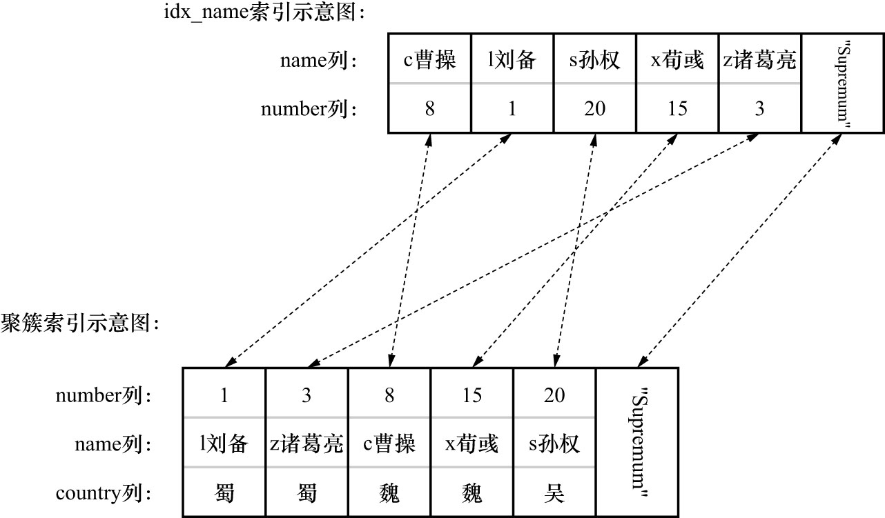

# 3. 实例2-使用二级索引进行查询(过程中涉及ICP)的加锁过程

```sql
SELECT *
FROM hero FORCE INDEX(idx_name)
WHERE
    name > 'c曹操'
AND
    name <= 'x荀或' 
AND 
    country != '吴'
LOCK IN SHARE MODE;
```

注: 因为查询优化器会计算使用二级索引执行查询的成本,在成本较大时可能会选择以全表扫描的方式来执行查询,所以这里使用`FORCE INDEX(idx_name)`语句,强制使用二级索引`idx_name`执行查询

需要先通过`EXPLAIN`语句确定该语句的执行计划:

```
mysql> EXPLAIN SELECT * FROM hero FORCE INDEX(idx_name) WHERE name > 'c曹操' AND name <= 'x荀或' AND country != '吴' LOCK IN SHARE MODE;
+----+-------------+-------+------------+-------+---------------+----------+---------+------+------+----------+------------------------------------+
| id | select_type | table | partitions | type  | possible_keys | key      | key_len | ref  | rows | filtered | Extra                              |
+----+-------------+-------+------------+-------+---------------+----------+---------+------+------+----------+------------------------------------+
|  1 | SIMPLE      | hero  | NULL       | range | idx_name      | idx_name | 403     | NULL |    1 |    80.00 | Using index condition; Using where |
+----+-------------+-------+------------+-------+---------------+----------+---------+------+------+----------+------------------------------------+
1 row in set, 1 warning (0.01 sec)
```

从执行计划可以看出,查询优化器将通过[`range`访问方法](https://github.com/rayallen20/howDoesMySQLWork/blob/main/%E7%AC%AC10%E7%AB%A0%20%E6%9D%A1%E6%9D%A1%E5%A4%A7%E8%B7%AF%E9%80%9A%E7%BD%97%E9%A9%AC--%E5%8D%95%E8%A1%A8%E8%AE%BF%E9%97%AE%E6%96%B9%E6%B3%95/5.%20range.md)来读取二级索引`idx_name`中的一些记录.很显然,可以通过搜索条件`name > 'c曹操' AND name <= 'x荀彧'`
来生成扫描区间`name ∈ ('c曹操', 'x荀彧']`也就是需要扫描 name 值在`('c曹操', 'x荀彧']`区间中的所有二级索引记录.另外,在执行计划的Extra列提示了额外信息
[`Using index condition`](https://github.com/rayallen20/howDoesMySQLWork/blob/main/%E7%AC%AC15%E7%AB%A0%20%E6%9F%A5%E8%AF%A2%E4%BC%98%E5%8C%96%E7%9A%84%E7%99%BE%E7%A7%91%E5%85%A8%E4%B9%A6--EXPLAIN%E8%AF%A6%E8%A7%A3/1.%20%E6%89%A7%E8%A1%8C%E8%AE%A1%E5%88%92%E8%BE%93%E5%87%BA%E4%B8%AD%E5%90%84%E5%88%97%E8%AF%A6%E8%A7%A3/11.%20Extra/5.%20Using%20index%20condition.md),这意味着执行该查询时,将使用到索引下推的条件

这里再贴一下`hero`表中的数据:

```
mysql> SELECT * FROM hero;
+--------+------------+---------+
| number | name       | country |
+--------+------------+---------+
|      1 | l刘备      | 蜀      |
|      3 | z诸葛亮    | 蜀      |
|      8 | c曹操      | 魏      |
|     15 | x荀彧      | 魏      |
|     20 | s孙权      | 吴      |
+--------+------------+---------+
5 rows in set (0.00 sec)
```

二级索引`idx_name`的示意图如下:



先分析该语句在隔离级别不大于`READ COMMITTED`时的加锁过程:

- 对`name = 'l刘备'`的二级索引记录的加锁过程进行分析

    过程如下:

    - 步骤1. 读取在`name ∈ ('c曹操', 'x荀彧']`扫描区间的第1条二级索引记录，即`name = 'l刘备'`的二级索引记录
    - 步骤2. 为`name = 'l刘备'`的二级索引记录加S型`LOCK_REC_NOT_GAP`锁
      - 注意: 因为当前的事务隔离级别为不大于`READ COMMITTED`,所以为该记录加的是`LOCK_REC_NOT_GAP`锁
      - 若当前事务隔离级别为不小于`REPEATABLE READ`,则为该记录加的是`next-key锁`
    - 步骤3. 本语句的索引条件下推的条件为`name > 'c曹操' AND name <= 'x荀或'`,很显然`name = 'l刘备'`的二级索引记录符合索引条件下推的条件
    - 步骤4. 由于读取的是二级索引记录,所以需要对该记录执行回表操作,找到相应的聚簇索引记录,即`name = 'l刘备'`的聚簇索引记录,然后为该聚簇索引记录加一个S型`LOCK_REC_NOT_GAP`锁
      - 注意: 当需要根据二级索引进行回表时,会为聚簇索引加一个`LOCK_REC_NOT_GAP`锁
        - 这一步中,加锁的类型与事务隔离级别无关,仅与是否回表有关.回表则加`LOCK_REC_NOT_GAP`锁,不回表则不加锁
    - 步骤5. 形成扫描区间`name ∈ ('c曹操', 'x荀彧']`的边界条件是`name > 'c曹操' AND name <= 'x荀或'`,很显然`name = 'l刘备'`的二级索引记录符合该边界条件
      - 注意: 即使回表后,判断是否符合扫描区间的边界条件依旧使用的是二级索引记录来判断(而不是使用聚簇索引记录判断,因为这个判断是在二级索引的B+树上进行的)
    - 步骤6. server层继续判断`name = 'l刘备'`的二级索引记录对应的聚簇索引记录是否符合条件`country != '吴'`.很显然符合,所以将其发送到客户端,并且不释放加在该记录上的锁
      - 注意: 由于本例中用到了ICP,所以在server层仅需判断与生成扫描区间无关的条件
    - 步骤7. 获取`name = 'l刘备'`的二级索引记录所在单向链表的下一条记录,即`name = 's孙权'`的二级索引记录

- 对`name = 's孙权'`的二级索引记录的加锁过程进行分析

    过程如下:

    - 步骤2. 为`name = 's孙权'`的二级索引记录加S型`LOCK_REC_NOT_GAP`锁
      - 注意: 因为当前的事务隔离级别为不大于`READ COMMITTED`,所以为该记录加的是`LOCK_REC_NOT_GAP`锁
      - 若当前事务隔离级别为不小于`REPEATABLE READ`,则为该记录加的是`next-key锁`
    - 步骤3. 本语句的索引条件下推的条件为`name > 'c曹操' AND name <= 'x荀或'`,很显然`name = 's孙权'`的二级索引记录符合索引条件下推的条件
    - 步骤4. 由于读取的是二级索引记录,所以需要对该记录执行回表操作,找到相应的聚簇索引记录,即`name = 's孙权'`的聚簇索引记录,然后为该聚簇索引记录加一个S型`LOCK_REC_NOT_GAP`锁
      - 注意: 当需要根据二级索引进行回表时,会为聚簇索引加一个`LOCK_REC_NOT_GAP`锁
        - 这一步中,加锁的类型与事务隔离级别无关,仅与是否回表有关.回表则加`LOCK_REC_NOT_GAP`锁,不回表则不加锁
    - 步骤5. 形成扫描区间`name ∈ ('c曹操', 'x荀彧']`的边界条件是`name > 'c曹操' AND name <= 'x荀或'`,很显然`name = 's孙权'`的二级索引记录符合该边界条件
      - 注意: 即使回表后,判断是否符合扫描区间的边界条件依旧使用的是二级索引记录来判断(而不是使用聚簇索引记录判断,因为这个判断是在二级索引的B+树上进行的)
    - 步骤6. server层继续判断`name = 's孙权'`的二级索引记录对应的聚簇索引记录是否符合条件`country != '吴'`.很显然不符合,所以释放掉加在该二级索引记录上的锁(`LOCK_REC_NOT_GAP`锁)以及对应的聚簇索引记录上的锁(`LOCK_REC_NOT_GAP`锁)
      - 注意: 由于本例中用到了ICP,所以在server层仅需判断与生成扫描区间无关的条件
      - 注意: 若当前事务隔离级别为不小于`REPEATABLE READ`,则不会释放加在该二级索引记录以及对应的聚簇索引记录上的锁
    - 步骤7. 获取`name = 's孙权'`的二级索引记录所在单向链表的下一条记录,即`name = 'x荀彧'`的二级索引记录

- 对`name = 'x荀彧'`的二级索引记录的加锁过程进行分析

    过程如下:

    - 步骤2. 为`name = 'x荀彧'`的二级索引记录加S型`LOCK_REC_NOT_GAP`锁
      - 注意: 因为当前的事务隔离级别为不大于`READ COMMITTED`,所以为该记录加的是`LOCK_REC_NOT_GAP`锁
      - 若当前事务隔离级别为不小于`REPEATABLE READ`,则为该记录加的是`next-key锁`
    - 步骤3. 本语句的索引条件下推的条件为`name > 'c曹操' AND name <= 'x荀或'`,很显然`name = 'x荀彧'`的二级索引记录符合索引条件下推的条件
    - 步骤4. 由于读取的是二级索引记录,所以需要对该记录执行回表操作,找到相应的聚簇索引记录,即`name = 'x荀彧'`的聚簇索引记录,然后为该聚簇索引记录加一个S型`LOCK_REC_NOT_GAP`锁
      - 注意: 当需要根据二级索引进行回表时,会为聚簇索引加一个`LOCK_REC_NOT_GAP`锁
        - 这一步中,加锁的类型与事务隔离级别无关,仅与是否回表有关.回表则加`LOCK_REC_NOT_GAP`锁,不回表则不加锁
    - 步骤5. 形成扫描区间`name ∈ ('c曹操', 'x荀彧']`的边界条件是`name > 'c曹操' AND name <= 'x荀或'`,很显然`name = 'x荀或'`的二级索引记录符合该边界条件
      - 注意: 即使回表后,判断是否符合扫描区间的边界条件依旧使用的是二级索引记录来判断(而不是使用聚簇索引记录判断,因为这个判断是在二级索引的B+树上进行的)
    - 步骤6. server层继续判断`name = 'x荀或'`的二级索引记录对应的聚簇索引记录是否符合条件`country != '吴'`.很显然符合,所以将其发送到客户端,并且不释放加在该记录上的锁
      - 注意: 由于本例中用到了ICP,所以在server层仅需判断与生成扫描区间无关的条件
    - 步骤7. 获取`name = 'x荀或'`的二级索引记录所在单向链表的下一条记录,即`name = 'z诸葛亮'`的二级索引记录

- 对`name = 'z诸葛亮'`的二级索引记录的加锁过程进行分析

    过程如下:

    - 步骤2. 为`name = 'z诸葛亮'`的二级索引记录加S型`LOCK_REC_NOT_GAP`锁
      - 注意: 因为当前的事务隔离级别为不大于`READ COMMITTED`,所以为该记录加的是`LOCK_REC_NOT_GAP`锁
      - 若当前事务隔离级别为不小于`REPEATABLE READ`,则为该记录加的是`next-key锁`
    - 步骤3. 本语句的索引条件下推的条件为`name > 'c曹操' AND name <= 'x荀或'`,很显然`name = 'z诸葛亮'`的二级索引记录不符合索引条件下推的条件.因为这条二级索引记录还不合边界条件,所以所以就不再去找当前记录的下一条记录了,因此跳过步骤4和步骤5,直接向server层报告"查询完毕"的信息
      - 由于在该条二级索引记录已经不在扫描区间内,所以标志着整个循环就已经结束了
      - 注意: 此时`name = 'z诸葛亮'`的二级索引记录被加锁(`LOCK_REC_NOT_GAP`锁),而这条二级索引记录对应的聚簇索引记录没有被加锁
    - 步骤4. 本步骤被跳过
    - 步骤5. 本步骤被跳过
    - 步骤6. server层收到存储引擎层报告的"査询完毕"的信息,结束查询

综上所述,在隔离级别不大于`READ COMMITTED`的情况下,该语句在执行过程中的加锁效果如下图示:


注意: 

- 对于`name = 's孙权'`的二级索引记录和`number = 20`的聚簇索引记录来说,都是先加锁,后释放锁(即图中的③和④,这两条记录的锁被释放是因为server层判断不符合语句的查询条件,且隔离级别为不大于`READ COMMITTED`)
- 对于`name = 'z诸葛亮'`的二级索引记录来说,在步骤3中被被判断为不符合边界条件,且该步骤并不会释放加在该记录上的锁(即图中的⑦),而是直接向server层报告"查询完毕"信息,因此导致整个语句在执行结束后,也不会释放加在`name = 'z诸葛亮'`的二级索引记录上的锁

再分析该语句在隔离级别不小于`REPEATABLE READ`时的加锁过程:

- 对`name = 'l刘备'`的二级索引记录的加锁过程进行分析

    过程如下:

    - 步骤1. 读取在`name ∈ ('c曹操', 'x荀彧']`扫描区间的第1条二级索引记录，即`name = 'l刘备'`的二级索引记录
    - 步骤2. 为`name = 'l刘备'`的二级索引记录加S型`next-key`锁
      - 注意: 因为当前的事务隔离级别为不小于`REPEATABLE READ`,所以为该记录加的是`next-key锁`
      - 若当前事务隔离级别为不大于`READ COMMITTED`,则为该记录加的是`LOCK_REC_NOT_GAP`锁
    - 步骤3. 本语句的索引条件下推的条件为`name > 'c曹操' AND name <= 'x荀或'`,很显然`name = 'l刘备'`的二级索引记录符合索引条件下推的条件
    - 步骤4. 由于读取的是二级索引记录,所以需要对该记录执行回表操作,找到相应的聚簇索引记录,即`name = 'l刘备'`的聚簇索引记录,然后为该聚簇索引记录加一个S型`LOCK_REC_NOT_GAP`锁
      - 注意: 当需要根据二级索引进行回表时,会为聚簇索引加一个`LOCK_REC_NOT_GAP`锁
        - 这一步中,加锁的类型与事务隔离级别无关,仅与是否回表有关.回表则加`LOCK_REC_NOT_GAP`锁,不回表则不加锁
    - 步骤5. 形成扫描区间`name ∈ ('c曹操', 'x荀彧']`的边界条件是`name > 'c曹操' AND name <= 'x荀或'`,很显然`name = 'l刘备'`的二级索引记录符合该边界条件
        - 注意: 即使回表后,判断是否符合扫描区间的边界条件依旧使用的是二级索引记录来判断(而不是使用聚簇索引记录判断,因为这个判断是在二级索引的B+树上进行的)
    - 步骤6. server层继续判断`name = 'l刘备'`的二级索引记录对应的聚簇索引记录是否符合条件`country != '吴'`.很显然符合,所以将其发送到客户端,并且不释放加在该记录上的锁
        - 注意: 由于本例中用到了ICP,所以在server层仅需判断与生成扫描区间无关的条件
    - 步骤7. 获取`name = 'l刘备'`的二级索引记录所在单向链表的下一条记录,即`name = 's孙权'`的二级索引记录

- 对`name = 's孙权'`的二级索引记录的加锁过程进行分析

    过程如下:

    - 步骤2. 为`name = 's孙权'`的二级索引记录加S型`next-key`锁
      - 注意: 因为当前的事务隔离级别为不小于`REPEATABLE READ`,所以为该记录加的是`next-key锁`
      - 若当前事务隔离级别为不大于`READ COMMITTED`,则为该记录加的是`LOCK_REC_NOT_GAP`锁
    - 步骤3. 本语句的索引条件下推的条件为`name > 'c曹操' AND name <= 'x荀或'`,很显然`name = 's孙权'`的二级索引记录符合索引条件下推的条件
    - 步骤4. 由于读取的是二级索引记录,所以需要对该记录执行回表操作,找到相应的聚簇索引记录,即`name = 's孙权'`的聚簇索引记录,然后为该聚簇索引记录加一个S型`LOCK_REC_NOT_GAP`锁
      - 注意: 当需要根据二级索引进行回表时,会为聚簇索引加一个`LOCK_REC_NOT_GAP`锁
        - 这一步中,加锁的类型与事务隔离级别无关,仅与是否回表有关.回表则加`LOCK_REC_NOT_GAP`锁,不回表则不加锁
    - 步骤5. 形成扫描区间`name ∈ ('c曹操', 'x荀彧']`的边界条件是`name > 'c曹操' AND name <= 'x荀或'`,很显然`name = 's孙权'`的二级索引记录符合该边界条件
        - 注意: 即使回表后,判断是否符合扫描区间的边界条件依旧使用的是二级索引记录来判断(而不是使用聚簇索引记录判断,因为这个判断是在二级索引的B+树上进行的)
    - 步骤6. server层继续判断`name = 's孙权'`的二级索引记录对应的聚簇索引记录是否符合条件`country != '吴'`.很显然不符合,但是由于现在的隔离级别为不小于`REPEATABLE READ`,所以不会释放掉加在该记录上的锁(二级索引记录上的`next-key锁`和对应的聚簇索引记录上的`LOCK_REC_NOT_GAP`锁)
      - 注意: 若当前事务隔离级别为不大于`READ COMMITED`,则会释放加在该二级索引记录以及对应的聚簇索引记录上的锁
        - 但是,在事务隔离级别为不大于`READ COMMITED`的场景下,只会给二级索引记录以及对应的聚簇索引记录加`LOCK_REC_NOT_GAP`锁,而不会给二级索引记录加`next-key锁`
      - 注意: 由于本例中用到了ICP,所以在server层仅需判断与生成扫描区间无关的条件
    - 步骤7. 获取`name = 's孙权'`的二级索引记录所在单向链表的下一条记录,即`name = 'x荀彧'`的二级索引记录

- 对`name = 'x荀彧'`的二级索引记录的加锁过程进行分析

    过程如下:

    - 步骤2. 为`name = 'x荀彧'`的二级索引记录加S型`next-key`锁
      - 注意: 因为当前的事务隔离级别为不小于`REPEATABLE READ`,所以为该记录加的是`next-key锁`
      - 若当前事务隔离级别为不大于`READ COMMITTED`,则为该记录加的是`LOCK_REC_NOT_GAP`锁
    - 步骤3. 本语句的索引条件下推的条件为`name > 'c曹操' AND name <= 'x荀或'`,很显然`name = 'x荀彧'`的二级索引记录符合索引条件下推的条件
    - 步骤4. 由于读取的是二级索引记录,所以需要对该记录执行回表操作,找到相应的聚簇索引记录,即`name = 'x荀彧'`的聚簇索引记录,然后为该聚簇索引记录加一个S型`LOCK_REC_NOT_GAP`锁
      - 注意: 当需要根据二级索引进行回表时,会为聚簇索引加一个`LOCK_REC_NOT_GAP`锁
        - 这一步中,加锁的类型与事务隔离级别无关,仅与是否回表有关.回表则加`LOCK_REC_NOT_GAP`锁,不回表则不加锁
    - 步骤5. 形成扫描区间`name ∈ ('c曹操', 'x荀彧']`的边界条件是`name > 'c曹操' AND name <= 'x荀或'`,很显然`name = 'x荀或'`的二级索引记录符合该边界条件
        - 注意: 即使回表后,判断是否符合扫描区间的边界条件依旧使用的是二级索引记录来判断(而不是使用聚簇索引记录判断,因为这个判断是在二级索引的B+树上进行的)
    - 步骤6. server层继续判断`name = 'x荀或'`的二级索引记录对应的聚簇索引记录是否符合条件`country != '吴'`.很显然符合,所以将其发送到客户端,并且不释放加在该记录上的锁
        - 注意: 由于本例中用到了ICP,所以在server层仅需判断与生成扫描区间无关的条件
    - 步骤7. 获取`name = 'x荀或'`的二级索引记录所在单向链表的下一条记录,即`name = 'z诸葛亮'`的二级索引记录

- 对`name = 'z诸葛亮'`的二级索引记录的加锁过程进行分析

    过程如下:

    - 步骤2. 为`name = 'z诸葛亮'`的二级索引记录加S型`next-key`锁
      - 注意: 因为当前的事务隔离级别为不小于`REPEATABLE READ`,所以为该记录加的是`next-key锁`
      - 若当前事务隔离级别为不大于`READ COMMITTED`,则为该记录加的是`LOCK_REC_NOT_GAP`锁
    - 步骤3. 本语句的索引条件下推的条件为`name > 'c曹操' AND name <= 'x荀或'`,很显然`name = 'z诸葛亮'`的二级索引记录不符合索引条件下推的条件.因为这条二级索引记录不符合边界条件,所以就不再去找当前记录的下一条记录了,因此跳过步骤4和步骤5,直接向server层报告"查询完毕"的信息
        - 由于在该条二级索引记录已经不在扫描区间内,所以标志着整个循环就已经结束了
        - 注意: 此时`name = 'z诸葛亮'`的二级索引记录被加锁(`next-key`锁),而这条二级索引记录对应的聚簇索引记录没有被加锁
    - 步骤4. 本步骤被跳过
    - 步骤5. 本步骤被跳过
    - 步骤6. server层收到存储引擎层报告的"査询完毕"的信息,结束查询

综上所述,在隔离级别不小于`REPEATABLE READ`的情况下,该语句在执行过程中的加锁效果如下图示:


注意:

- 该语句对`name  = 'l刘备'`/`name  = 's孙权'`/`name  = 'x荀彧'`/`name  = 'z诸葛亮'`的二级索引记录都加了S型`next-key`锁(即图中的①/③/⑤/⑦)
  - 没有给`name = 'z诸葛亮'`的二级索引记录对应的聚簇索引记录加`LOCK_REC_NOT_GAP`锁,是因为在步骤3中就已经判断该二级索引记录不符合边界条件,所以没有进行回表操作
- 该语句对`number = 1`/`number = 15`/`number = 20`的聚簇索引记录都加了S型`LOCK_REC_NOT_GAP`锁(即图中的②/④/⑥)

在这个例子中需要注意的是: 若一条二级索引记录不符合索引条件下推中的条件,即使当前事务的隔离级别不大于`READ COMMITTED`,也不会释放掉该加在该二级索引记录上的锁
(参考在隔离级别不大于`READ COMMITTED`时,对`name = 'z诸葛亮'`的二级索引记录加锁过程的分析中的步骤3).

作者认为: 这是InnoDB的设计者认为存储引擎不配拥有释放锁的权利,因此只能在server层进行释放

另外,索引条件下推这个特性是在MySQL 5.6中引入的,可以通过`SET optimizer_switch='index condition pushdown=off'`语句来手动停用该特性.
若停用该特性,则上述过程和实例1的过程相同,即: 不会在二级索引上判断二级索引记录是否符合索引条件下推的条件(因为关闭了索引条件下推的特性,也就是没有步骤3),
而是在回表读取到聚簇索引记录后,再判断该聚簇索引记录是否符合形成扫描区间的边界条件(即: 整个过程和实例1相同).

这2个实例都是以`SELECT ... LOCK IN SHARE MODE`语句为例来介绍如何为记录加锁的.`SELECT.. FOR UPDATE`语句的加锁过程与
`SELECT .. LOCK IN SHARE MODE`语句类似,只不过为记录加的是X锁
