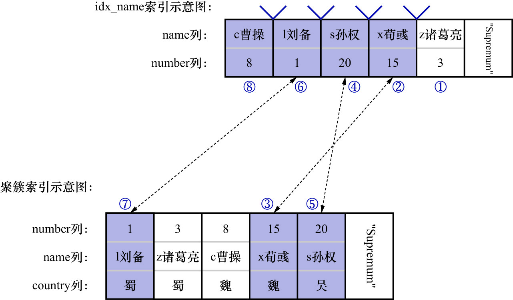

# 2. 使用`SHOW ENGINE INNODB STATUS`获取锁信息

现在假设前文使用的事务T1和事务T2都提交了,再新开启几个事务:

- 事务T3:(`REPEATABLE READ`隔离级别)

```
mysql> BEGIN;
Query OK, 0 rows affected (0.00 sec)

mysql> SELECT * FROM hero FORCE INDEX(uk_name) WHERE name > 'c曹操' AND name <= 'x荀彧' AND country!= '吴' ORDER BY name DESC FOR UPDATE;
+--------+---------+---------+
| number | name    | country |
+--------+---------+---------+
|     15 | x荀彧   | 魏      |
|      1 | l刘备   | 蜀      |
+--------+---------+---------+
2 rows in set (0.00 sec)
```
    
这个语句的加锁流程在前面已经分析过了(特殊情况7),我们再看一遍该语句在执行时的加锁示意图:



可通过执行`SHOW ENGINE INNODB STATUS`语句来获取当前系统中各个事务的加锁情况:

```
mysql> SHOW ENGINE INNODB STATUS\G;
*************************** 1. row ***************************
  Type: InnoDB

...中间信息省略

------------
TRANSACTIONS
------------
# 下一个待分配的事务id
Trx id counter 69939

# 一些关于purge的信息
Purge done for trx's n:o < 69931 undo n:o < 0 state: running but idle

# 每个回滚段中都有一个Hstory链表,这些链表的总长度为0
History list length 0

# 各个事务的具体信息
LIST OF TRANSACTIONS FOR EACH SESSION:
# 事务对应的内存结构的指针为421495939531560的事务信息 该事务还没有开始执行任何语句
---TRANSACTION 421495939531560, not started
# 该事务有0个锁结构 0个行锁 (heap size没介绍过,忽略)
0 lock struct(s), heap size 1128, 0 row lock(s)

---TRANSACTION 421495939530752, not started
0 lock struct(s), heap size 1128, 0 row lock(s)

---TRANSACTION 421495939529944, not started
0 lock struct(s), heap size 1128, 0 row lock(s)

---TRANSACTION 421495939529136, not started
0 lock struct(s), heap size 1128, 0 row lock(s)

---TRANSACTION 421495939528328, not started
0 lock struct(s), heap size 1128, 0 row lock(s)

# 事务id为69938的事务信息 处在活跃状态129秒
---TRANSACTION 69938, ACTIVE 129 sec
# 该事务有4个锁结构 8个行锁 (heap size没介绍过,忽略)
4 lock struct(s), heap size 1128, 8 row lock(s)
# 执行该事务的线程在MySQL中的编号为13 操作系统中的线程号为140020434282048 本次查询的编号为830
# 客户端主机名为localhost 用户名为root
MySQL thread id 13, OS thread handle 140020434282048, query id 830 localhost root

# 事务id为69937的事务信息 处在活跃状态1169秒
---TRANSACTION 69937, ACTIVE 1169 sec
# 该事务有1个锁结构 1个行锁 (heap size没介绍过,忽略)
1 lock struct(s), heap size 1128, 1 row lock(s)
# 执行该事务的线程在MySQL中的编号为14 操作系统中的线程号为140020433225280 本次查询的编号为791
# 客户端主机名为localhost 用户名为root
MySQL thread id 14, OS thread handle 140020433225280, query id 791 localhost root

...后面信息省略

1 row in set (0.00 sec)

ERROR: 
No query specified
```

注: 由于输出的内容太多,处于方便起见,所以这里只保留了`TRANSACTIONS`的相关信息

但是,还有个问题: 无法从上述输出中看出,到底是哪个事务对哪些记录加了哪些锁

将系统变量`innodb_status_output_locks`设置为`ON`:

```
mysql> SET GLOBAL innodb_status_output_locks = ON;
Query OK, 0 rows affected (0.00 sec)
```

再运行`SHOW ENGINE INNODB STATUS`语句:

```
mysql> SHOW ENGINE INNODB STATUS\G;
*************************** 1. row ***************************
  Type: InnoDB
...中间信息省略

------------
TRANSACTIONS
------------
Trx id counter 69939
Purge done for trx's n:o < 69931 undo n:o < 0 state: running but idle
History list length 0
LIST OF TRANSACTIONS FOR EACH SESSION:
---TRANSACTION 421495939531560, not started
0 lock struct(s), heap size 1128, 0 row lock(s)
---TRANSACTION 421495939530752, not started
0 lock struct(s), heap size 1128, 0 row lock(s)
---TRANSACTION 421495939529944, not started
0 lock struct(s), heap size 1128, 0 row lock(s)
---TRANSACTION 421495939529136, not started
0 lock struct(s), heap size 1128, 0 row lock(s)
---TRANSACTION 421495939528328, not started
0 lock struct(s), heap size 1128, 0 row lock(s)
---TRANSACTION 69938, ACTIVE 792 sec
4 lock struct(s), heap size 1128, 8 row lock(s)
MySQL thread id 13, OS thread handle 140020434282048, query id 830 localhost root
TABLE LOCK table `join_demo`.`hero` trx id 69938 lock mode IX
RECORD LOCKS space id 30 page no 6 n bits 72 index uk_name of table `join_demo`.`hero` trx id 69938 lock_mode X locks gap before rec
Record lock, heap no 6 PHYSICAL RECORD: n_fields 2; compact format; info bits 0
 0: len 10; hex 7ae8afb8e8919be4baae; asc z         ;;      # 7ae8afb8e8919be4baae是'z诸葛亮'的utf8mb4编码
 1: len 4; hex 80000003; asc     ;;     # 80000003表示主键值为3

RECORD LOCKS space id 30 page no 6 n bits 72 index uk_name of table `join_demo`.`hero` trx id 69938 lock_mode X
Record lock, heap no 2 PHYSICAL RECORD: n_fields 2; compact format; info bits 0
 0: len 7; hex 63e69bb9e6938d; asc c      ;;        # 63e69bb9e6938d是'c曹操'的utf8mb4编码
 1: len 4; hex 80000008; asc     ;;     # 80000008表示主键值为8

Record lock, heap no 3 PHYSICAL RECORD: n_fields 2; compact format; info bits 0
 0: len 7; hex 6ce58898e5a487; asc l      ;;        # 6ce58898e5a487是'l刘备'的utf8mb4编码
 1: len 4; hex 80000001; asc     ;;     # 80000001表示主键值为1

Record lock, heap no 4 PHYSICAL RECORD: n_fields 2; compact format; info bits 0
 0: len 7; hex 73e5ad99e69d83; asc s      ;;        # 73e5ad99e69d83是's孙权'的utf8mb4编码
 1: len 4; hex 80000014; asc     ;;     # 80000014表示主键值为20

Record lock, heap no 5 PHYSICAL RECORD: n_fields 2; compact format; info bits 0
 0: len 7; hex 78e88d80e5bda7; asc x      ;;        # 78e88d80e5bda7是'x荀彧'的utf8mb4编码
 1: len 4; hex 8000000f; asc     ;;     # 8000000f表示主键值为15

RECORD LOCKS space id 30 page no 4 n bits 80 index PRIMARY of table `join_demo`.`hero` trx id 69938 lock_mode X locks rec but not gap
Record lock, heap no 2 PHYSICAL RECORD: n_fields 5; compact format; info bits 0
 0: len 4; hex 80000001; asc     ;;
 1: len 6; hex 000000010933; asc      3;;
 2: len 7; hex 81000000850110; asc        ;;
 3: len 7; hex 6ce58898e5a487; asc l      ;;
 4: len 3; hex e89c80; asc    ;;

Record lock, heap no 5 PHYSICAL RECORD: n_fields 5; compact format; info bits 0
 0: len 4; hex 8000000f; asc     ;;
 1: len 6; hex 000000010933; asc      3;;
 2: len 7; hex 81000000850137; asc       7;;
 3: len 7; hex 78e88d80e5bda7; asc x      ;;
 4: len 3; hex e9ad8f; asc    ;;

Record lock, heap no 6 PHYSICAL RECORD: n_fields 5; compact format; info bits 0
 0: len 4; hex 80000014; asc     ;;
 1: len 6; hex 000000010933; asc      3;;
 2: len 7; hex 81000000850144; asc       D;;
 3: len 7; hex 73e5ad99e69d83; asc s      ;;
 4: len 3; hex e590b4; asc    ;;

---TRANSACTION 69937, ACTIVE 1832 sec
1 lock struct(s), heap size 1128, 1 row lock(s)
MySQL thread id 14, OS thread handle 140020433225280, query id 791 localhost root
TABLE LOCK table `join_demo`.`hero` trx id 69937 lock mode IX

...后面信息省略

1 row in set (0.00 sec)

ERROR: 
No query specified

```
  
其中:

- TABLE LOCK table `join_demo`.`hero` trx id 69938 lock mode IX

    表示事务id为69938的事务对`join_demo`数据库下的`hero`表加了表级别的意向独占锁(IX锁)

- RECORD LOCKS space id 30 page no 6 n bits 72 index uk_name of table `join_demo`.`hero` trx id 69938 lock_mode X locks gap before rec

    表示一个[锁结构](https://github.com/rayallen20/howDoesMySQLWork/blob/main/%E7%AC%AC22%E7%AB%A0%20%E5%B7%A5%E4%BD%9C%E9%9D%A2%E8%AF%95%E8%80%81%E5%A4%A7%E9%9A%BE--%E9%94%81/3.%20MySQL%E4%B8%AD%E7%9A%84%E8%A1%8C%E9%94%81%E5%92%8C%E8%A1%A8%E9%94%81/3.%20InnoDB%E9%94%81%E7%9A%84%E5%86%85%E5%AD%98%E7%BB%93%E6%9E%84/1.%20%E5%86%85%E5%AD%98%E7%BB%93%E6%9E%84%E8%AE%B2%E8%A7%A3.md),这个锁结构的:

    - Space ID是30
    - Page Number是6
    - `n_bits`属性值为72
    - 对应的索引是`uk_name`
    - 锁的类型是X型gap锁(`lock_mode X locks gap before rec`代表的就是X型gap锁)
        
```
Record lock, heap no 6 PHYSICAL RECORD: n_fields 2; compact format; info bits 0         # 即图中的①
 0: len 10; hex 7ae8afb8e8919be4baae; asc z         ;;      # 7ae8afb8e8919be4baae是'z诸葛亮'的utf8mb4编码
 1: len 4; hex 80000003; asc     ;;     # 80000003表示主键值为3
```
    
这部分内容是加锁记录的详细信息(其实就是`name = 'z诸葛亮'`的二级索引记录)

-  RECORD LOCKS space id 30 page no 6 n bits 72 index uk_name of table `join_demo`.`hero` trx id 69938 lock_mode X

    也表示一个锁结构,这个锁结构的:
    
    - Space ID是30
    - Page Number是6
    - `n_bits`属性值为72
    - 对应的索引是`uk_name`
    - 锁的类型是X型`next-key`锁(`lock_mode X`代表的就是X型next-key锁)

```
Record lock, heap no 2 PHYSICAL RECORD: n_fields 2; compact format; info bits 0         # 即图中的⑧
 0: len 7; hex 63e69bb9e6938d; asc c      ;;        # 63e69bb9e6938d是'c曹操'的utf8mb4编码
 1: len 4; hex 80000008; asc     ;;     # 80000008表示主键值为8
```
    
这部分内容是加锁记录的详细信息(其实就是`name = 'c曹操'`的二级索引记录)

```
Record lock, heap no 3 PHYSICAL RECORD: n_fields 2; compact format; info bits 0         # 即图中的⑥
 0: len 7; hex 6ce58898e5a487; asc l      ;;        # 6ce58898e5a487是'l刘备'的utf8mb4编码
 1: len 4; hex 80000001; asc     ;;     # 80000001表示主键值为1

Record lock, heap no 4 PHYSICAL RECORD: n_fields 2; compact format; info bits 0         # 即图中的④
 0: len 7; hex 73e5ad99e69d83; asc s      ;;        # 73e5ad99e69d83是's孙权'的utf8mb4编码
 1: len 4; hex 80000014; asc     ;;     # 80000014表示主键值为20

Record lock, heap no 5 PHYSICAL RECORD: n_fields 2; compact format; info bits 0         # 即图中的②
 0: len 7; hex 78e88d80e5bda7; asc x      ;;        # 78e88d80e5bda7是'x荀彧'的utf8mb4编码
 1: len 4; hex 8000000f; asc     ;;     # 8000000f表示主键值为15
```

这部分内容依此类推即可

- RECORD LOCKS space id 30 page no 4 n bits 80 index PRIMARY of table `join_demo`.`hero` trx id 69938 lock_mode X locks rec but not gap

    也表示一个锁结构,这个锁结构的:

    - Space ID是30
    - Page Number是4
    - `n_bits`属性值为80
    - 对应的索引是`PRIMARY`
    - 锁的类型是X型`LOCK_REC_NOT_GAP`锁(`lock_mode X locks rec but not gap`代表的就是X型`LOCK_REC_NOT_GAP`锁)

```
Record lock, heap no 2 PHYSICAL RECORD: n_fields 5; compact format; info bits 0         # 即图中的⑦
 0: len 4; hex 80000001; asc     ;;
 1: len 6; hex 000000010933; asc      3;;
 2: len 7; hex 81000000850110; asc        ;;
 3: len 7; hex 6ce58898e5a487; asc l      ;;
 4: len 3; hex e89c80; asc    ;;

Record lock, heap no 5 PHYSICAL RECORD: n_fields 5; compact format; info bits 0         # 即图中的③
 0: len 4; hex 8000000f; asc     ;;
 1: len 6; hex 000000010933; asc      3;;
 2: len 7; hex 81000000850137; asc       7;;
 3: len 7; hex 78e88d80e5bda7; asc x      ;;
 4: len 3; hex e9ad8f; asc    ;;

Record lock, heap no 6 PHYSICAL RECORD: n_fields 5; compact format; info bits 0         # 即图中的⑤
 0: len 4; hex 80000014; asc     ;;
 1: len 6; hex 000000010933; asc      3;;
 2: len 7; hex 81000000850144; asc       D;;
 3: len 7; hex 73e5ad99e69d83; asc s      ;;
 4: len 3; hex e590b4; asc    ;;
```

这部分内容是加锁记录的详细信息(其实就是`number = 1`/`number = 15`/`number = 20`的聚簇索引记录)

- 注意: **若某个事务没有被分配唯一的事务id,则执行`SHOW ENGINE INNODB STATUS`语句时并不会显示该事务在执行过程中持有的锁**
  - 比如: 事务T4只执行了`SELECT * FROM hero WHERE number = 1 LOCK IN SHARE MODE`语句,则事务T4所持有的锁是不显示的
- 注意: **`SHOW ENGINE INNODB STATUS`不显示隐式锁**

注:

在`SHOW ENGINE INNODB STATUS`的输出中可以看到: `hero`表的`number`列的值都是`800000XX`的形式.这是因为`number`列是存储有符号数的(即:既可以存储负数,
也可以存储非负数).InnoDB的设计者规定: 在储存有符号数时,要将首位取反(若原先数字是非负数,即首位是0,则把首位置为1;若原先数字是负数,即首位是1,则把首位置为0)
