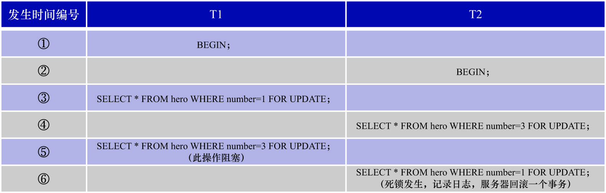

# 6. 死锁

假设现在开启了2个事务:T1和T2,它们的具体执行流程如下图示:



对该图中的过程进行分析:

- ③: T1先对`number  = 1`的聚簇索引记录加了一个X型`LOCK_REC_NOT_GAP`锁
- ④: T2对`number = 3`的聚簇索引记录加了一个X型`LOCK_REC_NOT_GAP`锁
- ⑤: T1也想对`number = 3`的聚簇索引记录加一个X型`LOCK_REC_NOT_GAP`锁,但是与④中T2持有的锁冲突,所以T1进入阻塞状态,等待获取锁
- ⑥: T2也想对`number = 1`的聚簇索引记录加一个X型`LOCK_REC_NOT_GAP`锁,但是与③中T1持有的锁冲突,所以T2进入阻塞状态,等待获取锁

这就陷入了一个比较尴尬的局面:

- T1说: "我不能继续执行了,我要等T2把在`number = 3`的聚簇索引记录上加的X型`LOCK_REC_NOT_GAP`锁释放掉,之后才能继续执行"
- T2说: "我也不能继续执行了,我要等 T1 把在`number = 1`的聚簇索引记录上加的X型`LOCK_REC_NOT_GAP`锁释放掉,之后才能继续执行"

即: 由于T1和T2都在等待对方先释放掉与自己需要的锁相冲突的锁,因此导致T1和T2都不能继续执行,此时就称发生了死锁

InnoDB有一个死锁检测机制: 当它检测到死锁发生时,会选择一个较小的事务进行回滚(**所谓较小的事务,是指在事务执行过程中插入/更新或删除的记录条数较少的事务**),并向客户端发送一条消息:

```
ERROR 1213 (40001): Deadlock found when trying to get lock; try restarting transaction
```

从上述例子中可以看出: 当不同的事务以不同的顺序获取某些记录的锁时,可能会发生死锁.当死锁发生时,InnoDB会回滚一个事务以释放掉该事务所获取的锁,从而使得另一个事务可以继续执行下去

- 事务T1:

```
mysql> BEGIN;
Query OK, 0 rows affected (0.00 sec)

mysql> SELECT * FROM hero WHERE number = 1 FOR UPDATE;
+--------+---------+---------+
| number | name    | country |
+--------+---------+---------+
|      1 | l刘备   | 蜀      |
+--------+---------+---------+
1 row in set (0.00 sec)
```

- 事务T2:

```
mysql> BEGIN;
Query OK, 0 rows affected (0.00 sec)

mysql> SELECT * FROM hero WHERE number = 3 FOR UPDATE;
+--------+------------+---------+
| number | name       | country |
+--------+------------+---------+
|      3 | z诸葛亮    | 蜀      |
+--------+------------+---------+
1 row in set (0.00 sec)
```

- 事务T1阻塞:

```
mysql> BEGIN;
Query OK, 0 rows affected (0.00 sec)

mysql> SELECT * FROM hero WHERE number = 1 FOR UPDATE;
+--------+---------+---------+
| number | name    | country |
+--------+---------+---------+
|      1 | l刘备   | 蜀      |
+--------+---------+---------+
1 row in set (0.00 sec)

mysql> SELECT * FROM hero WHERE number = 3 FOR UPDATE;  # 该语句阻塞
```

- 事务T2阻塞并死锁回滚:

```
mysql> BEGIN;
Query OK, 0 rows affected (0.00 sec)

mysql> SELECT * FROM hero WHERE number = 3 FOR UPDATE;
+--------+------------+---------+
| number | name       | country |
+--------+------------+---------+
|      3 | z诸葛亮    | 蜀      |
+--------+------------+---------+
1 row in set (0.00 sec)

mysql> SELECT * FROM hero WHERE number = 1 FOR UPDATE;
ERROR 1213 (40001): Deadlock found when trying to get lock; try restarting transaction
```

- 事务T1继续执行:

```
mysql> BEGIN;
Query OK, 0 rows affected (0.00 sec)

mysql> SELECT * FROM hero WHERE number = 1 FOR UPDATE;
+--------+---------+---------+
| number | name    | country |
+--------+---------+---------+
|      1 | l刘备   | 蜀      |
+--------+---------+---------+
1 row in set (0.00 sec)

mysql> SELECT * FROM hero WHERE number = 3 FOR UPDATE;
+--------+------------+---------+
| number | name       | country |
+--------+------------+---------+
|      3 | z诸葛亮    | 蜀      |
+--------+------------+---------+
1 row in set (5.33 sec)
```

有必要找出那些发生死锁的语句,通过优化语句来改变加锁顺序,或者建立合适的索引以改变加锁过程,从而避免死锁问题.
不过,在实际应用中可能不知道到底是哪些语句在执行时导致了死锁,因此需要根据死锁发生时产生的死锁日志来逆向定位产生死锁的语句,然后再优化业务.

可以通过执行`SHOW ENGINE INNODB STATUS`语句来查看最近发生的一次死锁信息:

```
mysql> SHOW ENGINE INNODB STATUS\G;
*************************** 1. row ***************************
  Type: InnoDB
...省略中间部分
------------------------
LATEST DETECTED DEADLOCK
------------------------
# 死锁发生的时间是2025-10-19 17:01:05
# 140020497249856是操作系统为当前会话分配的线程的线程编号
2025-10-19 17:01:05 140020497249856

# 死锁发生时第1个事务的有关信息
*** (1) TRANSACTION:

# 为事务分配的事务id为69939
# 事务处于ACTIVE状态已经17秒了
# 事务现在正在做的操作是: "starting index read"
# 该事务的事务id为69939,比第2个事务的事务id(69940)小,说明是先执行的,说明该事务为T1
TRANSACTION 69939, ACTIVE 17 sec starting index read

# 该事务当前执行的语句使用了1个表,为1个表上了锁
mysql tables in use 1, locked 1

# 该事务处于LOCK WAIT状态,拥有3个锁结构,2个行锁,heap size忽略
LOCK WAIT 3 lock struct(s), heap size 1128, 2 row lock(s)

# 执行该事务的线程信息
MySQL thread id 14, OS thread handle 140020433225280, query id 977 localhost root statistics

# 发生死锁时该事务正在执行的SQL语句
SELECT * FROM hero WHERE number = 3 FOR UPDATE

# 该事务当前正在持有的锁
*** (1) HOLDS THE LOCK(S):

# Space ID是30
# Page Number是4
# n_bits属性值为80
# 对应的索引是PRIMARY
# 锁的类型是X型`LOCK_REC_NOT_GAP`锁
RECORD LOCKS space id 30 page no 4 n bits 80 index PRIMARY of table `join_demo`.`hero` trx id 69939 lock_mode X locks rec but not gap

# 加锁记录的详细信息
Record lock, heap no 2 PHYSICAL RECORD: n_fields 5; compact format; info bits 0
 0: len 4; hex 80000001; asc     ;;         # 记录的第一个字段的值,即number字段的值为1
 1: len 6; hex 000000010933; asc      3;;
 2: len 7; hex 81000000850110; asc        ;;
 3: len 7; hex 6ce58898e5a487; asc l      ;;
 4: len 3; hex e89c80; asc    ;;

# 该事务当前正在等待获取的锁
*** (1) WAITING FOR THIS LOCK TO BE GRANTED:

# Space ID是30
# Page Number是4
# n_bits属性值为80
# 对应的索引是PRIMARY
# 锁的类型是X型`LOCK_REC_NOT_GAP`锁
RECORD LOCKS space id 30 page no 4 n bits 80 index PRIMARY of table `join_demo`.`hero` trx id 69939 lock_mode X locks rec but not gap waiting

# 加锁记录的详细信息
Record lock, heap no 3 PHYSICAL RECORD: n_fields 5; compact format; info bits 0
 0: len 4; hex 80000003; asc     ;;         # 记录的第一个字段的值,即number字段的值为3
 1: len 6; hex 000000010933; asc      3;;
 2: len 7; hex 8100000085011d; asc        ;;
 3: len 10; hex 7ae8afb8e8919be4baae; asc z         ;;
 4: len 3; hex e89c80; asc    ;;

# 死锁发生时第2个事务的有关信息
*** (2) TRANSACTION:

# 为事务分配的事务id为69940
# 事务处于ACTIVE状态已经11秒了
# 事务现在正在做的操作是: "starting index read"
# 该事务的事务id为69940,比第1个事务的事务id(69939)大,说明是后执行的,说明该事务为T2
TRANSACTION 69940, ACTIVE 11 sec starting index read

# 该事务当前执行的语句使用了1个表,为1个表上了锁
mysql tables in use 1, locked 1

# 该事务处于LOCK WAIT状态,拥有3个锁结构,2个行锁,heap size忽略
LOCK WAIT 3 lock struct(s), heap size 1128, 2 row lock(s)

# 执行该事务的线程信息
MySQL thread id 13, OS thread handle 140020434282048, query id 978 localhost root statistics

# 发生死锁时该事务正在执行的SQL语句
SELECT * FROM hero WHERE number = 1 FOR UPDATE

# 该事务当前正在持有的锁
*** (2) HOLDS THE LOCK(S):

# Space ID是30
# Page Number是4
# n_bits属性值为80
# 对应的索引是PRIMARY
# 锁的类型是X型`LOCK_REC_NOT_GAP`锁
RECORD LOCKS space id 30 page no 4 n bits 80 index PRIMARY of table `join_demo`.`hero` trx id 69940 lock_mode X locks rec but not gap

# 加锁记录的详细信息
Record lock, heap no 3 PHYSICAL RECORD: n_fields 5; compact format; info bits 0
 0: len 4; hex 80000003; asc     ;;         # 记录的第一个字段的值,即number字段的值为3
 1: len 6; hex 000000010933; asc      3;;
 2: len 7; hex 8100000085011d; asc        ;;
 3: len 10; hex 7ae8afb8e8919be4baae; asc z         ;;
 4: len 3; hex e89c80; asc    ;;

# 该事务当前正在等待获取的锁
*** (2) WAITING FOR THIS LOCK TO BE GRANTED:

# Space ID是30
# Page Number是4
# n_bits属性值为80
# 对应的索引是PRIMARY
# 锁的类型是X型`LOCK_REC_NOT_GAP`锁
RECORD LOCKS space id 30 page no 4 n bits 80 index PRIMARY of table `join_demo`.`hero` trx id 69940 lock_mode X locks rec but not gap waiting

# 加锁记录的详细信息
Record lock, heap no 2 PHYSICAL RECORD: n_fields 5; compact format; info bits 0
 0: len 4; hex 80000001; asc     ;;         # 记录的第一个字段的值,即number字段的值为1
 1: len 6; hex 000000010933; asc      3;;
 2: len 7; hex 81000000850110; asc        ;;
 3: len 7; hex 6ce58898e5a487; asc l      ;;
 4: len 3; hex e89c80; asc    ;;

# InnoDB决定回滚第二个事务,也就是T2
*** WE ROLL BACK TRANSACTION (2)

...省略结尾部分

----------------------------
END OF INNODB MONITOR OUTPUT
============================

1 row in set (0.00 sec)

ERROR: 
No query specified
```

按如下流程分析死锁日志:

- step1. 找出发生死锁时各个事务正在执行的语句

    很显然,事务T1正在执行的语句是:
    
    ```sql
    SELECT * FROM hero WHERE number = 3 FOR UPDATE
    ```
    
    事务T2正在执行的语句是:
    
    ```sql
    SELECT * FROM hero WHERE number = 1 FOR UPDATE
    ```
  
- step2. 到业务代码中找到这2条语句所在事务的其他语句

    事务T1之前执行了下面这条语句:
    
    ```sql
    SELECT * FROM hero WHERE number = 1 FOR UPDATE;
    ```
    
    事务T2之前执行了下面这条语句:
    
    ```sql
    SELECT * FROM hero WHERE number = 3 FOR UPDATE;
    ```
  
- step3. 对照各个事务获取到的锁和正在等待的锁的信息,分析死锁发生过程

    事务T1已经获取到了`number  = 1`的聚索引记录的X型`LOCK_REC_NOT_GAP`锁,该锁是在T1执行下面这条语句时加的:
    
    ```sql
    SELECT * FROM hero WHERE number = 1 FOR UPDATE;
    ```
    
    事务T2已经获取到了`number  = 3`的聚索引记录的X型`LOCK_REC_NOT_GAP`锁,该锁是在T2执行下面这条语句时加的:
    
    ```sql
    SELECT * FROM hero WHERE number = 3 FOR UPDATE;
    ```
    
    然后看到事务T1正在等待获取`number  = 3`的聚簇索引上的X型`LOCK_REC_NOT_GAP`锁,这是由T1执行下面这条语句造成的:
    
    ```sql
    SELECT * FROM hero WHERE number = 3 FOR UPDATE;
    ```
    
    最后看到事务T2正在等待获取`number  = 1`的聚簇索引上的X型`LOCK_REC_NOT_GAP`锁,这是由T2执行下面这条语句造成的:
    
    ```sql
    SELECT * FROM hero WHERE number = 1 FOR UPDATE;
    ```

这样,通过把每个事务因为执行哪些语句而对哪些记录进行加锁的情况分析出来,也就把死锁发生的整个过程还原了出来.

就这个具体问题而言,最后发现: 是2个事务对`number = 1`/`number = 3`的2条聚簇素引记录的加镄顺序不同而导致发生了死锁.可以在业务代码中考虑
是否通过更改事务对记录的加锁顺序来避免死锁

比如,将T2修改为:

- 先获取`number  = 1`的聚簇索引记录的锁
- 再获取`number  = 3`的聚簇索引记录的锁

这样2个事务在执行过程中就不会发生死锁了

注:

`SHOW ENGINE INNODB STATUS`只会显示最近一次发生的死锁信息

若死锁频繁出现,可以将全局系统变量`innodb_print_all_deadlocks`设置为ON,这样可以将每个死锁发生时的信息都记录在MySQL错误日志中,
然后就可以通过查看错误日志来分析更多的死锁情况了
