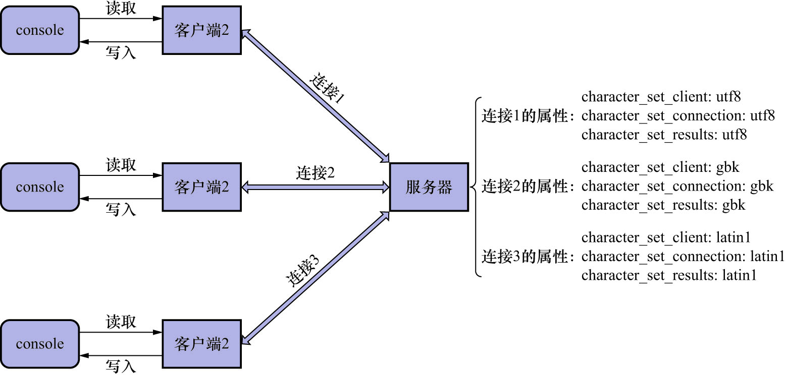

# 4. 服务器生成响应

还是以前面创建的`tt`表为例.列`c`是使用`utf8mb4`字符集进行编码的,所以字符串`'我'`在列`c`中存放的格式就是`0xE68891`

那么执行:

```sql
SELECT c FROM tt WHERE c = '我';
```

时,是不是将`0xE68891`发送给客户端呢?

这不一定.这取决于**SESSION级系统变量**`character_set_results`的值.服务器会先将字符串`'我'`从`utf8mb4`字符集编码的`0xE68891`,转换为`character_set_results`指定的字符集编码后的字节序列,然后再发送给客户端.

```
mysql> SHOW VARIABLES LIKE 'character_set_results';
+-----------------------+---------+
| Variable_name         | Value   |
+-----------------------+---------+
| character_set_results | utf8mb4 |
+-----------------------+---------+
1 row in set (0.00 sec)
```

|            系统变量            | 描述                                                                    |
|:--------------------------:|:----------------------------------------------------------------------|
|   `character_set_client`   | 服务器认为请求时按照该系统变量指定的字符集进行编码的                                            |
| `character_set_connection` | 服务器处理请求时,会把请求字节序列从`character_set_client`转换为`character_set_connection` |
|  `character_set_results`   | 服务器使用该系统变量指定的字符集对返回给客户端的字符串进行编码                                       |

这3个系统变量在服务器中的作用域都是SESSION级别.每个客户端在与服务器连接后,服务器都会为该连接维护这3个变量:



**客户端一侧,若MySQL不支持操作系统当前使用的字符集,则会将客户端默认的字符集设置为MySQL默认的字符集**

MySQL5.7及之前的版本,默认的字符集是`latin1`,而MySQL8.0及之后的版本,默认的字符集是`utf8mb4`

在连接服务器时,客户端将默认的字符集信息/用户名/密码登信息一起发送给服务器,服务器在收到后,会将`character_set_client`/`character_set_connection`/`character_set_results`这3个系统变量的值设置为客户端发送的字符集

一次性修改这3个变量的值:

```
SET NAMES 字符集名称;
```

等价于:

```
SET character_set_client = 字符集名;
SET character_set_connection = 字符集名;
SET character_set_results = 字符集名;
```

需要注意的是,`SET NAMES`语句并不会改变客户端在编码请求字符串时(也就是在`mysql`命令行中敲下回车之前)使用的字符集