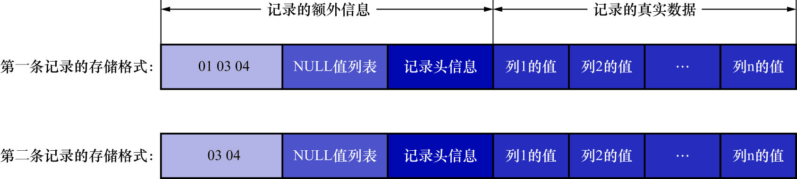

# 1. 变长字段长度列表

MySQL支持一些变长的数据类型,如`VARCHAR(M)`/`VARBINARY(M)`/各种`TEXT`类型,各种`BLOB`类型(存储二进制数据或文件用的类型),我们也可以把拥有这些数据类型的列称为变长字段.

变长字段中存储多少字节的数据是不固定的,所以在存储真实数据时,需要顺便把这些数据占用的字节数也存起来,这样才不至于把MySQL服务器搞懵.

也就是说,这些变长字段占用的存储空间分为两部分:

- 真正的数据内容
- 占用的字节数

在COMPACT行格式中,把所有变长字段的真实数据占用的字节长度都存放在记录的开头位置,从而形成一个变长字段长度列表,**各变长字段数据占用的字节数按照列的顺序逆序存放**

拿`record_format_demo`表举例:

```
mysql> SHOW CREATE TABLE record_format_demo;
+--------------------+--------------------------------------------------------------------------------------------------------------------------------------------------------------------------------------------------------------------------+
| Table              | Create Table                                                                                                                                                                                                             |
+--------------------+--------------------------------------------------------------------------------------------------------------------------------------------------------------------------------------------------------------------------+
| record_format_demo | CREATE TABLE `record_format_demo` (
  `c1` varchar(10) DEFAULT NULL,
  `c2` varchar(10) NOT NULL,
  `c3` char(10) DEFAULT NULL,
  `c4` varchar(10) DEFAULT NULL
) ENGINE=InnoDB DEFAULT CHARSET=ascii ROW_FORMAT=COMPACT |
+--------------------+--------------------------------------------------------------------------------------------------------------------------------------------------------------------------------------------------------------------------+
1 row in set (0.00 sec)
```

```
mysql> SELECT * FROM record_format_demo;
+------+-----+------+------+
| c1   | c2  | c3   | c4   |
+------+-----+------+------+
| aaaa | bbb | cc   | d    |
| eeee | fff | NULL | NULL |
+------+-----+------+------+
2 rows in set (0.00 sec)
```

可以看到,`c1`/`c2`/`c4`列是变长字段,所以这3个列的值占用的存储空间的字节数需要保存在记录的开头处.

`record_format_demo`的各个列都是使用的ascii字符集,每个字符都只需要1个字节来编码.因此,第1条记录的各变长字段内容的长度为:

| 列名 |  存储内容  | 内容长度(十进制表示) | 内容长度(十六进制表示) |
|:--:|:------:|:-----------:|:------------:|
| c1 | 'aaaa' |      4      |     0x04     |
| c2 | 'bbb'  |      3      |     0x03     |
| c4 |  'd'   |      1      |     0x01     |

又因为这些长度值需要按照列的顺序逆序存放,所以最后变长字段长度列表的字节串用十六进制表示的效果就是:`01 03 04`(各个字节之间实际上没有空格,用空格隔开只是方便理解)


由于第一行记录中,`c1`/`c2`/`c4`列中的字符串都比较短,也就是说内容占用的字节数比较小(`c1`内容为`'aaaa'`,占用4字节;`c2`内容为`'bbb'`,占用3字节;`c4`内容为`'d'`,占用1字节),
每个变长字段的内容占用的字节数,用1字节就可以表示(也就是4/3/1这3个数字分别可以使用字节`0x04`/`0x03`/`0x01`来表示).

但是,如果变长字段的内容占用的字节数比较多,可能就需要使用2字节来表示了.

至于具体用1个还是2个字节来表示真实数据占用的字节数,InnoDB 有它的一套规则,这里我们引入`W`/`M`/`L`这3个符号来表述这个规则:

- `W`: 假设某个字符集中,最多需要W个字节来表示1个字符(也就是使用`SHOW CHARSET`语句的结果中的`Maxlen`列).例如:
  - `utf8mb4`字符集中的`W`值为4
  - `gb2312`字符集中的`W`值为2
- `M`: 对于变长类型`VARCHAR(M)`来说,该类型表示能存储最多M个字符(注意是字符不是字节)
  - 所以这个类型能表示的字符串最多占用的字节数为`M*W`
- `L`: 假设该变长字段实际存储的字符串占用的字节数为`L`

则,确定定使用1个字节还是2个字节表示一个变长字段的真实数据占用的字节数的规则如下:

- 若`M*W ≤ 255`,则使用1个字节来表示真实数据占用的字节数

注: InnoDB在读记录的变长字段长度列表时先查看表结构,若某个变长字段允许存储的最大字节数(即`M*W`)不大于255,可以认为针对该字段,只需使用1个字节来表示真实数据占用的字节数
(很明显,1字节能表示的最大数字是255,也就是`0xFF`;而这个字段的内容占用的字节数不超过255,所以只需要1个字节就能表示)

- 若`M*W ＞ 255`,则分为2种情况:
  - 若 `L ≤ 127`,则使用1个字节来表示真正字符串占用的字节数
  - 若 `L ＞ 127`,则使用2个字节来表示真正字符串占用的字节数

注: InnoDB在读记录的变长字段长度列表时先查看表结构.如果某个变长字段允许存储的最大字节数(即`M*W`)大于255时,该怎么区分它正在读的某个字节是一个单独的字段长度还是半个字段长度呢?

MySQL**使用该字节的第1个二进制位作为标志位**:

- 如果该字节的第一个位为0,那该字节就是一个单独的字段长度
- 如果该字节的第一个位为1,那该字节就是半个字段长度
  - 这也解释了为什么在`M*W > 255`的情况下,`L`的分界线为127
  - 127的二进制表示为`01111111`,由于每个字节的第1个二进制位作为标志位,所以单字节能表示的最大值其实就是127
  - 因此,假设某一行的某个变长列,其实际存储的字节数为128,则变长字段长度列表中,存储该列的实际长度就需要2个字节:`10000000 10000000`
    - 第1个字节的第1个bit是标记位,表示这是半个字段长度,后面跟着7个0,表示128的二进制表示的前7位
    - 第2个字节用于表示128(此时第2个字节的第1个bit就不再是标记位了,而是用于实际表达数字)
    - 注: 实际上变长字段长度列表的存储顺序为小端序(就是和人类阅读顺序相反,低位在前高位在后)
    - 注: 这个例子讲的也不全对,只是一个表示.具体的存储方式是`实际字节数 * 2`的小端序表示

对于一条记录来说,如果某个字段占用的字节数特别多(大于了16KB),InnoDB有可能把该字段的值的**一部分数据**存储到溢出页中.
那么该字段在变长字段列表处记录的长度是只存储留在本页面中的长度,所以使用2字节也可以表示这个留在本页面中的长度.尽管也是使用2字节,
但对于溢出字段来说,采用的方案并不是单纯地将首字节的第1bit作为标志位,而是使用了特殊方式,这里就不细讲了

总结: 如果该可变字段允许存储的最大字节数(`M*W`)超过255字节并且真实存储的字节数(`L`)超过127字节,则使用2个字节,否则使用1个字节

另外需要注意的一点是,**变长字段长度列表中只存储值为非NULL列的内容长度,不储存值为NULL列的内容长度**

以第2条记录为例(这里再贴一次表结构和数据):

```
mysql> SHOW CREATE TABLE record_format_demo;
+--------------------+--------------------------------------------------------------------------------------------------------------------------------------------------------------------------------------------------------------------------+
| Table              | Create Table                                                                                                                                                                                                             |
+--------------------+--------------------------------------------------------------------------------------------------------------------------------------------------------------------------------------------------------------------------+
| record_format_demo | CREATE TABLE `record_format_demo` (
  `c1` varchar(10) DEFAULT NULL,
  `c2` varchar(10) NOT NULL,
  `c3` char(10) DEFAULT NULL,
  `c4` varchar(10) DEFAULT NULL
) ENGINE=InnoDB DEFAULT CHARSET=ascii ROW_FORMAT=COMPACT |
+--------------------+--------------------------------------------------------------------------------------------------------------------------------------------------------------------------------------------------------------------------+
1 row in set (0.00 sec)
```

```
mysql> SELECT * FROM record_format_demo;
+------+-----+------+------+
| c1   | c2  | c3   | c4   |
+------+-----+------+------+
| aaaa | bbb | cc   | d    |
| eeee | fff | NULL | NULL |
+------+-----+------+------+
2 rows in set (0.00 sec)
```

因为`c4`列的值为NULL,所以第二条记录的变长字段长度列表只需要存储`c1`和`c2`列的长度即可.
其中`c1`列存储的值为`'eeee'`,占用的字节数为4;`c2`列存储的值为`'fff'`,占用的字节数为3.
数字4可以用1个字节(0x04)表示,3也可以用1个字节(0x03)表示,所以整个变长字段长度列表共需2个字节:



注: 并不是所有记录都有这个变长字段长度列表部分,比如果表中所有的列都不是变长的数据类型或者所有列的值都是NULL的话,就不需要有变长字段长度列表
