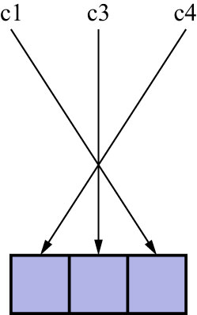
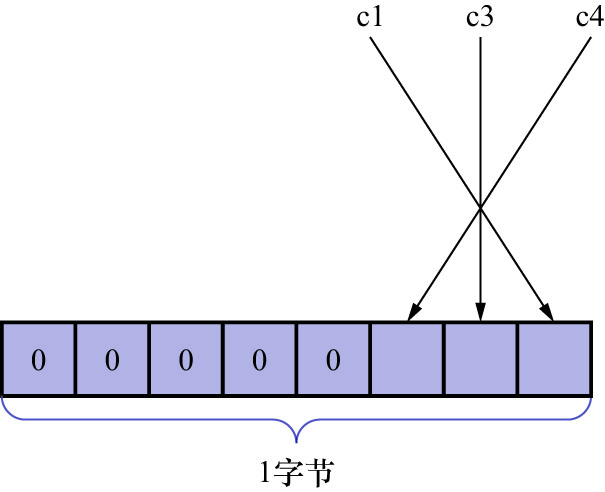
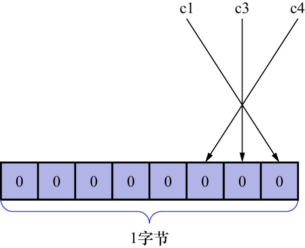
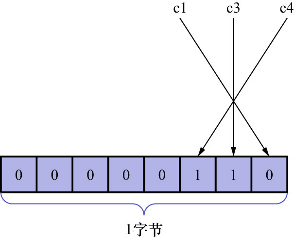
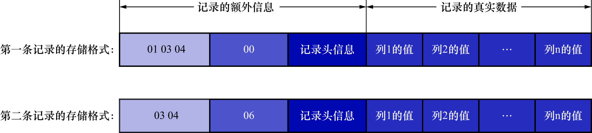

# 2. NULL值列表

一条记录中的某些列可能存储NULL值,如果把这些NULL值都放到记录的真实数据中存储会很占地方,
所以COMPACT行格式把这些值为NULL的列统一管理起来,存储到NULL值列表中.处理过程如下:

1. 首先统计表中允许存储NULL的列有哪些

    主键列/使用`NOT NULL`修饰的列都是不能存储NULL值的,所以在统计时,这些列不会被计算在内.
    例如表`record_format_demo`的3个列`c1`/`c3`/`c4`都是允许存储NULL值的,
    而`c2`列是被`NOT NULL`修饰,不允许存储NULL值

2. 如果表中没有允许存储NULL的列,则NULL值列表也不存在了.**否则为每个允许存储NULL值的列各分配1个二进制位(1bit),二进制位按列的顺序逆序排列**.二进制位的含义如下:

    - 二进制位的值为1时,代表该列的值为NULL
    - 二进制位的值为0时,代表该列的值不为NULL

    表`record_format_demo`有3个允许存储NULL值的列,这3个列和二进制位的对应关系如下:

    

    注意: **二进制位按照列的顺序逆序排列**,所以第一个列`c1`和最后一个二进制位对应

3.  MySQL规定NULL值列表必须用整数个字节的位表示,如果使用的二进制位个数不是整数个字节,则在字节的高位补0

    以表`record_format_demo`的NULL值列表为例,如下图示:

    

    以此类推,如果一个表中有9个值允许为NULL的列,则这个表中的记录中,NULL值列表部分就需要2个字节来表示了

知道了规则之后,我们再返回头看表`record_format_demo`中的两条记录中的NULL值列表应该怎么储存.
因为只有`c1`/`c3`/`c4`这3个列允许存储NULL值,所以所有记录的NULL值列表只需要一个字节

这里再贴一次表结构和数据:

```
mysql> SHOW CREATE TABLE record_format_demo;
+--------------------+--------------------------------------------------------------------------------------------------------------------------------------------------------------------------------------------------------------------------+
| Table              | Create Table                                                                                                                                                                                                             |
+--------------------+--------------------------------------------------------------------------------------------------------------------------------------------------------------------------------------------------------------------------+
| record_format_demo | CREATE TABLE `record_format_demo` (
  `c1` varchar(10) DEFAULT NULL,
  `c2` varchar(10) NOT NULL,
  `c3` char(10) DEFAULT NULL,
  `c4` varchar(10) DEFAULT NULL
) ENGINE=InnoDB DEFAULT CHARSET=ascii ROW_FORMAT=COMPACT |
+--------------------+--------------------------------------------------------------------------------------------------------------------------------------------------------------------------------------------------------------------------+
1 row in set (0.00 sec)
```

```
mysql> SELECT * FROM record_format_demo;
+------+-----+------+------+
| c1   | c2  | c3   | c4   |
+------+-----+------+------+
| aaaa | bbb | cc   | d    |
| eeee | fff | NULL | NULL |
+------+-----+------+------+
2 rows in set (0.00 sec)
```

- 对于第1条记录来说,`c1`/`c3`/`c4`这3个列的值都不为NULL,所以它们对应的二进制位都是0.所以第1条记录的NULL值列表用十六进制表示就是`0x00`



- 对于第二条记录来说,`c1`/`c3`/`c4`这3个列中`c3`和`c4`的值都为NULL,所以这3个列对应的二进制位的情况如下图示.所以第2条记录的NULL值列表用十六进制表示就是`0x06`



这2条记录在填充了NULL值列表后的示意图如下:

