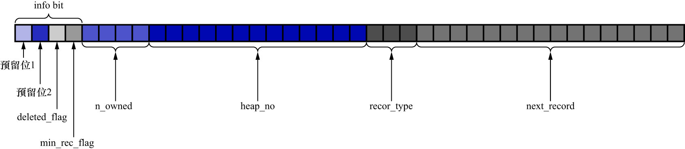
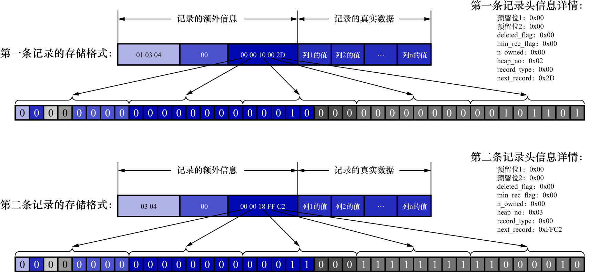

# 3. 记录头信息

记录头信息是由固定的5个字节组成.5个字节也就是40个二进制位,不同的位代表不同的意思,如下图示:

|       名称       | 大小（单位: bit） |                                                描述                                                 |
|:--------------:|:-----------:|:-------------------------------------------------------------------------------------------------:|
|      预留位1      |      1      |                                               没有使用                                                |
|      预留位2      |      1      |                                               没有使用                                                |
| `delete_flag`  |      1      |                                            标记该记录是否被删除                                             |
| `min_rec_flag` |      1      |                                   B+树的每层非叶子节点中的最小的目录项记录都会添加该标记                                    |
|   `n_owned`    |      4      | 一个页面中的记录会被分成若干个组,每个组中有1个记录是"带头大哥",其余记录都是"小弟"."带头大哥"记录的`n_owned`值表示该组中所有的记录条数;"小弟"记录的`n_owned`值都为0 |
|   `heap_no`    |     13      |                                         表示当前记录在页面堆中的相对位置                                          |
| `record_type`  |      3      |        表示当前记录的类型.`0`表示普通记录;`1`表示B+树非叶子节点的目录项记录;`2`表示Infimum记录(最小记录);`3`表示Supremum记录(最大记录)         |
| `next_record`  |     16      |                                           表示下一条记录的相对位置                                            |

现在只需要看一遍混个脸熟即可.

因为我们并不清楚这些属性详细的用法,所以这里就不分析各个属性值是怎么产生的了,之后我们遇到会详细看的.
所以我们现在直接看一下`record_format_demo`中的2条记录的头信息分别是什么:

