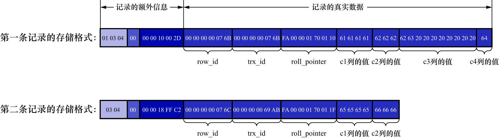

# 2. 记录的真实数据

对于`record_format_demo`表来说,记录的真实数据除了`c1`/`c2`/`c3`/`c4`这几个我们自己定义的列的数据外,MySQL会为每个记录默认的添加一些列(也称为隐藏列),具体的列如下:

|       列名       | 是否必须 | 占用空间 | 描述           |
|:--------------:|:----:|:----:|:-------------|
|    `row_id`    |  否   | 6字节  | 行ID,唯一标识一条记录 |
|    `trx_id`    |  是   | 6字节  | 事务ID         |
| `roll_pointer` |  是   | 7字节  | 回滚指针         |

注: 实际上这几个列的真正名称为`DB_ROW_ID`/`DB_TRX_ID`/`DB_ROLL_PTR`

InnoDB主键生成策略:

- 优先使用用户自定义主键作为主键
- 如果用户没有定义主键,则选取一个不允许存储NULL值的UNIQUE键作为主键
- 如果表中连不允许存储NULL值的UNIQUE键都没有定义,则InnoDB会为表默认添加一个名为`row_id`的隐藏列作为主键

所以从上表中我们可以看出: **InnoDB存储引擎会为每条记录都添加`trx_id`和`roll_pointer`这两个列,但是`row_id`是可选的(在没有自定义主键且不存在不允许存储NULL值的UNIQUE键的情况下才会添加该列)**

因为表`record_format_demo`并没有定义主键,所以MySQL服务器会为每条记录增加上述的3个列.
现在看一下加上记录的真实数据的两条记录的结构:

-  表`record_format_demo`使用的是`ascii`字符集,所以`0x61616161`就表示字符串`'aaaa'`;`0x626262`就表示字符串`'bbb'`,以此类推
- 注意第1条记录中`c3`列的值,该列的类型为`CHAR(10)`,它实际存储的字符串为`'cc'`,在`ascii`字符集中的字节表示是`'0x6363'`(这里图中标识的c3列的值有误)
  - 虽然表示这个字符串只占用了2个字节,但整个`c3`列仍然占用了10个字节的空间
  - 除真实数据以外的8个字节的**用空格字符填充**,空格字符在`ascii`字符集的表示就是`0x20`
- 第2条记录中`c3`和`c4`列的值都为NULL,它们被存储在了前边的NULL值列表处,在记录的真实数据处就不再冗余存储,从而节省存储空间

