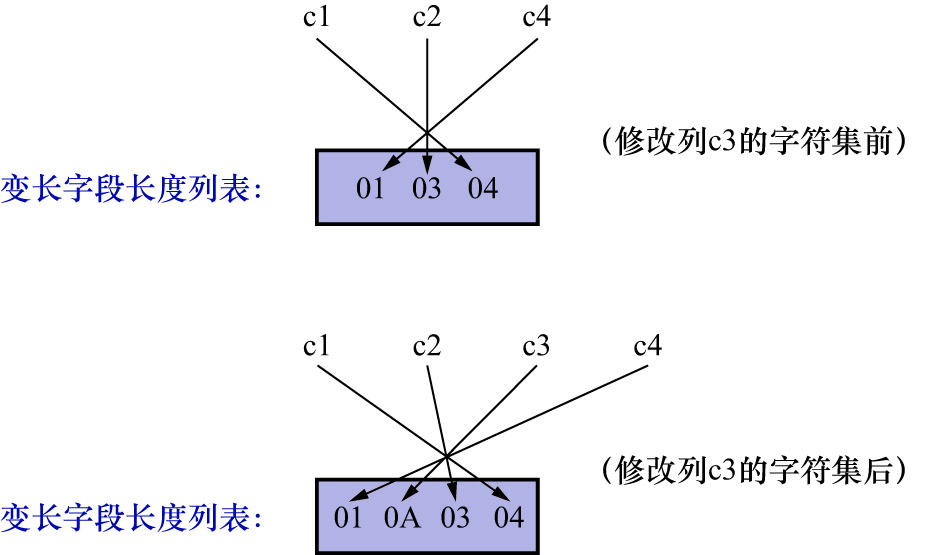

# 3. `CHAR(M)`列的存储格式

在COMPACT行格式下,变长字段长度列表只存放1条记录中,各个变长字段的值占用的字节长度.
`record_format_demo`表的`c1`/`c2`/`c4`列的类型是`VARCHAR(10)`,即:`c1`/`c2`/`c4`列是变长字段;
`c3`列的类型是`CHAR(10)`,即:`c3`列是定长字段.因此会把1条记录的`c1`/`c2`/`c4`这3个列占用的字节长度**逆序**存到变长字段长度列表中,如下图示:


但这是建立在`record_format_demo`表采用的是`ascii`字符集的前提下的.如果采用变长编码的字符集(
即:表示1个字符所需的字节数不确定,例如`gb2312`表示1个字符需要1-2个字节;`utf8mb4`表示1个字符需要1-4个字节),
此时虽然`c3`列的类型为`CHAR(10)`,但COMPACT行格式规定,此时该列占用的字节数也要被存储到变长字段长度列表中.

例: 修改`c3`列的字符集为`utf8mb4`:

```
mysql> ALTER TABLE record_format_demo MODIFY c3 CHAR(10) CHARACTER SET utf8mb4;
Query OK, 2 rows affected (0.05 sec)
Records: 2  Duplicates: 0  Warnings: 0
```

修改了该列的字符集后,记录的变长字段长度列表也发生了变化,如下图示:



即: **对于`CHAR(M)`类型的列来说,当列采用的是定长字符集时,该列占用的字节数不会被加到变长字段长度列表;而如果采用变长字符集时,该列占用的字节数会被加到变长字段长度列表**

另外还有一点需要注意: COMPACT行格式规定,**采用变长编码字符集的`CHAR(M)`类型的列,要求至少占用`M`个字节(即使实际存储的字节长度少于`M`,也会占用`M`个字节).而`VARCHAR(M)`类型的列没有这个要求**

例: 对于使用`utf8mb4`字符集的`CHAR(10)`的列来说,该列存储的数据字节长度的范围是10-40个字节.即使向该列中存储一个空字符串也会占用10个字节
(这也就是为什么图中`c3`列在变长字段长度列表中占用的字节数是`0A`而非`06`的原因.`0x0A`即二进制中的10).

**这样设计的目的是为了在更新该列时,若`新值的字节长度 > 旧值的字节长度`且`新值的字节长度 ≤ M`时,可以在该条记录处原地更新,
而不是在存储空间中再分配一个新的记录空间,导致原有的记录空间成为所谓的"碎片"**