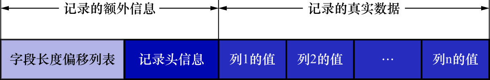

# 0. REDUNDANT行格式示意图

REDUNDANT行格式是MySQL5.0之前用的一种行格式,也就是说它已经非常老了,但是本着知识完整性的角度还是要提一下



把表`record_format_demo`的行格式修改为REDUNDANT:

```
mysql> ALTER TABLE record_format_demo ROW_FORMAT=REDUNDANT;
Query OK, 0 rows affected (0.04 sec)
Records: 0  Duplicates: 0  Warnings: 0
```

此处直接把表`record_format_demo`在REDUNDANT行格式下的两条记录的真实存储数据提供出来,如下图示:

