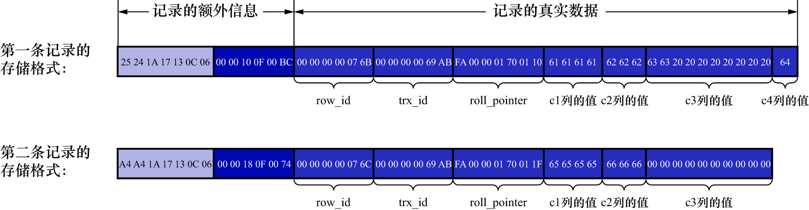

# 1. 字段长度偏移列表

注意COMPACT行格式的开头是变长字段长度列表,而REDUNDANT行格式的开头是字段长度偏移列表,与变长字段长度列表有两处不同:

- 没有了"变长"两个字,意味着REDUNDANT行格式会把该条记录中所有列(包括隐藏列)的长度信息都按照**逆序**存储到字段长度偏移列表
- 多了个**偏移**两个字m这意味着计算列值长度的方式不像COMPACT行格式那么直观,它是采用两个相邻偏移量的差值来计算各个列值的长度



这里再贴一下表结构和数据:

```
mysql> SHOW CREATE TABLE record_format_demo;
+--------------------+-----------------------------------------------------------------------------------------------------------------------------------------------------------------------------------------------------------------------------------------------------------------------------+
| Table              | Create Table                                                                                                                                                                                                                                                                |
+--------------------+-----------------------------------------------------------------------------------------------------------------------------------------------------------------------------------------------------------------------------------------------------------------------------+
| record_format_demo | CREATE TABLE `record_format_demo` (
  `c1` varchar(10) DEFAULT NULL,
  `c2` varchar(10) NOT NULL,
  `c3` char(10) CHARACTER SET utf8mb4 COLLATE utf8mb4_0900_ai_ci DEFAULT NULL,
  `c4` varchar(10) DEFAULT NULL
) ENGINE=InnoDB DEFAULT CHARSET=ascii ROW_FORMAT=REDUNDANT |
+--------------------+-----------------------------------------------------------------------------------------------------------------------------------------------------------------------------------------------------------------------------------------------------------------------------+
1 row in set (0.00 sec)
```

```
mysql> SELECT * FROM record_format_demo;
+------+-----+------+------+
| c1   | c2  | c3   | c4   |
+------+-----+------+------+
| aaaa | bbb | cc   | d    |
| eeee | fff | NULL | NULL |
+------+-----+------+------+
2 rows in set (0.00 sec)
```

比如第一条记录的字段长度偏移列表为:

```
 25 24 1A 17 13 0C 06
```

因为它是逆序排放的,所以按照列的顺序排列就是:

```
06 0C 13 17 1A 24 25
```

按照两个相邻偏移量的差值来计算各个列值的长度,即:

- 第1列(`row_id`)的长度: `0x06`(即十进制的6),即6个字节
- 第2列(`trx_id`)的长度: `0x0C - 0x06`(即十进制的`12 - 6`)个字节,即6个字节
- 第3列(`roll_ptr`)的长度: `0x13 - 0x0C`(即十进制的`19 - 12`)个字节,即7个字节
- 第4列(`c1`)的长度: `0x17 - 0x13`(即十进制的`23 - 19`)个字节,即4个字节
- 第5列(`c2`)的长度: `0x1A - 0x17`(即十进制的`26 - 23`)个字节,即3个字节
- 第6列(`c3`)的长度: `0x24 - 0x1A`(即十进制的`36 - 26`)个字节,即10个字节
- 第7列(`c4`)的长度: `0x25 - 0x24`(即十进制的`37 - 36`)个字节,即1个字节