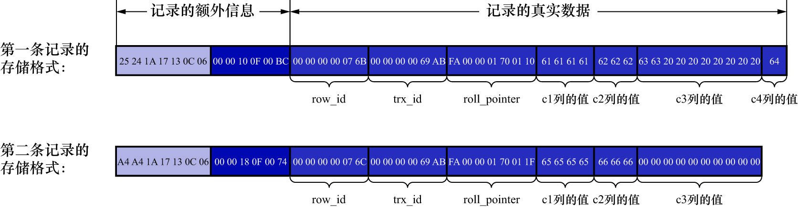

# 2. 记录头信息



REDUNDANT行格式的记录头信息占用6字节,即48个二进制位,这些二进制位代表的意思如下:

|        名称         | 大小(单位:bit) | 描述                                                                                                |
|:-----------------:|:----------:|:--------------------------------------------------------------------------------------------------|
|       预留位1        |     1      | 没有使用                                                                                              |
|       预留位2        |     1      | 没有使用                                                                                              |
|   `delete_flag`   |     1      | 标记该记录是否被删除                                                                                        |
|  `min_rec_flag`   |     1      | B+树的每层非叶子节点中的最小记录都会添加该标记                                                                          |
|     `n_owned`     |     4      | 一个页面中的记录会被分成若干个组,每个组中有1个记录是"带头大哥",其余记录都是"小弟"."带头大哥"记录的`n_owned`值表示该组中所有的记录条数;"小弟"记录的`n_owned`值都为0 |
|     `heap_no`     |     13     | 表示当前记录在页面堆中的相对位置                                                                                  |
|     `n_field`     |     10     | 表示记录中列的数量                                                                                         |
| `1byte_offs_flag` |     1      | 标记字段长度偏移列表中每个列对应的偏移量是使用1字节还是2字节表示的;值为1表示使用1字节存储偏移量;值为0表示使用2字节存储偏移量                                |
|   `next_record`   |     16     | 表示下一条记录的相对位置                                                                                      |

第一条记录中的头信息为:

```
00 00 10 0F 00 BC
```

二进制表示即为:

```
00000000 00000000 00010000 00001111 00000000 10111100
```

按字段划分即为:

```
0 0 0 0 0000 0000000000010 0000000111 1 0000000010111100
```

- 预留位1: `0x00`
- 预留位2: `0x00`
- `delete_flag`: `0x00`
- `min_rec_flag`: `0x00`
- `n_owned`: `0x00`
- `heap_no`: `0x02` (`0000000000010`部分)
- `n_field`: `0x07` (`0000000111`部分)
- `1byte_offs_flag`: `0x01`
- `next_record`: `0xBC` (`0000000010111100`部分)

与COMPACT行格式的记录头信息对比来看,有两处不同:

- REDUNDANT行格式多了`n_field`和`1byte_offs_flag`这两个属性
- REDUNDANT行格式没有`record_type`这个属性
