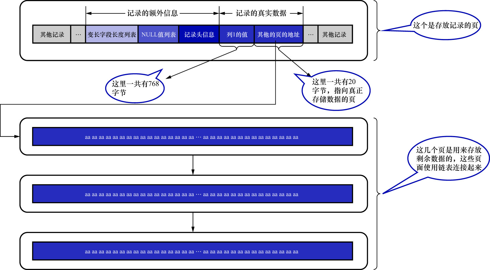

# 1. 溢出列

以使用`ascii`字符集下的`off_page_demo`表为例:

```
mysql> CREATE TABLE off_page_demo (
    ->     c VARCHAR(65532)
    -> ) CHARSET=ascii ROW_FORMAT=COMPACT;
Query OK, 0 rows affected (0.04 sec)
```

插入1条记录:

```
mysql> INSERT INTO off_page_demo VALUES (REPEAT('a', 65532));
Query OK, 1 row affected (0.01 sec)
```

其中的`REPEAT('a', 65532)`是一个函数调用,表示生成一个把字符`'a'`重复65532次的字符串

前边说过,InnoDB中,磁盘和内存交互的基本单位是页,也就是说**InnoDB是以页为单位来管理存储空间的**.记录都会被分配到某个页中存储.
而一个页的大小一般是16KB,也就是16384个字节,而本例中1个列的实际数据就需要占用65532个字节,很显然1个页都存不了1条记录,此时该怎么办呢?

在COMPACT和REDUNDANT行格式中,对于占用存储空间非常多的列,在记录的真实数据处只会存储该列的一部分数据,
而把剩余的数据分散存储在几个其他的页中,然后记录的真实数据处用20个字节存储指向这些页的地址
(当然这20个字节中还包括这些分散在其他页面中的数据的占用的字节数),从而可以找到剩余数据所在的页,如下图示:



从图中可以看出,对于COMPACT和REDUNDANT行格式来说,如果某一列中的数据非常多,则在本记录的真实数据处
只会**存储该列的前768个字节的数据和一个指向其他页的地址**,然后把剩下的数据存放到其他页中.
这些存储超出768字节之外的数据的页面称为**溢出页**(overflow page).简图如下:


`off_page_demo`表的这条记录的列`c`,就需要使用溢出页来存储.这种需要使用溢出页来存储的列,称为**溢出列**(off-page column)

不只是`VARCHAR(M)`类型的列.像`TEXT`/`BLOB`类型的列在存储数据相当多的时候,也会成为溢出列