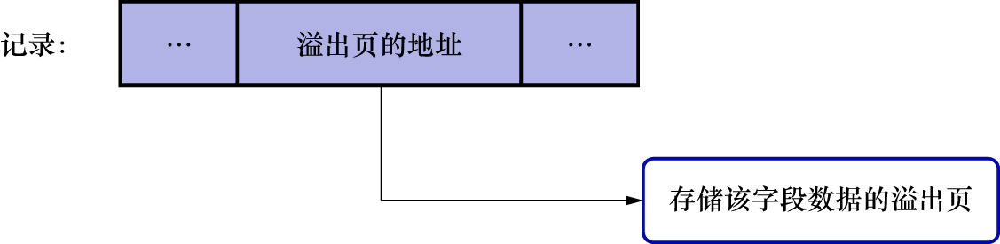

# 5. DYNAMIC和COMPRESSED行格式

MySQL5.7.9开始,DYNAMIC行格式成为默认行格式,而COMPRESSED行格式则是DYNAMIC行格式的压缩版本.

这两个行格式和COMPACT行格式很像,只是在处理溢出列的数据时稍有不同: 它们不会在记录的真实数据处存储该溢出列真实数据的前768个字节,
而是把该列的所有真实数据都存储到溢出页中,只在记录的真实数据处存储20个字节大小的指向溢出页的地址(这20字节还包括真实数据占用的字节数).如下图示:

COMPRESSED行格式和DYNAMIC不同的一点:COMPRESSED行格式会采用压缩算法对页面进行压缩,以节省空间

REDUNDANT行格式是一种比较原始的行格式,它是非紧凑的;而COMPACT/DYNAMIC/COMPRESSED行格式是较新的格式,它们是紧凑的(占用的存储空间更少)
