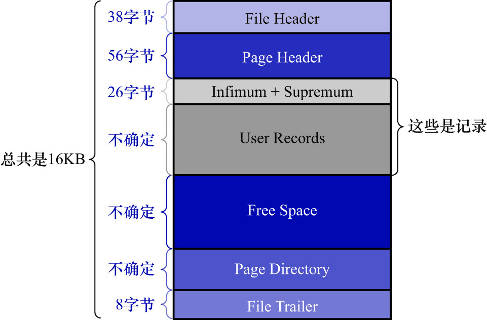

# 2. 数据页结构快览

|          名称          |      中文名      | 占用空间大小 | 简单描述         |
|:--------------------:|:-------------:|:------:|:-------------|
|    `File Header`     |     文件头部      | 38 字节  | 页的一些通用信息     |
|    `Page Header`     |     页面头部      | 56 字节  | 数据页专有的一些信息   |
| `Infimum + Supremum` | 页面中的最小记录和最大记录 | 26 字节  | 2个虚拟的记录      |
|    `User Records`    |     用户记录      |  不确定   | 用户存储的记录内容    |
|     `Free Space`     |     空闲空间      |  不确定   | 页中尚未使用的空间    |
|   `Page Directory`   |     页面目录      |  不确定   | 页中的某些记录的相对位置 |
|    `File Trailer`    |     文件尾部      |  8 字节  | 校验页是否完整      |
