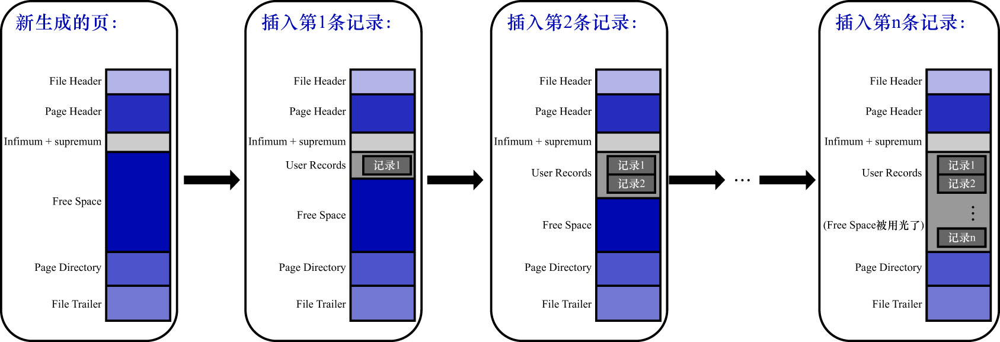

# 0. 概述

在页的7个组成部分中,我们自己存储的记录会按照我们指定的行格式存储到`User Records`部分.
但是在一开始生成页的时候,其实并没有`User Records`这个部分,每当插入一条记录时,都会从`Free Space`部分(也就是尚未使用的存储空间)
申请1个记录大小的空间,并将这个空间划分到`User Records`部分.
当`Free Space`部分的空间全部被`User Records`部分替代掉之后,也就表示这个页使用完了,此时如果还有新的记录插入,就需要去申请新的页了,
这个过程的如下图示:

为了更好地管理`User Records`中的记录,需要从行格式的记录头信息部分说起.
