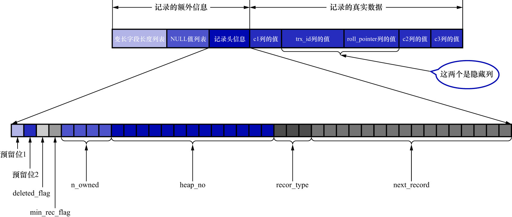
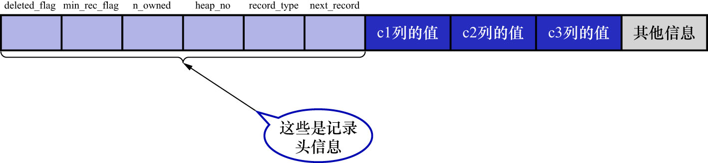
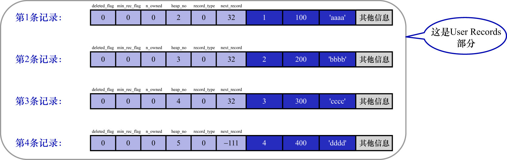

# 0. 准备工作

创建表如下:

```
mysql> CREATE TABLE page_demo (
    ->     c1 INT,
    ->     c2 INT,
    ->     c3 VARCHAR(10000),
    ->     PRIMARY KEY (c1)
    -> ) CHARSET=ascii ROW_FORMAT=COMPACT;
Query OK, 0 rows affected (0.07 sec)
```

这个新创建的`page_demo`表有3个列,其中:

- `c1`和`c2`列是用来存储整数的
- `c3`列是用来存储字符串的
- 注意:`c1`列被指定为主键,所以InnoDB就没必要创建隐藏列`row_id`了
- 且为这个表指定了`ascii`字符集以及`COMPACT`的行格式

所以这个表中记录的行格式示意图如下:



再次把记录头信息中各个属性的大体意思浏览一下:

|       名称       | 大小（单位: bit） |                                                描述                                                 |
|:--------------:|:-----------:|:-------------------------------------------------------------------------------------------------:|
|      预留位1      |      1      |                                               没有使用                                                |
|      预留位2      |      1      |                                               没有使用                                                |
| `delete_mask`  |      1      |                                            标记该记录是否被删除                                             |
| `min_rec_mask` |      1      |                                   B+树的每层非叶子节点中的最小的目录项记录都会添加该标记                                    |
|   `n_owned`    |      4      | 一个页面中的记录会被分成若干个组,每个组中有1个记录是"带头大哥",其余记录都是"小弟"."带头大哥"记录的`n_owned`值表示该组中所有的记录条数;"小弟"记录的`n_owned`值都为0 |
|   `heap_no`    |     13      |                                         表示当前记录在页面堆中的相对位置                                          |
| `record_type`  |      3      |        表示当前记录的类型.`0`表示普通记录;`1`表示B+树非叶子节点的目录项记录;`2`表示Infimum记录(最小记录);`3`表示Supremum记录(最大记录)         |
| `next_record`  |     16      |                                           表示下一条记录的相对位置                                            |

由于我们现在主要讲解记录头信息的作用,所以为理解方便,只在`page_demo`表的行格式演示图中画出有关的头信息属性以及`c1`/`c2`/`c3`列的信息(
其他信息没画不代表它们不存在,只是为了理解上的方便在图中省略了),简化后的行格式示意图如下:



然后向`page_demo`表中插入一些数据:

```
mysql> INSERT INTO page_demo VALUES(1, 100, 'aaaa'), (2, 200, 'bbbb'), (3, 300, 'cccc'), (4, 400, 'dddd');
Query OK, 4 rows affected (0.02 sec)
Records: 4  Duplicates: 0  Warnings: 0
```

为了方便分析这些记录在页的`User Records`部分中是怎么表示的,这里把记录中头信息和实际的列数据都用十进制表示出来了(其实是一堆二进制位),
所以这些记录的示意图如下:

