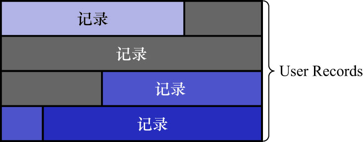
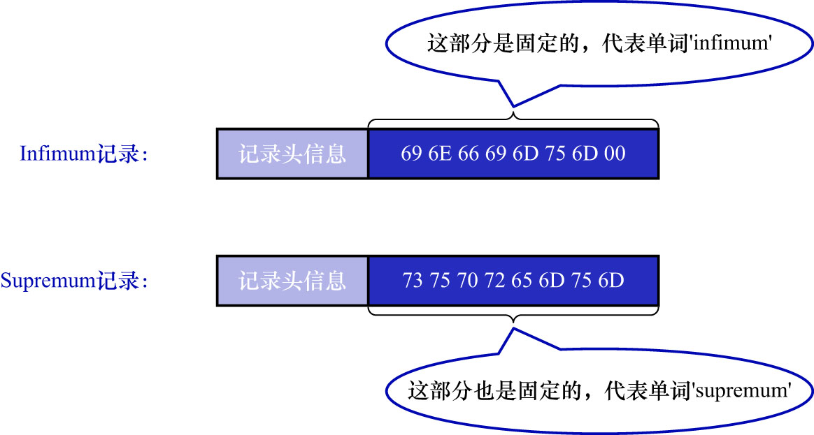
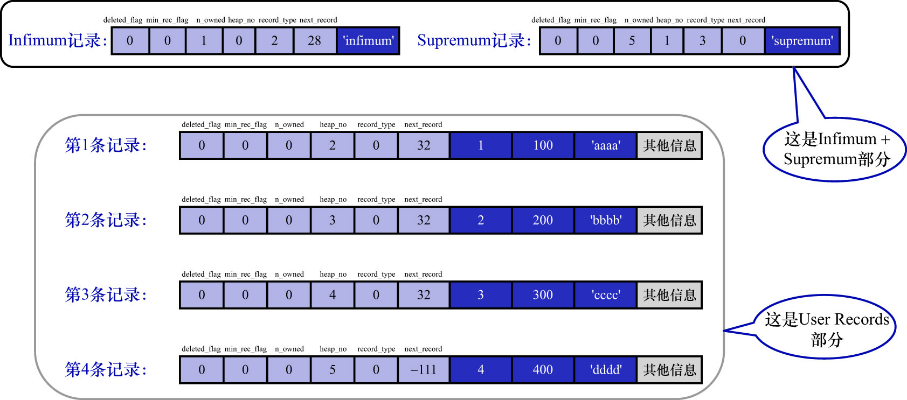

# 4. `heap_no`

我们向表中插入的记录,从本质上讲,都是放到数据页的`User Records`部分中的,这些记录一条一条紧密地排列,
如下图示(这不是`page_demo`表中的记录,只是一个通用的示意图):

MySQL的设计者将这种"记录一条一条紧密地排列"的结构称为堆(heap).为了方便管理这个堆,将**1条记录(这条记录的`deleted_flag`可以为1)
在堆中的相对位置**称为`heap_no`.在页面前边的记录`heap_no`相对较小,在页面后面的记录`heap_no`相对较大,每新申请1条记录的存储空间时,
该条记录比物理位置在它前面的那条记录的`heap_no`值大1.

问题: 为什么我们插入的4条记录的`heap_no`值是2/3/4/5? `heap_no`值为0和1的记录去哪了?

MySQL的设计者自动给每个页中添加了2条记录,由于这2条记录并不是用户自己插入的,所以有时候也称为伪记录或者虚拟记录.在这2条记录中,1条代表
页面中的最小记录(即Infimum记录),1条代表页面中的最大记录(Supremum记录).这2条伪记录也算作堆的一部分(这两条记录的`heap_no`值最小,
说明它们在页面中的相对位置最靠前).

问题: 记录怎么比大小?

**对于一条完整的记录来说,比较记录的大小就是比较主键的大小**.

不管我们向页中插入了多少条记录,MySQL的设计者规定:

- 任何用户记录都比`Infimum`记录大
- 任何用户记录都比`Supremum`记录小

注: `Infimum`记录和`Supremum`记录没有主键值,它们从结构上讲,更类似于一种"边界",标志着当前页中存储的最小记录和最大记录(后续会展开讲这个结构).

`Infimum`记录和`Supremum`记录的构造十分简单,都是由5字节大小的记录头信息和8字节大小的一个固定的单词组成的,如下图示:

由于`Infimum`记录和`Supremum`记录是MySQL设计者默认创建的记录,为了与用户自己插入的记录进行区分,就没有把它们放在页的`User Records`部分,
而是单独放在一个称为`Infimum + Supremum`的部分,如下图示:

