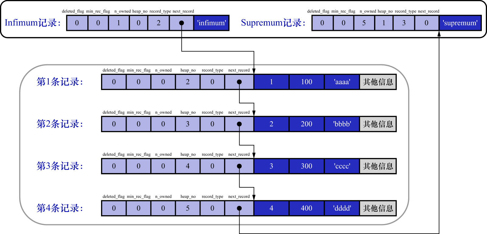
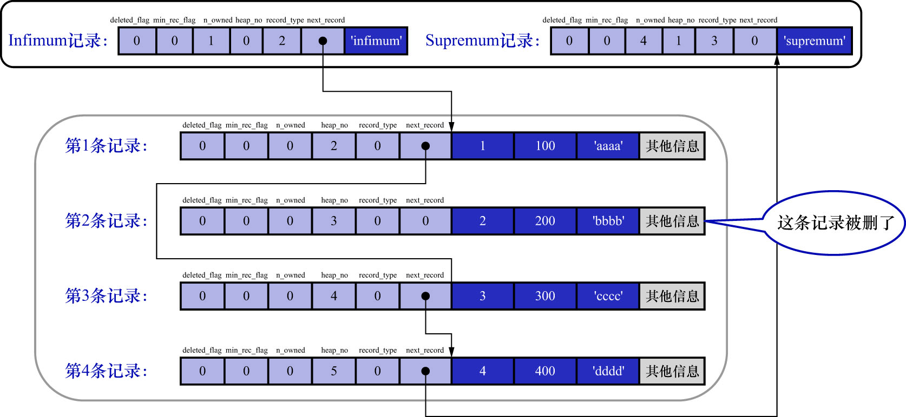
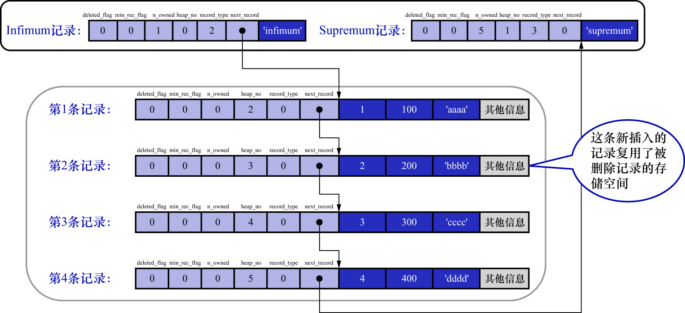

# 6. `next_record`

该属性表示从**当前记录的真实数据到下一条记录的真实数据的距离(单位: 字节)**(注意是真实数据到真实数据的距离,不是当前记录起始位置到下一条记录的起始位置).
若该属性值为正数,则表明当前记录的下一条记录在当前记录的后面;若该属性值为负数,则表明当前记录的下一条记录在当前记录的前面.

例: 第1条记录的`next_record`值为32,说明从第1条记录的**真实数据的地址处**向后找32个字节就是下一条记录的**真实数据**

例: 第4条记录的`next_record`值为-111,说明从第4条记录的**真实数据的地址处**向前找111个字节就是下一条记录的**真实数据**

**这是个很标准的链表结构,可以通过一条记录找到它的下一条记录**

注意: **这里说的"下一条记录",指的不是插入顺序中的下一条记录,而是按照主键值由小到大的顺序排列的下一条记录**

规定: 

- `Infimum`记录的下一条记录为本页中主键值最小的记录
- 本页中主键值最大的用户记录的下一条记录为`Supremum`记录

这也就是为什么之前说,`Infimum`记录和`Supremum`记录从结构上讲,更类似于一种"边界"的原因.

如下图示:



从图中可以看出,记录按主键从小到大的顺序形成了一个单向链表.`Supremum`记录的`next_record`值为0,
也就是说`Supremum`记录之后就没有下一条记录了.换言之,**`Supremum`记录是这个单向链表中的最后一个节点**.

如果从表中删除掉一条记录,这个由记录组成的单向链表也会跟着变化,比如把第2条记录删掉:

```
mysql> DELETE FROM page_demo WHERE c1 = 2;
Query OK, 1 row affected (0.01 sec)
```

删除第2条记录后的示意图如下:



注: 图中第2条数据的`delete_flag`字段值应该为1,他写错了

从图中可以看出,删除第2条记录,后主要发生了这些变化:

- 第2条记录并没有从存储空间中移除,而是把该条记录的`delete_flag`值设置为1
- 第2条记录的`next_record`值变为了0,表示该记录没有下一条记录了
- 第1条记录的`next_record`指向了第3条记录的真实数据部分的位置
- 还有一点你可能忽略了,就是`Supremum`记录的`n_owned`值从5变成了4,关于这一点的变化我们稍后会详细说明的

**无论怎么对页中的记录做增删改操作,InnoDB始终会维护一个单向链表,链表中的各个节点是按照主键值由小到大的顺序链接起来的**

注: `next_record`指针为什么要指向记录头信息和真实数据之间的位置呢? 为什么不指向整条记录的开头位置(即记录的额外信息的开头位置)?

因为在这个位置,向左读取就是记录头信息,向右读取就是真实数据.
前文讲到过,变长字段长度列表/NULL值列表中的信息都是逆序存放的,**这样可以使记录中位置靠前的字段和它们对应的字段长度信息在内存中的距离更近**,可能会提高高速缓存的命中率

现在,主键值为2的记录被删掉了,但是存储空间却没有回收(该记录的`heap_no`字段值也没有改变),如果再次把这条记录插入到表中,会怎么样?

```
mysql> INSERT INTO page_demo VALUES(2, 200, 'bbbb');
Query OK, 1 row affected (0.00 sec)
```

再次插入主键值为2的记录后,示意图如下:



从图中可以看到,InnoDB并没有因为新记录的插入而为它申请新的存储空间,而是直接复用了原来被删除记录的存储空间.

注: 当数据页中存在多条被删除掉的记录时,这些记录的`next_record`属性将会把这些被删除掉的记录组成一个垃圾链表,以备之后重用这部分存储空间
