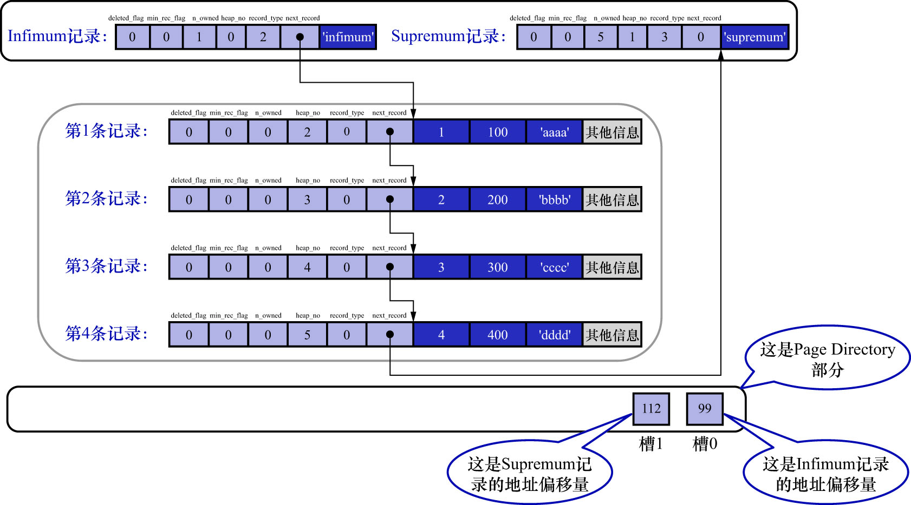
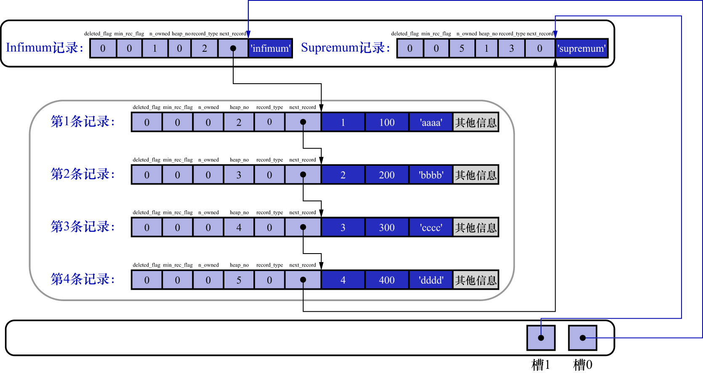
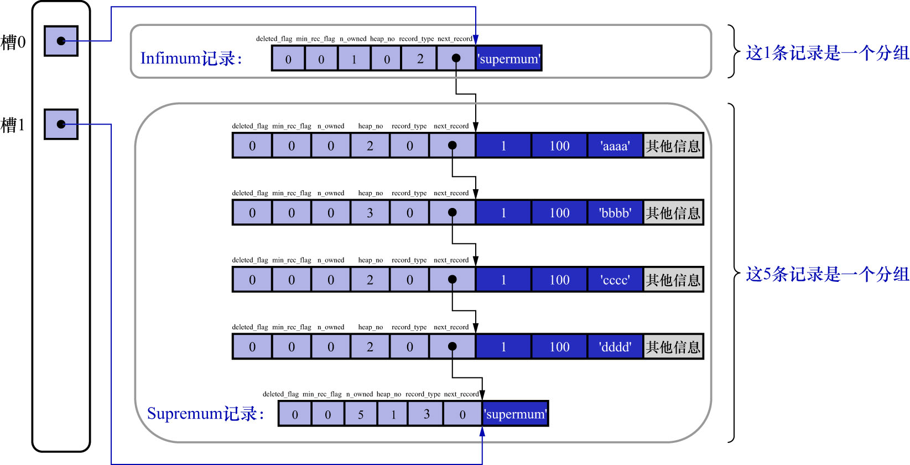
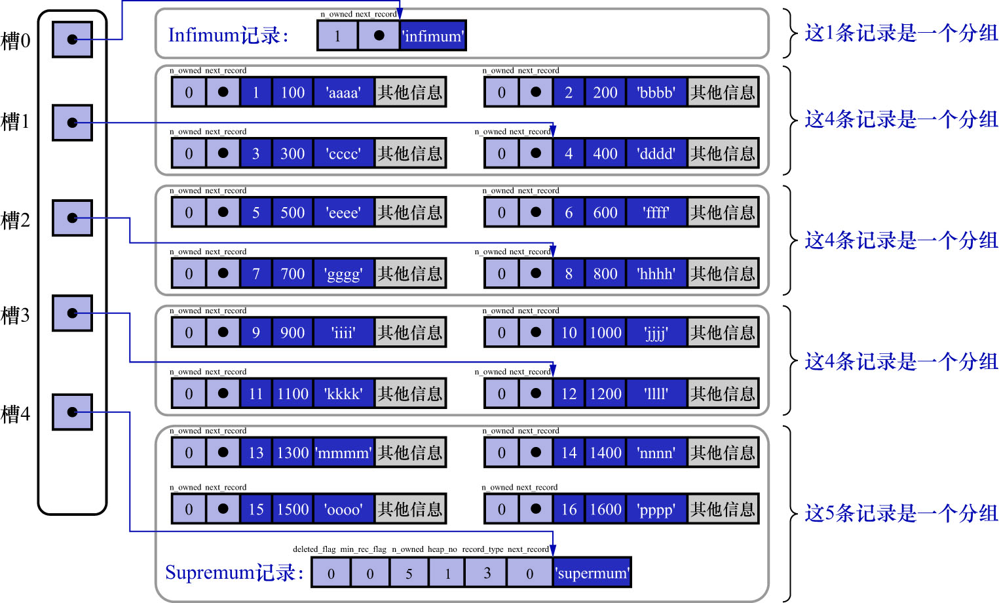

# 4. `Page Directory`(页目录)

现在我们知道了记录在页中是按照主键值由小到大的顺序串联成一个单向链表,那如果我们想根据主键值查找页中的某条记录该怎么做?
比如说这样的查询语句:

```
mysql> SELECT * FROM page_demo WHERE c1 = 3;
+----+------+------+
| c1 | c2   | c3   |
+----+------+------+
|  3 |  300 | cccc |
+----+------+------+
1 row in set (0.00 sec)
```

最笨的办法是从`Infimum`记录开始,沿着单向链表一直往后找,总有一天会找到(或者找不到).
而且在找的时候还能投机取巧,因为链表中各个记录的主键值是按照从小到大顺序排列的,所以当链表的某个节点代表的记录的主键值大于你想要查找的主键值时,
就可以停止查找了(因为该节点后边的节点的主键值依次递增)

当页中存储的记录数量比较少时,这种方法是没什么问题的.但是如果一个页中存储了非常多的记录,
遍历操作对性能来说还是有损耗的,所以说这种遍历查找这是一个笨办法.而MySQL的设计者,从图书的目录中找到了灵感.

我们平常想从一本书中查找某个内容的时候,一般会先看目录,找到该内容对应的书的页码,然后到对应的页码查看内容.
InnoDB的设计者为页中的记录也制作了一个类似的目录,制作过程如下:

1. 将所有正常的记录(包括`Infimum`记录和`Supremum`记录,但不包括已经移除到垃圾链表的记录)划分为几个组
2. 每个组的最后一条记录(也就是组内最大的那条记录)相当于"带头大哥",组内其余的记录相当于"小弟"."带头大哥"的记录头信息中的`n_owned`属性表示该该组内共有几条记录
3. 将每个组中最后一条记录在页面中的地址偏移量(即该记录的**真实数据处**与页面中第0个字节之间的距离)单独提取出来,**按顺序存储到靠近页的尾部的地方**.这个地方就是`Page Directory`(页目录).页目录中的这些地址偏移量称为槽(`Slot`),每个槽占用2字节.页目录就是由多个槽组成

注: 1个正常的页面大小为16KB,而2字节能表示的地址偏移量的范围是0-65535,所以2字节表示1个槽是肯定足够的

例如,现在`page_demo`表中正常的记录共有6条.InnoDB会把它们分成2个组:

- 第一组中只有一个`Infimum`记录
- 第二组中是剩余的5条记录

2个组就对应着2个槽,每个槽中存放的是每个组中最大的那条记录在页面中的地址偏移量,如下图示:



注意:

-  页目录部分中有2个槽,也就是说记录被分成了两个组:
- 槽1中的值是112,表示`Supremum`记录的地址偏移量(就是从页面的0字节开始数,数112个字节)
- 槽0中的值是99,表示`Infimum`记录的地址偏移量
- `Infimum`记录和`Supremum`记录的记录头信息中的`n_owned`属性:
    - `Infimum`记录的`n_owned`值为1,表示以`Infimum`记录为最后一个节点的分组中,中只有1条记录,也就是`Infimum`记录自身
    - `Supremum`记录的`n_owned`值为5,表示以`Supremum`记录为最后一个节点的分组中,共有5条记录,也就是我们插入的4条记录 + `Supremum`记录自身
- 每个槽占用2字节,按照对应记录的大小相邻分布,**槽对应的记录越小,槽就越靠近File Trailer**
- **页目录的大小是可变的**

99和112这样的地址偏移量很不直观,我们用箭头指向的方式替代数字,这样更易于理解,如下图示:



纯从逻辑上看一下记录和页目录的关系,如下图示:



划分分组的依据是什么?

InnoDB对分组中记录条数的规定如下:

- `Infimum`记录所在的分组只能有1条记录
- `Supremum`记录所在的分组可以1-8条记录
- 普通分组中可以有4-8条记录

所以给记录进行分组是按照下边的步骤进行的:

1. 初始情况,1个数据页中只有`Infimum`记录和`Supremum`记录这2条,它们分属2个分组.页目录中也只有2个槽,分别代表`Infimum`记录和`Supremum`记录在页面中的地址偏移量
2. 之后每插入一条记录,都会从页目录中找到对应记录的主键值比待插入记录的主键值大并且差值最小的槽(本质上讲,槽是一个组内最大的那条记录在页面中的地址偏移量,通过槽可以快速找到对应的记录的主键值),然后把该槽对应的记录的`n_owned`值加1,表示本组内又添加了一条记录,直到该组中的记录数等于8个
    
    这里再强调一下,对于`Infimum`记录和`Supremum`记录,它们没有主键值,但人为规定它们是一个页面中最小和最大的记录
3. 当一个组中的记录条数为8时,再向该组插入记录,会将组中的记录拆分为2个组:
   - 一个组中存放4条记录,另一个组存放5条记录
     - 至于待插入记录会被放在哪个组,要看它的主键值具体是多少,来决定它被划分在哪个组中
   - 这个拆分过程会在页目录中新增一个槽,记录这个新增分组中最大的那条记录的偏移量

由于现在`page_demo`表中的记录太少,无法演示在添加了页目录之后如何加快查找速度的,所以再往`page_demo`表中添加一些记录:

```
mysql> INSERT INTO page_demo VALUES(5, 500, 'eeee'), (6, 600, 'ffff'), (7, 700, 'gggg'),(8, 800, 'hhhh'), (9, 900, 'iiii'), (10, 1000, 'jjjj'), (11, 1100, 'kkkk'), (12, 1200, 'llll'), (13, 1300, 'mmmm'), (14, 1400, 'nnnn'), (15, 1500, 'oooo'), (16, 1600, 'pppp');
Query OK, 12 rows affected (0.01 sec)
Records: 12  Duplicates: 0  Warnings: 0
```

这里省略了各个记录之间的箭头,只保留了记录头信息中的`n_owned`属性和`next_record`属性,如下图示:



来看怎么从页目录中查找记录.1个槽占用2字节,各个槽之间是挨着的,且它们代表的记录的主键值都是从小到大排序的,所以可以通过二分来查找.
5个槽的编号分别是:0/1/2/3/4,所以初始情况下最低的槽就是`low=0`,最高的槽就是`high=4`.
此时我们想找主键值为6的记录,过程如下:

1. 计算中间槽的位置:`(0+4)/2=2`,所以查看槽2对应记录的主键值为8,又因为`8 > 6`,说明主键值为6的记录在`low`到槽2的范围内,所以设置`high=2`,`low`保持不变
2. 重新计算中间槽的位置:`(0+2)/2=1`,所以查看槽1对应的主键值为4,又因为`4 < 6`,说明主键值为6的记录在槽1到`high`的范围内,所以设置`low=1`,`high`保持不变
3. 因为`high-low`的值为1,所以确定主键值为6的记录在槽2对应的组中(因为`low`对应的数据到`high`对应的数据之间只有1个组,也就是槽2对应的组)
    - 此时需要找到槽2所在分组中,主键值最小的那条记录,然后沿着单向链表遍历槽2中的记录
    - 可问题来了: 每个槽对应的记录都是该组中主键值最大的记录,而槽2对应的记录是主键值为8的记录,该怎么定位到这个组中主键值最小的记录呢?
    - 别忘了各个槽都是挨着的,我们可以很轻易的拿到槽1对应的记录(主键值为4)
    - 这条记录的下一条记录就是槽2所在分组中,主键值最小的记录(主键值为5)
    - 所以,从主键值为5的记录出发,遍历槽2中的各条记录,直到找到主键值为6的记录即可
    - **由于一个组中包含的记录条数最多只有8条,所以遍历一个组中的记录的代价是很小的**

综上所述,在一个数据页中查找指定主键值的记录时,过程分为两步:

1. **通过二分法确定该记录所在的分组对应的槽,然后找到该槽所在分组中主键值最小的那条记录**
2. **通过记录的`next_record`属性遍历该槽所在的组中的各个记录**
