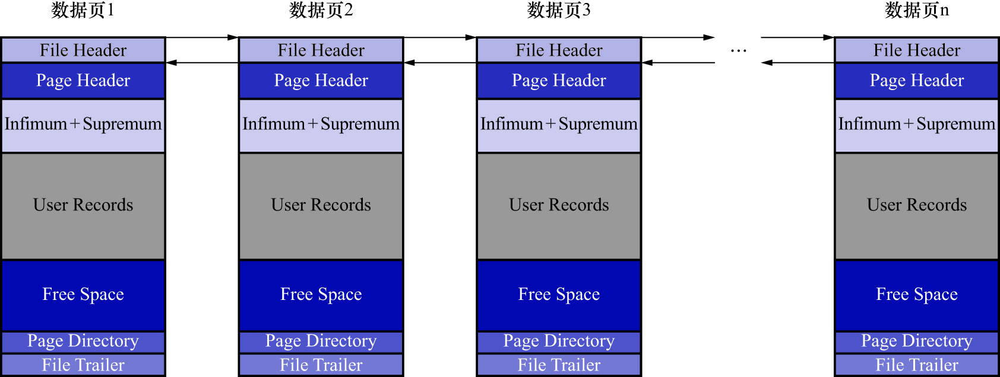

# 6. `File Header`(文件头部)

`File Header`通用于各种类型的页,也就是说各种类型的页都会以`File Header`作为第1个组成部分.
它描述了一些通用于各种页的一些信息,例如:

- 这个页的编号是多少
- 它的上一个页/下一个页是谁
- 等等

这个部分占用固定的38个字节,是由以下这些内容组成:

|                 名称                 | 占用空间大小 |                                描述                                |
|:----------------------------------:|:------:|:----------------------------------------------------------------:|
|     `FIL_PAGE_SPACE_OR_CHKSUM`     |  4字节   | 当MySQL的版本低于4.0.14时,该属性表示本页所在的表空间ID;在之后的版本中,该属性表示页的校验和(checksum值) |
|         `FIL_PAGE_OFFSET`          |  4字节   |                                页号                                |
|          `FIL_PAGE_PREV`           |  4字节   |                             上一个页的页号                              |
|          `FIL_PAGE_NEXT`           |  4字节   |                             下一个页的页号                              |
|           `FIL_PAGE_LSN`           |  8字节   |            页面被最后修改时对应的LSN(Log Sequence Number,日志序列号)值            |
|          `FIL_PAGE_TYPE`           |  2字节   |                              该页的类型                               |
|     `FIL_PAGE_FILE_FLUSH_LSN`      |  8字节   |                仅在系统表空间的第一个页中定义,表示文件至少被刷新到了对应的LSN值                |
| `FIL_PAGE_ARCH_LOG_NO_OR_SPACE_ID` |  4字节   |                             页属于哪个表空间                             |

- `FIL_PAGE_SPACE_OR_CHKSUM`: 此处直接讨论MySQL版本高于4.0.14的情况.该属性表示当前页面的校验和(checksum值)
  - 对于一个很长很长的字节串来说,我们会通过某种算法来计算一个比较短的值来代表这个很长的字节串.这个比较短的值就称为校验和
  - 这样在比较两个很长的字节串之前,先比较这两个长字节串的校验和,如果校验和都不一样,则两个长字节串肯定是不同的,这样就省去了直接比较两个长字节串的时间损耗
- `FIL_PAGE_OFFSET`: 每一个页都有一个单独的页号,如同身份证号码.InnoDB通过页号来可以唯一定位一个页
- `FIL_PAGE_TYPE`: 表示当前页的类型,类型如下:

|           类型名称            |   十六进制   |         描述         |
|:-------------------------:|:--------:|:------------------:|
| `FIL_PAGE_TYPE_ALLOCATED` | `0x0000` |     最新分配,还没使用      |
|    `FIL_PAGE_UNDO_LOG`    | `0x0002` |      Undo日志页       |
|     `FIL_PAGE_INODE`      | `0x0003` |       存储段的信息       |
| `FIL_PAGE_IBUF_FREE_LIST` | `0x0004` | Change Buffer空闲列表  |
|  `FIL_PAGE_IBUF_BITMAP`   | `0x0005` | Change Buffer的一些属性 |
|    `FIL_PAGE_TYPE_SYS`    | `0x0006` |      存储一些系统数据      |
|  `FIL_PAGE_TYPE_TRX_SYS`  | `0x0007` |       事务系统数据       |
|  `FIL_PAGE_TYPE_FSP_HDR`  | `0x0008` |      表空间头部信息       |
|   `FIL_PAGE_TYPE_XDES`    | `0x0009` |      存储区的一些属性      |
|   `FIL_PAGE_TYPE_BLOB`    | `0x000A` |        溢出页         |
|     `FIL_PAGE_INDEX`      | `0x45BF` |  索引页,也就是我们所说的数据页   |

注: 溢出页的类型为`FIL_PAGE_TYPE_BLOB`;存放正常记录的页面类型为`FIL_PAGE_INDEX`,二者不同

- `FIL_PAGE_PREV`和`FIL_PAGE_NEXT`: InnoDB是以页为单位存放数据的,有时在存放某种类型的数据时,占用的空间非常大(比如一张表中可以有成千上万条记录)
  InnoDB可能无法一次性为这么多数据分配一个非常大的存储空间,而如果分散到多个不连续的页中进行存储,则需要把这些页关联起来
- `FIL_PAGE_PREV`和`FIL_PAGE_NEXT`就分别代表本页的上一个和下一个页的页号
- 这样通过建立一个双向链表把许许多多的页就都串联起来了,而无需这些页在物理上真正连着
- 注意: 并不是所有类型的页都有上一个和下一个页的属性,不过我们此处重点讲解的数据页(类型为`FIL_PAGE_INDEX`的页)是有这两个属性的

