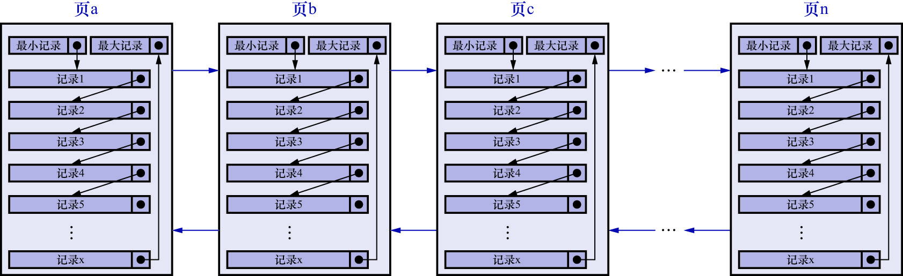

# 0. 回顾

前边详细介绍了InnoDB数据页的7个组成部分,知道了各个数据页可以组成一个双向链表,而每个数据页中的记录会按照主键值从小到大的顺序组成一个单向链表,
每个数据页都会为存储在它里面的记录生成一个页目录,在通过主键查找某条记录的时,可以在页目录中使用二分法快速定位到对应的槽,
然后再遍历该槽对应分组中的记录即可快速找到指定的记录.页和记录的关系示意图如下:

其中页a/页b/页c/.../页n这些页可以不在物理结构上相连,只要通过双向链表相关联即可
