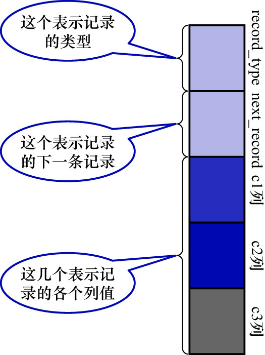

# 0. 准备工作

为了故事的顺利发展,我们先建一个表:

```
mysql> CREATE TABLE index_demo (
    ->     c1 INT,
    ->     c2 INT,
    ->     c3 CHAR(1),
    ->     PRIMARY KEY(c1)
    ->  ) ROW_FORMAT = COMPACT;
Query OK, 0 rows affected (0.06 sec)
```

`index_demo`表中有2个INT类型的列/1个CHAR(1)类型的列,且规定了`c1`列为主键,该表使用COMPACT行格式来实际存储记录的.
为理解上的方便,简化`index_demo`表的行格式如下图:


图中展示的部分如下:

- `record_type`: 记录头信息的一项属性,表示记录的类型.其中:
    - 0: 普通记录
    - 2: `Infimum`记录
    - 3: `Supremum`记录
    - 1: 还没用过,后续会讲到
- `next_record`: 记录头信息的一项属性,表示从当前记录的真实数据到下一条记录的真实数据处的距离.为方便理解,在图中用箭头来表明下一条记录是谁
- 各个列的值: 这里只记录在`index_demo`表中的三个列,分别是`c1`/`c2`/`c3`
- 其他信息: 除了上述3种信息以外的所有信息,包括其他隐藏列的值以及记录的额外信息

为节省篇幅,之后的示意图中会把记录的"其他信息"部分省略掉,因为它占地方并且不会有什么观赏效果.
另外,为方便理解,把记录竖着放看起来感觉更好.
所以将记录格式示意图的其他信息去掉并把它竖起来的效果如下图示:




