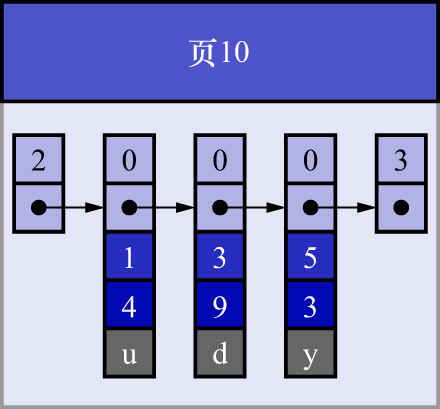
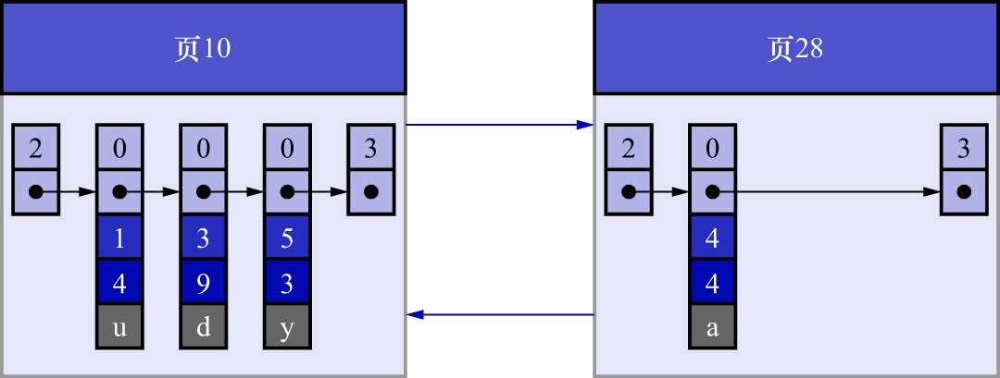
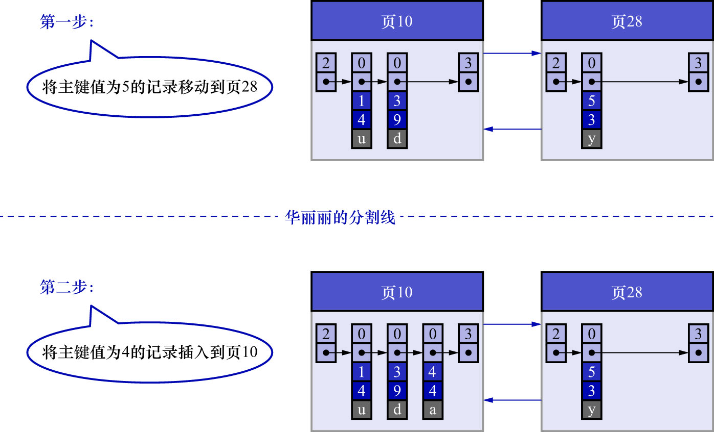

# 1. 下一个数据页中的用户记录的主键值必须大于上一个页中用户记录的主键值

为了故事的顺利发展,这里先做一个假设:假设每个数据页最多能存放3条记录(实际上一个数据页是16KB,可以存放很多记录).
有了这个假设之后,向`index_demo`表插入3条记录:

```
mysql> INSERT INTO index_demo VALUES(1, 4, 'u'), (3, 9, 'd'), (5, 3, 'y');
Query OK, 3 rows affected (0.02 sec)
Records: 3  Duplicates: 0  Warnings: 0
```

**此时这些记录已经按照主键值的大小串联成一个单向链表了**,如下图示:



从图中可以看出,`index_demo`表中的3条记录都被插入到了编号为10的数据页中.
此时再插入一条记录:

```
mysql> INSERT INTO index_demo VALUES(4, 4, 'a');
Query OK, 1 row affected (0.00 sec)
```

因为页10最多只能放3条记录,所以**不得不**再分配一个新页,如下图示:



注意新分配的页的页号是28,而非11.
再次强调,**新分配的数据页编号可能并不是连续的,也就是说我们使用的这些页在磁盘上可能并不连续(InnoDB存储引擎会尽量使得页在磁盘上连续,但并不能保证)**.
它们只是通过维护着上一个页和下一个页的编号,而建立了链表关系.

另外,页10中用户记录最大的主键值是5,而页28中有一条记录的主键值是4,因为`5 > 4`,
所以这就不符合**下一个数据页中用户记录的主键值必须大于上一个页中用户记录的主键值**的要求,
所以在插入主键值为4的记录时,需要伴随着一次记录移动:也就是把主键值为5的记录移动到页28中,然后再把主键值为4的记录插入到页10中,
这个过程如下图示:



这个过程表明,在对页中的记录进行增删改的过程中,必须通过一些诸如记录移动的操作来始终保证这个状态一直成立:
**下一个数据页中用户记录的主键值必须大于上一个页中用户记录的主键值**.这个过程也被称为**页分裂**.

注: 页分裂时,是"按字节数接近50%/50%"的原则来移动记录的,而不是"按记录条数接近50%/50%"的原则来移动记录的.
算法会选一个分裂点(按有序记录的物理大小接近页内容的中位),把该分裂点及其右侧的一段"**搬到**"新页中,以便让原页和新页
在字节占用上尽量均衡,然后再把新插入的记录放进对应的页(由`(二级索引, 主键)`的顺序决定放入原页还是新页).

这里说的"搬到",指的不是逻辑删除(`delete_flag`的值置为1),而是真正的**物理迁移**.页分裂的过程如下:

1. InnoDB在原页中找到分裂点
2. 将分裂点及其右边的部分**复制**到一个新页中
3. 在原页中,这些被复制走的记录会被**物理删除**,即:

    - 从页的`User Records`部分中被删除
    - 同时,这些数据对应的`Page Directory`中的`Slot`也会被移除/更新

4. 更新页头信息(`PAGE_N_DIR_SLOTS`/`PAGE_N_HEAP`等元数据)
5. 将新记录插入到对应的页中(可能插入到原页,也可能插入到新页)
6. 最后在父节点更新指针(或引发父节点分裂)

- `delete_flag`(逻辑删除)是用在普通删除操作上的: 记录还在页中,只是标记为已删除,可以用于一致性读/回滚,直到`purge`线程真正清理
- 页分裂是**结构性操作**,不涉及事务可见性,因此必须物理移除并插入新页.不能依赖`delete_flag`.
  - 否则页目录仍然膨胀,失去了分裂的意义
