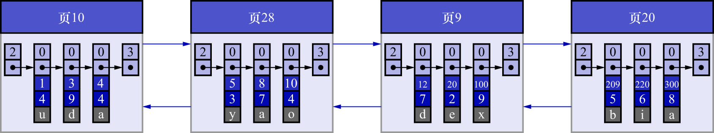
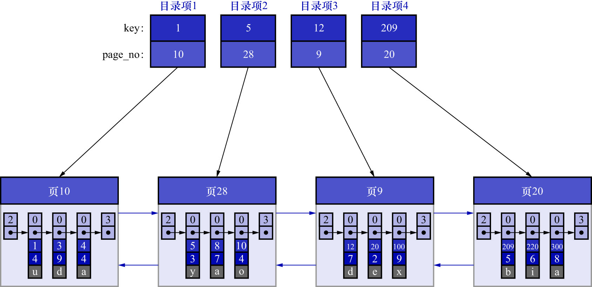

# 2. 给所有的页建立一个目录项

由于**数据页的编号可能并不是连续的**,所以在向`index_demo`表中插入许多条记录后,可能是如下图示的效果:

由于这些16KB的页在物理存储上可能并不连续,所以如果想**从这么多页中根据主键值快速定位某些记录所在的页**,
需要给它们编制一个目录,每个页对应一个目录项,每个目录项包括下边两个部分:

- 页的用户记录中最小的主键值,用`key`来表示
- 页号,用`page_no`表示

所以为上边几个页编制的目录如下图示:

以页28为例,它对应目录项2,该目录项中包含着该页的页号28以及该页中用户记录的最小主键值5.
只需要**把几个目录项在物理存储器上连续存储**(比如把它们放到一个数组里),就可以实现根据主键值快速查找某条记录的功能了.
例如想找主键值为20的记录,具体查找过程分两步:

1. 从目录项中根据二分法快速确定出主键值为20的记录在目录项3中(因为`12 < 20 < 209`),该目录项对应的页为页9
2. 再根据前边说的在页中查找记录的方式去页9中定位具体的记录

至此,针对数据页做的简易目录就完成了.**这个目录就是索引**.

注: **所以索引的作用是快速定位某条记录所在的页,而不是直接定位到具体的记录**.
