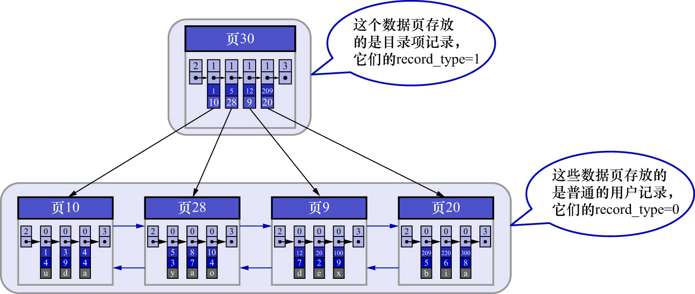
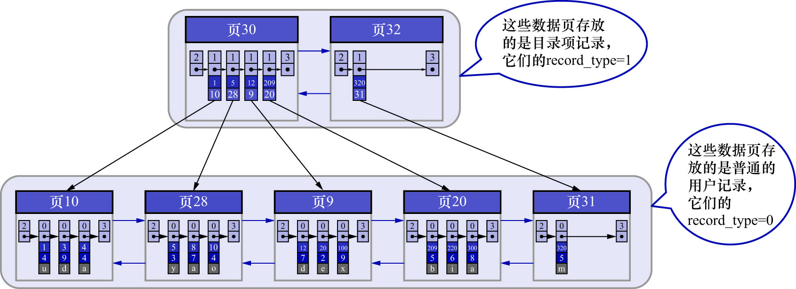
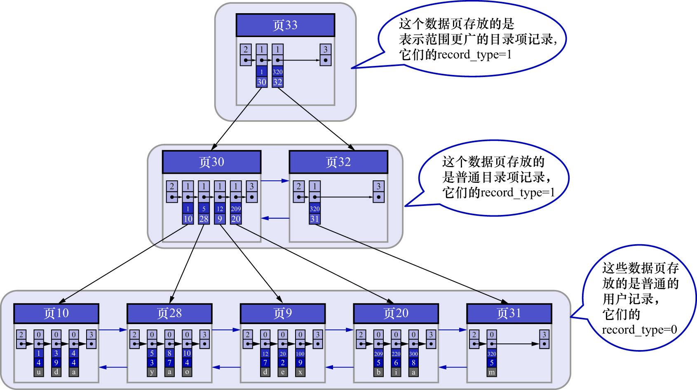
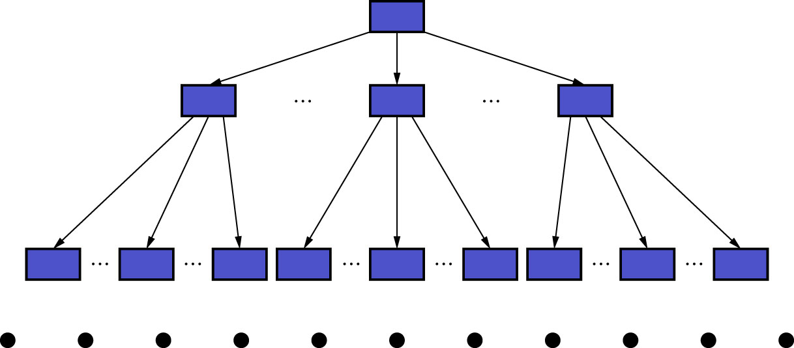

# 0. 具体方案

之所以说刚才的方案是一个简易的索引方案是因为:为了使用二分法快速定位具体的目录项,而假设所有目录项都可以在物理存储器上连续存储.
但是这样的设计有几个问题:

- InnoDB使用页作为管理存储空间的基本单位,**也就是最多只能保证16KB的连续存储空间**
    - 虽然1个目录项占用不了多大的存储空间,但随着表中记录数量的增多,就需要非常大的连续的存储空间才能把所有的目录项都放下了
    - 这对记录数量非常多的表是不现实的
- 我们时常会对记录进行增删改操作
    - 假设把页28中的记录都删除,那么页28也就没有存在的必要了
    - 同样地,目录项2也就没有存在的必要了.这就需要把目录项2后面的目录项都向前移动一下
    - 这种牵一发而动全身的设计也不是太好的设计

这种场景下,需要一种**可以灵活管理所有目录项的方式**.InnoDB的设计者发现,这些目录项其实和用户记录长得很像,
只不过目录项中的两个列是主键和页号而已.
所以他们复用了之前存储用户记录的数据页来存储目录项.
为了和用户记录进行区分,把这些用来表示目录项的记录称为目录项记录.
那么,InnoDB是怎么区分一条记录是普通的用户记录还是目录项记录呢?
别忘了记录头信息里的`record_type`属性,它的各个取值代表的意思如下:

- 0: 普通记录
- 1: 目录项记录
- 2: `Infimum`记录
- 3: `Supremum`记录

把目录项放到数据页中,如下图示:

从图中可以看,新分配了一个编号为30的页来专门存储目录项记录.这里再次强调目录项记录和普通的用户记录的不同点:

- 目录项记录的`record_type`值为1;用户记录的`record_type`值是0
- 目录项记录只有主键值和页的编号两个列;用户记录的列是用户自己定义的,可能包含多个列,另外还有InnoDB自己添加的隐藏列
- 记录头信息中的`min_rec_mask`属性,只有目录项记录的`min_rec_mask`属性值可能为1;用户记录的`min_rec_mask`属性值都是0

除了上述几点外,二者就没有什么其他区别了.它们用的是一样的数据页(页面类型都是`0x45BF`,该属性在`File Header`中,`FIL_PAGE_TYPE`字段,值为`FIL_PAGE_INDEX`),
页的组成结构也是完全一样的(就是数据页的7个部分),都会为主键值生成`Page Directory`(页目录),从而在按照主键值进行查找时可以使用二分法来加快查询速度.

现在以查找主键为20的记录为例,根据某个主键值去查找记录的步骤就可以大致拆分成下边两步:

1. 先到存储目录项记录的页(也就是页30)中,通过二分法快速定位到对应的目录项,因为`12 < 20 < 209`,所以定位到对应的记录所在的页就是页9
2. 再到存储用户记录的页9中根据二分法快速定位到主键值为20的用户记录

虽然目录项记录中只存储主键值和对应的页号,比用户记录需要的存储空间小很多,但毕竟一个页只有16KB的大小,能存放的目录项记录也是有限的.
那如果表中的数据太多,以至于1个数据页不足以存放所有的目录项记录,该怎么办?

答案很简单: 再新建一个存储目录项记录的页即可.

为更好的理解新分配一个存储目录项记录的页的过程,此处假设1个存储目录项记录的页最多只能存放4条目录项记录(注意这是假设,真实情况下可以存放很多条),
如果此时再向上图中插入一条主键值为320的用户记录,那就需要分配一个新的存储目录项记录的页了,如下图示:

从图中可以看出,插入了一条主键值为320的用户记录之后,需要2个新的数据页:

- 为存储该用户记录而新分配了页31
- 因为存储目录项记录的页30的容量已满(之前假设每个页只能存储4条目录项记录),所以**不得不**分配一个新的页32来存放页31对应的目录项

现在因为存储目录项记录的页不止1个,所以如果想根据主键值查找1条用户记录,则大致需要3个步骤.以查找主键值为20的记录为例:

- **步骤1: 确定存储目录项记录的页**(也就是确定页30和页32)

现在存储目录项记录的页有2个,即页30和页32.又因为页30表示的目录项的主键值的范围是`[1, 320)`,页32表示的目录项的主键值不小于320.
所以主键值为20的记录对应的目录项记录在页30中.

- **步骤2: 通过目录项记录页确定用户记录真实所在的页**

之前已经讲过如何在1个存储目录项记录的页中通过主键值定位1条目录项记录了,这里就不再赘述

- **步骤3: 在真实存储用户记录的页中定位到具体的记录**

这个步骤也讲过,这里就不再赘述

那么问题来了:在这个查询步骤的第1步中,需要定位存储目录项记录的页,但是这些页在存储空间中也可能不连续,
如果表中的数据非常多(即数据页非常多,也就是目录项记录非常多),则会产生很多存储目录项记录的页,此时该怎么根据主键值快速定位一个存储目录项记录的页?
答案也简单:为这些存储目录项记录的页再生成一个更高级的目录,就像是一个多级目录一样,大目录里嵌套小目录,小目录里才是实际的数据.
所以现在各个页的示意图如下:

如图所示,新分配了一个存储更高级目录项的页33.这个页中的两条记录分别代表页30和页32.
如果用户记录的主键值在`[1, 320)`之间,则到页30中查找更详细的目录项记录;如果主键值不小于320,
就到页32中查找更详细的目录项记录.

随着表中记录的增加,这个目录的层级会继续增加,如果简化一下,可以用下边这个图来描述它:

其实这就是B+树.

无论是存放用户记录的数据页,还是存放目录项记录的数据页,都可以存放到B+树这个数据结构中.
所以也称这些数据页为B+树的节点.
从图中可以看出,用户记录都存放在B+树的最底层的节点上,这些节点也被称为**叶子节点**或**叶节点**.
其余用来存放目录项记录的节点称为**非叶子节点**或者**内节点**.
其中B+树最上边的节点也称为**根节点**.

从图中可以看出,一个B+树的节点其实可以分成好多层.InnoDB的设计者为了讨论方便,规定:最下边的那层(也就是存放用户记录的那层)为第0层,
之后层级依次往上加.
之前的讨论我们做了一个非常极端的假设: 存放用户记录的页最多存放3条记录,存放目录项记录的页最多存放4条记录.
其实真实环境中一个页存放的记录数量是非常大的.假设所有存放用户记录的叶子节点代表的数据页可以存放100条用户记录,
所有存放目录项记录的非叶子节点代表的数据页可以存放1000条目录项记录,那么:

- 如果B+树只有1层,也就是只有1个用于存放用户记录的叶子节点,则最多能存放`100`条记录
- 如果B+树有2层,则最多能存放`1000 * 100 = 100000`条记录
- 如果B+树有3层,则最多能存放`1000 * 1000 * 100 = 100000000`条记录
- 如果B+树有4层,则最多能存放`1000 * 1000 * 1000 * 100 = 100000000000`条记录

所以一般情况下,我们用到的B+树都不会超过4层.
这样一来,在通过主键值去查找某条记录时,最多只需要进行4个页面内的查找(查找3个存储目录项记录的页和1个存储用户记录的页),
又因为在每个页面内有`Page Directory`(页目录),所以在页面内也可以通过二分法实现快速定位记录.

注: 在讲页的`Page Header`时,说过一个名为`PAGE_LEVEL`的属性,该属性表示当前页作为节点在B+树中的层级
