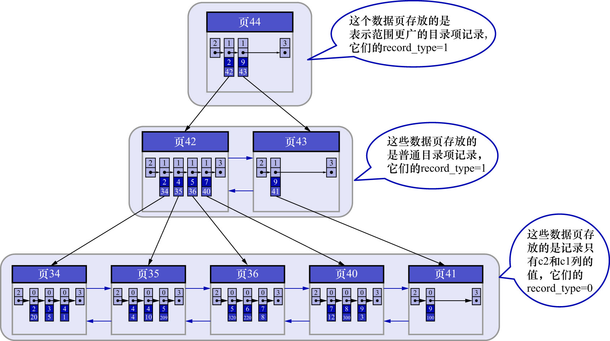

# 2. 二级索引

聚簇索引只能在搜索条件是主键值时才能发挥作用,因为B+树中的数据都是按照主键进行排序的.
那如果以别的列作为搜索条件该怎么办?难道只能从头到尾沿着链表依次遍历记录么?

这种场景,可以多建几棵B+树,不同的B+树中的数据采用不同的排序规则.例如,用`c2`列的大小作为数据页/页中记录的排序规则,再建一棵B+树.如下图示:

这个B+树与之前说的聚簇索引有几处不同:

- 使用记录`c2`列的大小进行记录和页的排序,这包括三个方面的含义:
    - 页(包括叶子节点和非叶子节点)内的记录是按照`c2`列的大小顺序排成一个单向链表
      - 页内的记录被划分成若干个组,每个组中`c2`列最大的记录在页内的偏移量会被当做槽依次存放在页目录中(`Supremum`记录比任何用户记录都大)
      - 在页目录中,通过二分法可以快速定位到`c2`列等于某个值的记录
    - 各个存放用户记录的页也是根据页中用户记录的`c2`列大小顺序排成一个双向链表
    - 存放目录项记录的页分为不同的层级,在同一层级中的页,也是根据页中目录项记录的`c2`列大小顺序排成一个双向链表
- B+树的叶子节点存储的并不是完整的用户记录,而是`c2列 + 主键`这两个列的值
- 目录项记录中不再是`主键 + 页号`的搭配,而变成了`c2列 + 页号`的搭配

现在,比如说要查找满足搜索条件`c2 = 4`的记录,就可以使用刚刚建好的这棵树了.不过这里有个地方需要注意:
因为`c2`列并没有唯一性约束,也就是说满足搜索条件`c2 = 4`的记录可能有多条.**但是在这棵树中查找时,
只需要在该B+树的叶子节点处定位到第1条满足搜索条件`c2 = 4`的记录,然后沿着由记录组成的单向链表一直向后扫描即可**.
另外,各个叶子节点组成了双向链表,搜索完本页面的记录后,可以直接跳到下一个页面中的第1条记录,然后继续沿着记录组成的单向链表向后扫描即可.
查找过程如下:

- 步骤1: 确定第1条符合条件`c2 = 4`的目录项记录所在的页

根据根页面(也就是页44),可以快速定位到第1条符合条件`c2 = 4`的目录项记录所在的页为页42(因为`2 < 4 < 9`)

- 步骤2: 通过第1条符合条件`c2 = 4`的目录项记录,确定第1条符合条件`c2 = 4`的用户记录所在的页

根据页42可以快速定位到第1条符合条件的用户记录所在的页为页34或者页35(因为`因为 2 < 4 ≤ 4`)

- 步骤3: 在真正存储第1条符合条件`c2 = 4`的用户记录所在的页中,定位到具体的记录

到页34和页35中定位到具体的用户记录(如果在页34中使用页目录定位到了第1条符合条件的用户记录,就不需要再到页35中使用页目录去定位第1条符合条件的用户记录了)

- 步骤4: 这棵B+树的叶子节点中的记录,只存储了`c2列 + c1列`(`c1`列是主键)这2个列.在这棵B+树的叶子节点处定位到第1条符合条件的用户记录之后,再根据该记录中的主键信息,到聚簇索引中查找完整的用户记录

这个通过携带主键信息到聚簇索引中重新定位完整的用户记录的过程也称为**回表**.

然后再返回到这棵B+树的叶子节点处,找到刚才定位到的符合条件的那条用户记录,并沿着记录组成的单向链表向后继续搜索其他也满足条件`c2 = 4`的用户记录,
每找到1条,就进行1次回表操作.重复这个过程,直到下一条记录不满足条件`c2 = 4`为止.

为什么还需要一次回表操作呢?直接把完整的用户记录放到这棵B+树的叶子节点可以吗?

如果把完整的用户记录放到这棵B+树的叶子节点确实是可以不用回表,但是占用的存储空间就太大了.这相当于每建立一棵B+树,
都需要把所有的用户记录再拷贝一遍,这就有点太浪费存储空间了.

因为这种以**非主键列的大小**为排序规则而建立的B+树需要回表操作才可以定位到完整的用户记录,所以这种B+树也被称为二级索引(Secondary Index)或辅助索引.
由于这里是以`c2`列的大小作为B+树的排序规则,所以也称这个B+树为:为`c2`列建立的索引,把`c2`列称为索引列.
二级索引记录和聚簇索引记录使用的是一样的行格式,只不过二级索引记录存储的列不像聚簇索引记录那么完整.

注: 之前把聚簇索引或二级索引的叶子节点中的记录称为用户记录,为了区分,有的地方也会把聚簇索引叶子节点中的记录称为**完整的用户记录**,把二级索引叶子节点中的记录称为**不完整的用户记录**

注: 这里只是拿`c2`列这个INT类型的列举例,若为`c3`这种字符串类型的列建立索引,情况是类似的,因为字符串也是可以比较大小的(按字符集和比较规则比较)
