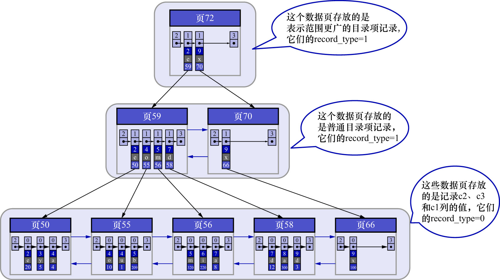

# 3. 联合索引

也可以同时以多个列的大小作为排序规则,也就是同时为多个列建立索引.例如:让B+树按照`c2`和`c3`列的大小进行排序,这里面包含两层含义:

- 先把各个记录和页按照`c2`列进行排序
- 在记录的`c2`列相同的情况下,采用`c3`列进行排序

为`c2`和`c3`列建立索引,如下图示:

如图所示,需要注意以下几点:

- 每条目录项记录都由`c2`/`c3`/页号这3个部分组成.各条记录先按照`c2`列的值进行排序,如果记录的`c2`列相同,则按照`c3`列的值进行排序
- B+树叶子节点处的用户记录由`c2`/`c3`和主键`c1`列组成

注意: 以`c2`和`c3`列的大小为排序规则建立的B+树称为**联合索引**,本质上也是一个二级索引.
"以`c2`和`c3`列的大小为排序规则建立联合索引"的意思与"分别为`c2`和`c3`列建立索引"的表述是不同的,不同点如下:

- 建立联合索引只会建立如上图一样的1棵B+树
- 为`c2`和`c3`列分别建立索引时,则会分别以`c2`和`c3`列的大小为排序规则,建立2棵B+树
