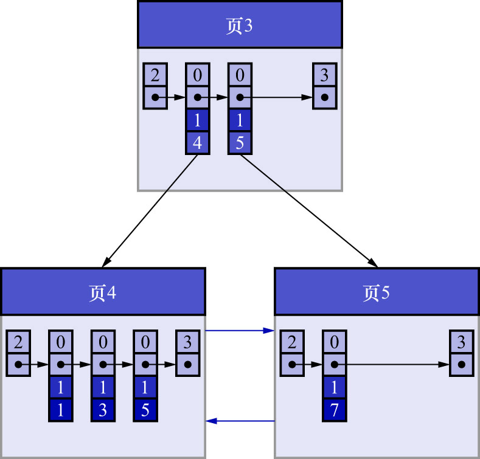

# 2. 非叶子节点中目录项记录的唯一性

B+树索引的非叶子节点中目录项记录的内容是`索引列 + 页号`的搭配,但是这个搭配对于二级索引来说有点儿不严谨.
还拿`index_demo`表为例,假设这个表中的数据现在是这样的:

| `c1` | `c2` | `c3`  |
|:----:|:----:|:-----:|
|  1   |  1   | `'u'` |
|  3   |  1   | `'d'` |
|  5   |  1   | `'y'` |
|  7   |  1   | `'a'` |

如果二级索引中目录项记录的内容只是`索引列 + 页号`的搭配,那么为`c2`列建立索引后的B+树应该长这样:

如果现在要新插入一行记录,其中`c1`/`c2`/`c3`的值分别为:`9`/`1`/`'c'`,那么在修改这个为c2列建立的二级索引对应的B+树时,
便遇到了个大问题:由于页3中存储的目录项记录是由`c2列 + 页号`的值构成的,页3中的两条目录项记录对应的`c2`列的值都是1,
而新插入的这条记录的`c2`列的值也是1,那这条新插入的记录到底应该放到页4中,还是应该放到页5中呢? 

答案是: 不知道

换言之,如果二级索引中目录项记录的内容只是`索引列 + 页号`的搭配,那么在插入新记录时,可能会遇到**无法在B+树的目录中确定新记录应该放到哪个子目录中**的问题

为了让新插入的记录能找到自己应该在哪个页中,就需要保证**在B+树的同一层内节点的目录项记录除页号这个字段以外是唯一的**.
所以对于二级索引的非叶子节点的目录项记录的内容实际上是由三个部分构成的:

- 索引列的值
- 主键值
- 页号

也就是说,把主键值也添加到二级索引非叶子节点节点中的目录项记录中,这样就能保证B+树每一层节点中各条目录项记录除页号这个字段外,仍然是唯一的.
所以为`c2`列建立二级索引后的示意图,实际上应该是这样子的:

这样,当插入记录`(9, 1, 'c')`时,由于页3中存储的目录项记录是由`c2列 + 主键 + 页号`构成的,
可以先把新记录的`c2`列的值和页3中各目录项记录的`c2`列的值进行比较: 如果`c2`列的值相同,再接着比较主键值,
因为B+树同一层中不同目录项记录的`c2列 + 主键`的值肯定是不一样的,所以最后肯定能定位到唯一的一条目录项记录.

在本例中最后确定新记录应该被插入到页5中

注: **对于二级索引记录来说,是先按照二级索引列的值进行排序,在二级索引列值相同的前提下,再按照主键值排序**.
所以,为`c2`列建立二级索引,其实就相当于为`(c2, c1)`列建立了一个联合索引

注: **对于唯一二级索引(为某个列或列组合声明`UNIQUE`属性时,便会为这个列或列组合建立唯一二级索引)来说,也可能会出现多条记录键值相同的情况**:

- 声明为`UNIQUE`属性的列可能存储多个NULL值
- MVCC

**因此,唯一二级索引的非叶子节点的目录项记录也会包含记录的主键值**
