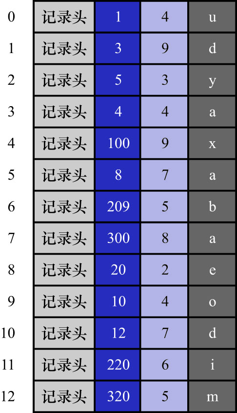

# 4. MyISAM中的索引方案简介

**InnoDB中,索引即数据**.也就是聚簇索引的那棵B+树的叶子节点中已经把包含了所有完整的用户记录.
而MyISAM的索引方案虽然也使用树形结构,但是却将索引和数据分开存储:

- 将表中的记录按照记录的插入顺序单独存储在一个文件中(称为数据文件)
    - 这个文件并不划分为若干个数据页,有多少记录就往这个文件中写多少记录
    - 搜索时通过行号快速访问到一条记录

MyISAM记录也需要记录头信息来存储一些额外数据.以前面的`index_demo`表为例,若该表中的记录使用MyISAM作为存储引擎,在存储空间中的表示如下图示:

由于插入数据时,并没有刻意按照主键大小排序,所以不能在这些数据上使用二分法进行查找.

- 使用MyISAM存储引擎的表会把索引信息单独存储到另外一个文件中(称为索引文件)
    - MyISAM会为表的主键单独创建一个索引,只不过在索引的叶子节点中存储的不是完整的用户记录,而是`主键值 + 行号`的组合
    - 也就是先通过索引找到对应的行号,再通过行号去找对应的记录

这一点和InnoDB是完全不同的.在InnoDB存储引擎中,只需要根据主键值对聚簇索引进行1次查找就能找到对应的记录.
而在MyISAM中却需要进行一次回表操作,这也就是说,MyISAM中建立的索引相当于全部都是二级索引(因为MyISAM的主键索引的叶子节点中存储的是`主键值 + 行号`,而不是完整的用户记录).

- 如果有需要,也可以为其它列分别建立索引或者建立联合索引,原理和InnoDB中的索引差不多,不过在叶子节点处存储的是`索引列 + 行号`.这些索引也全部都是二级索引

注: MyISAM的行格式有:

- STATIC: 定长记录格式
- DYNAMIC: 变长记录格式
- COMPRESSED: 压缩记录格式
- 等

这里用来举例的`index_demo`表表采用定长记录格式,也就是一条记录占用存储空间的大小是固定的,这样就可以轻松算出某条记录在数据文件中的地址偏移量.
但是变长记录格式就不行了,MyISAM会直接在索引的叶子节点处存储该条记录在数据文件中的地址偏移量.
由此可以看出,MyISAM的回表操作是十分快速的,因为它是拿着地址偏移量直接到文件中取数据,而InnoDB是通过获取主键之后再去聚簇索引中找记录,
虽然说也不慢,但还是比不上直接用地址去访问.

此处只是非常简要的介绍了一下MyISAM的索引.这里只是为了理解**InnoDB中的索引即数据,数据即索引**.
而MyISAM中却是"索引是索引,数据是数据".这两种存储引擎的索引方案是完全不同的.
